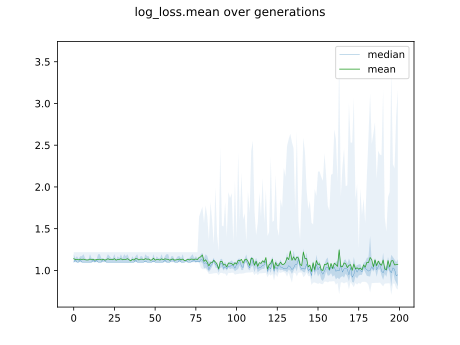
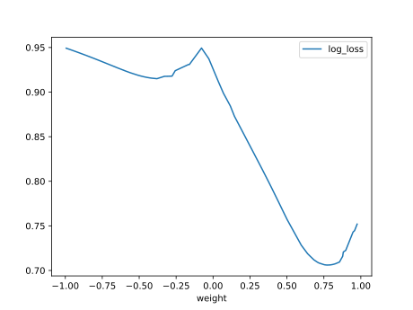
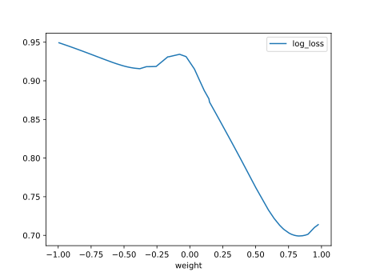

# Report Iris Uniform Distribution [-1, 1] run 0

## Best results in hall of fame

| measure       |    value |   individual |
|:--------------|---------:|-------------:|
| mean accuracy | 0.715133 |        13837 |
| max accuracy  | 0.946667 |        13837 |
| mean kappa    | 0.5727   |        13837 |
| max kappa     | 0.92     |        13837 |

## Individuals in hall of fame

### Individual 13837

| key                    |      value |
|:-----------------------|-----------:|
| mean log_loss:         |   0.853775 |
| mean accuracy:         |   0.715133 |
| mean kappa:            |   0.5727   |
| number of edges        |  37        |
| number of hidden nodes |   8        |
| number of layers       |   4        |
| birth                  | 154        |

#### Network

### Individual 13681

| key                    |      value |
|:-----------------------|-----------:|
| mean log_loss:         |   0.853775 |
| mean accuracy:         |   0.715133 |
| mean kappa:            |   0.5727   |
| number of edges        |  35        |
| number of hidden nodes |   7        |
| number of layers       |   3        |
| birth                  | 153        |

#### Network

### Individual 14952

| key                    |      value |
|:-----------------------|-----------:|
| mean log_loss:         |   0.853076 |
| mean accuracy:         |   0.688467 |
| mean kappa:            |   0.5327   |
| number of edges        |  41        |
| number of hidden nodes |  10        |
| number of layers       |   4        |
| birth                  | 167        |

#### Network

### Individual 15015

| key                    |      value |
|:-----------------------|-----------:|
| mean log_loss:         |   0.853076 |
| mean accuracy:         |   0.688467 |
| mean kappa:            |   0.5327   |
| number of edges        |  41        |
| number of hidden nodes |  10        |
| number of layers       |   4        |
| birth                  | 167        |

#### Network

### Individual 14045

| key                    |      value |
|:-----------------------|-----------:|
| mean log_loss:         |   0.851867 |
| mean accuracy:         |   0.694467 |
| mean kappa:            |   0.5417   |
| number of edges        |  37        |
| number of hidden nodes |   8        |
| number of layers       |   4        |
| birth                  | 157        |

#### Network

### Individual 17976

| key                    |      value |
|:-----------------------|-----------:|
| mean log_loss:         |   0.837216 |
| mean accuracy:         |   0.688733 |
| mean kappa:            |   0.5331   |
| number of edges        |  47        |
| number of hidden nodes |  11        |
| number of layers       |   4        |
| birth                  | 200        |

#### Network

### Individual 8987

| key                    |      value |
|:-----------------------|-----------:|
| mean log_loss:         |   0.967309 |
| mean accuracy:         |   0.672733 |
| mean kappa:            |   0.5091   |
| number of edges        |  17        |
| number of hidden nodes |   1        |
| number of layers       |   1        |
| birth                  | 100        |

#### Network

### Individual 14669

| key                    |      value |
|:-----------------------|-----------:|
| mean log_loss:         |   0.853076 |
| mean accuracy:         |   0.688467 |
| mean kappa:            |   0.5327   |
| number of edges        |  39        |
| number of hidden nodes |   9        |
| number of layers       |   4        |
| birth                  | 163        |

#### Network

### Individual 9107

| key                    |      value |
|:-----------------------|-----------:|
| mean log_loss:         |   1.07291  |
| mean accuracy:         |   0.682333 |
| mean kappa:            |   0.5235   |
| number of edges        |  15        |
| number of hidden nodes |   0        |
| number of layers       |   0        |
| birth                  | 102        |

#### Network

### Individual 14719

| key                    |      value |
|:-----------------------|-----------:|
| mean log_loss:         |   0.852548 |
| mean accuracy:         |   0.689333 |
| mean kappa:            |   0.534    |
| number of edges        |  39        |
| number of hidden nodes |   9        |
| number of layers       |   4        |
| birth                  | 164        |

#### Network

