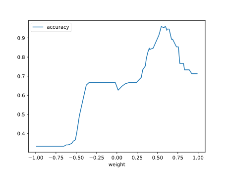

# Report Iris Uniform Distribution [-1, 1] run 1

## Best results in hall of fame

| measure       |   value |   individual |
|:--------------|--------:|-------------:|
| mean accuracy |  0.6674 |         9516 |
| max accuracy  |  0.96   |         9516 |
| mean kappa    |  0.5011 |         9516 |
| max kappa     |  0.94   |         9516 |

## Individuals in hall of fame

### Individual 8007

| key                    |     value |
|:-----------------------|----------:|
| mean log_loss:         |  1.00595  |
| mean accuracy:         |  0.666667 |
| mean kappa:            |  0.5      |
| number of edges        | 20        |
| number of hidden nodes |  2        |
| number of layers       |  1        |
| birth                  | 89        |

#### Network

### Individual 8047

| key                    |     value |
|:-----------------------|----------:|
| mean log_loss:         |  1.00595  |
| mean accuracy:         |  0.666667 |
| mean kappa:            |  0.5      |
| number of edges        | 21        |
| number of hidden nodes |  2        |
| number of layers       |  1        |
| birth                  | 90        |

#### Network

### Individual 9516

| key                    |      value |
|:-----------------------|-----------:|
| mean log_loss:         |   0.912253 |
| mean accuracy:         |   0.6674   |
| mean kappa:            |   0.5011   |
| number of edges        |  31        |
| number of hidden nodes |   5        |
| number of layers       |   2        |
| birth                  | 106        |

#### Network

### Individual 8137

| key                    |     value |
|:-----------------------|----------:|
| mean log_loss:         |  0.977527 |
| mean accuracy:         |  0.644933 |
| mean kappa:            |  0.4674   |
| number of edges        | 21        |
| number of hidden nodes |  2        |
| number of layers       |  1        |
| birth                  | 91        |

#### Network

### Individual 9695

| key                    |      value |
|:-----------------------|-----------:|
| mean log_loss:         |   0.900179 |
| mean accuracy:         |   0.632533 |
| mean kappa:            |   0.4488   |
| number of edges        |  31        |
| number of hidden nodes |   5        |
| number of layers       |   2        |
| birth                  | 108        |

#### Network

### Individual 9924

| key                    |      value |
|:-----------------------|-----------:|
| mean log_loss:         |   0.897166 |
| mean accuracy:         |   0.632733 |
| mean kappa:            |   0.4491   |
| number of edges        |  33        |
| number of hidden nodes |   6        |
| number of layers       |   2        |
| birth                  | 111        |

#### Network

### Individual 10041

| key                    |      value |
|:-----------------------|-----------:|
| mean log_loss:         |   0.966694 |
| mean accuracy:         |   0.615067 |
| mean kappa:            |   0.4226   |
| number of edges        |  32        |
| number of hidden nodes |   5        |
| number of layers       |   2        |
| birth                  | 112        |

#### Network

### Individual 10261

| key                    |      value |
|:-----------------------|-----------:|
| mean log_loss:         |   0.929972 |
| mean accuracy:         |   0.647133 |
| mean kappa:            |   0.4707   |
| number of edges        |  32        |
| number of hidden nodes |   6        |
| number of layers       |   3        |
| birth                  | 115        |

#### Network

### Individual 9715

| key                    |      value |
|:-----------------------|-----------:|
| mean log_loss:         |   0.911797 |
| mean accuracy:         |   0.614733 |
| mean kappa:            |   0.4221   |
| number of edges        |  31        |
| number of hidden nodes |   5        |
| number of layers       |   2        |
| birth                  | 108        |

#### Network

### Individual 9504

| key                    |      value |
|:-----------------------|-----------:|
| mean log_loss:         |   0.942237 |
| mean accuracy:         |   0.647    |
| mean kappa:            |   0.4705   |
| number of edges        |  32        |
| number of hidden nodes |   6        |
| number of layers       |   3        |
| birth                  | 106        |

#### Network

