# Report Iris Uniform Distribution [-1, 1] run 2

## Best results in hall of fame

| measure       |    value |   individual |
|:--------------|---------:|-------------:|
| mean accuracy | 0.581733 |        17751 |
| max accuracy  | 0.973333 |        17751 |
| mean kappa    | 0.3726   |        17751 |
| max kappa     | 0.96     |        17751 |

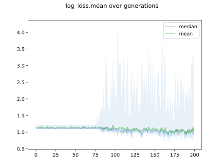

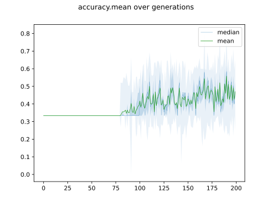

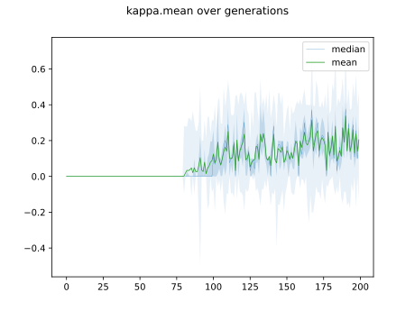

## Individuals in hall of fame

### Individual 17751

| key                    |      value |
|:-----------------------|-----------:|
| mean log_loss:         |   0.862162 |
| mean accuracy:         |   0.581733 |
| mean kappa:            |   0.3726   |
| number of edges        |  40        |
| number of hidden nodes |   8        |
| number of layers       |   5        |
| birth                  | 198        |

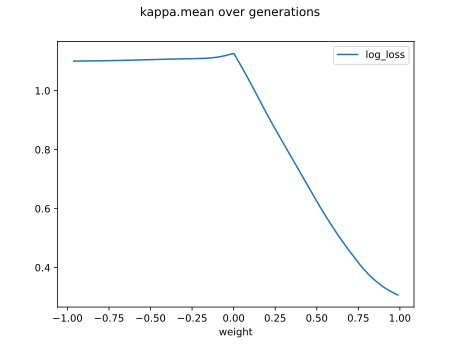

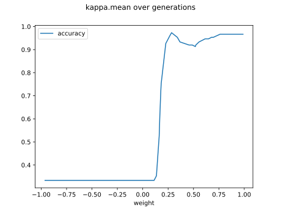

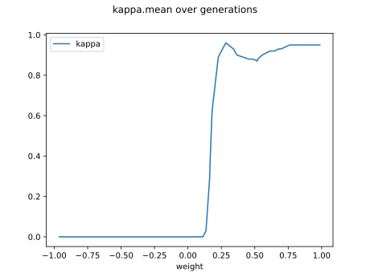

#### Network

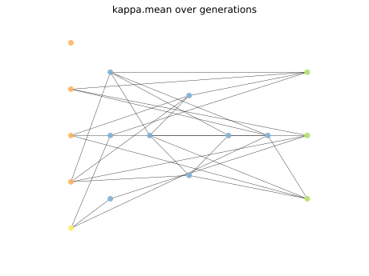

### Individual 11586

| key                    |      value |
|:-----------------------|-----------:|
| mean log_loss:         |   1.17062  |
| mean accuracy:         |   0.576733 |
| mean kappa:            |   0.3651   |
| number of edges        |  15        |
| number of hidden nodes |   0        |
| number of layers       |   0        |
| birth                  | 129        |

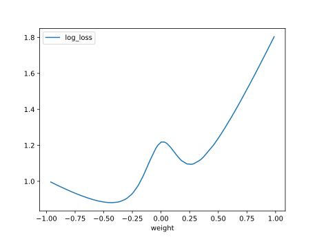

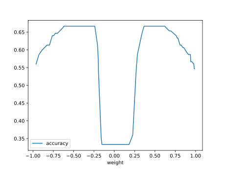

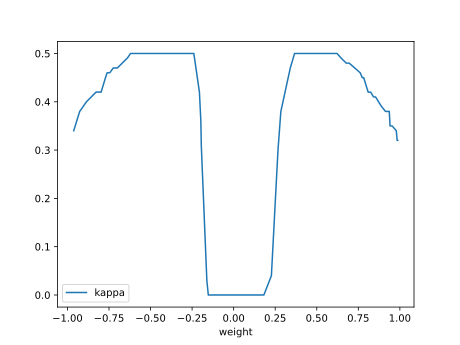

#### Network

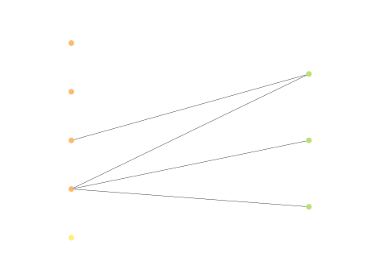

### Individual 10045

| key                    |      value |
|:-----------------------|-----------:|
| mean log_loss:         |   1.17062  |
| mean accuracy:         |   0.576733 |
| mean kappa:            |   0.3651   |
| number of edges        |  15        |
| number of hidden nodes |   0        |
| number of layers       |   0        |
| birth                  | 112        |

#### Network

### Individual 17163

| key                    |      value |
|:-----------------------|-----------:|
| mean log_loss:         |   0.867801 |
| mean accuracy:         |   0.549667 |
| mean kappa:            |   0.3245   |
| number of edges        |  37        |
| number of hidden nodes |   7        |
| number of layers       |   5        |
| birth                  | 191        |

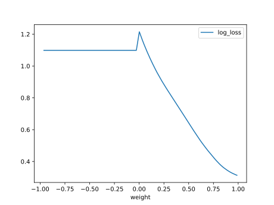

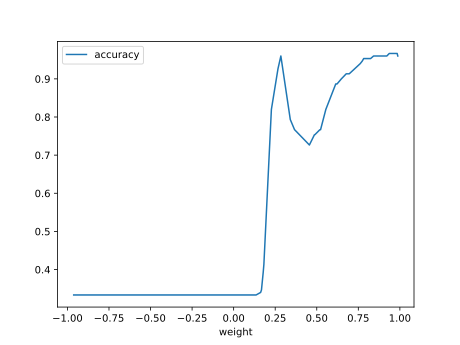

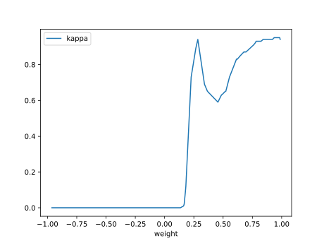

#### Network

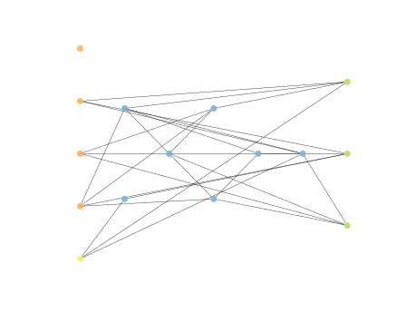

### Individual 17092

| key                    |      value |
|:-----------------------|-----------:|
| mean log_loss:         |   0.866214 |
| mean accuracy:         |   0.5646   |
| mean kappa:            |   0.3469   |
| number of edges        |  37        |
| number of hidden nodes |   7        |
| number of layers       |   5        |
| birth                  | 190        |

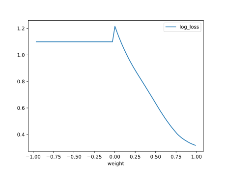

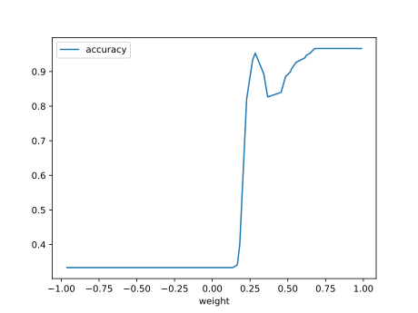

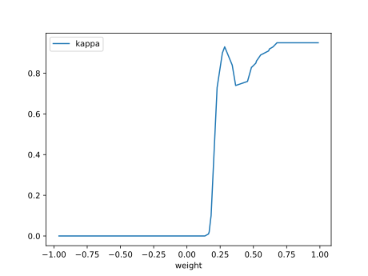

#### Network

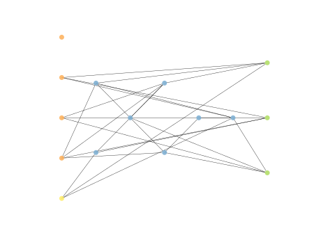

### Individual 14177

| key                    |      value |
|:-----------------------|-----------:|
| mean log_loss:         |   0.887992 |
| mean accuracy:         |   0.552    |
| mean kappa:            |   0.328    |
| number of edges        |  32        |
| number of hidden nodes |   6        |
| number of layers       |   2        |
| birth                  | 158        |

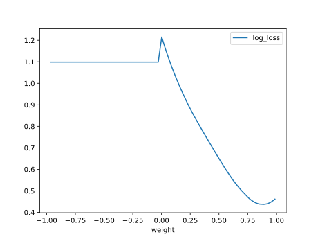

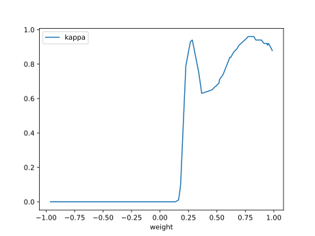

#### Network

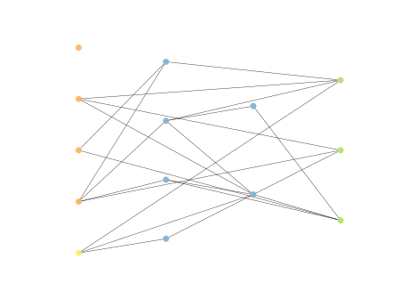

### Individual 14131

| key                    |      value |
|:-----------------------|-----------:|
| mean log_loss:         |   0.887356 |
| mean accuracy:         |   0.535    |
| mean kappa:            |   0.3025   |
| number of edges        |  31        |
| number of hidden nodes |   5        |
| number of layers       |   3        |
| birth                  | 158        |

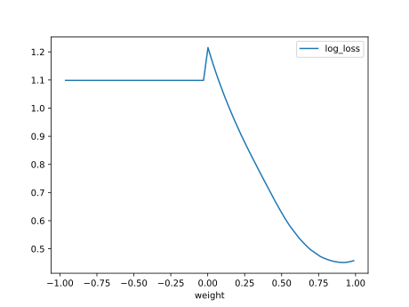

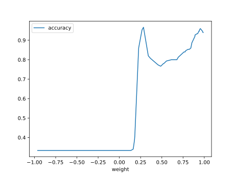

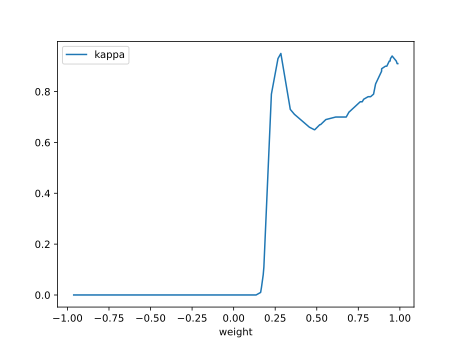

#### Network

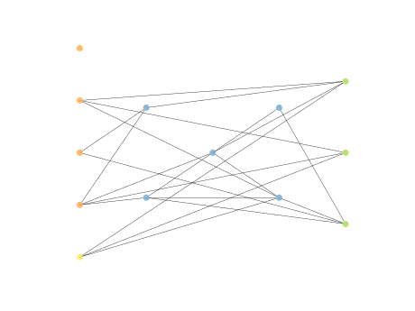

### Individual 11544

| key                    |      value |
|:-----------------------|-----------:|
| mean log_loss:         |   1.00302  |
| mean accuracy:         |   0.563667 |
| mean kappa:            |   0.3455   |
| number of edges        |  17        |
| number of hidden nodes |   1        |
| number of layers       |   1        |
| birth                  | 129        |

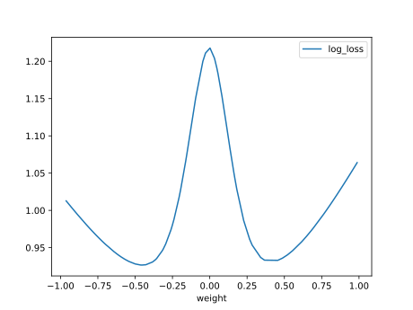

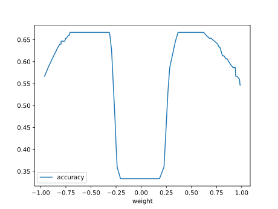

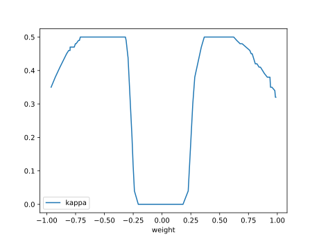

#### Network

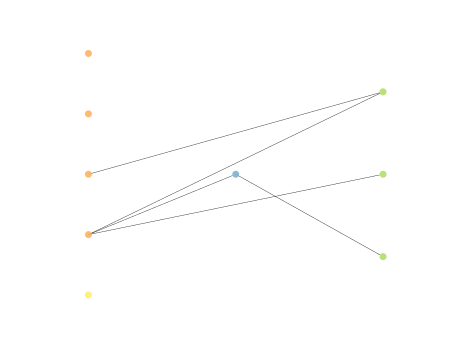

### Individual 15311

| key                    |      value |
|:-----------------------|-----------:|
| mean log_loss:         |   0.887992 |
| mean accuracy:         |   0.552    |
| mean kappa:            |   0.328    |
| number of edges        |  33        |
| number of hidden nodes |   6        |
| number of layers       |   2        |
| birth                  | 171        |

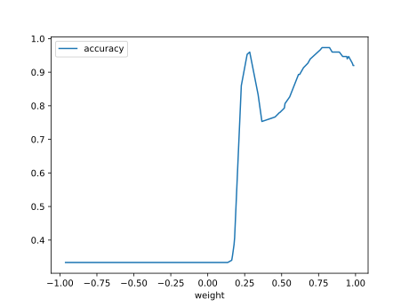

#### Network

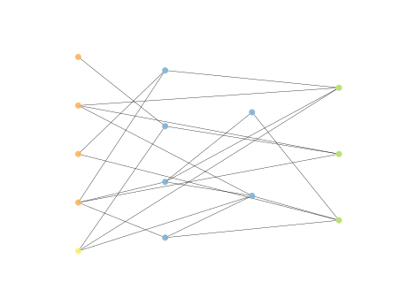

### Individual 17565

| key                    |      value |
|:-----------------------|-----------:|
| mean log_loss:         |   0.864862 |
| mean accuracy:         |   0.5668   |
| mean kappa:            |   0.3502   |
| number of edges        |  40        |
| number of hidden nodes |   8        |
| number of layers       |   5        |
| birth                  | 196        |

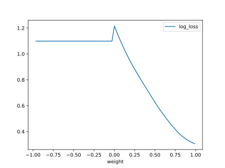

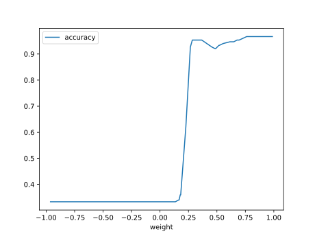

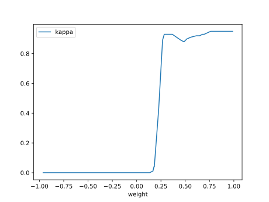

#### Network

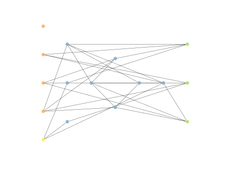

