# Report Iris Uniform Distribution [-1, 1] run 3

## Best results in hall of fame

| measure       |    value |   individual |
|:--------------|---------:|-------------:|
| mean accuracy | 0.8158   |        11299 |
| max accuracy  | 0.973333 |        14637 |
| mean kappa    | 0.7237   |        11299 |
| max kappa     | 0.96     |        14637 |

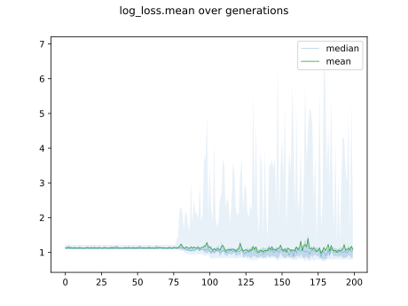

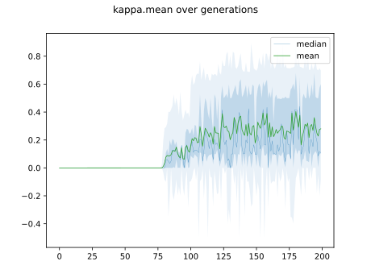

## Individuals in hall of fame

### Individual 14986

| key                    |      value |
|:-----------------------|-----------:|
| mean log_loss:         |   0.818435 |
| mean accuracy:         |   0.8108   |
| mean kappa:            |   0.7162   |
| number of edges        |  44        |
| number of hidden nodes |  11        |
| number of layers       |   9        |
| birth                  | 167        |

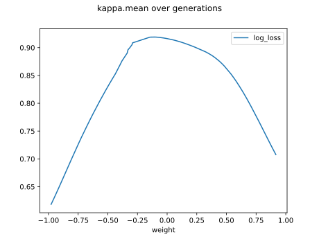

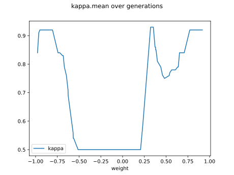

#### Network

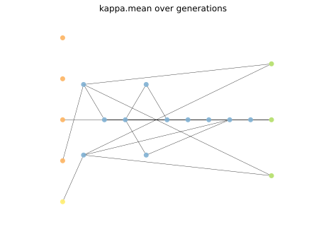

### Individual 14637

| key                    |      value |
|:-----------------------|-----------:|
| mean log_loss:         |   0.823825 |
| mean accuracy:         |   0.807067 |
| mean kappa:            |   0.7106   |
| number of edges        |  42        |
| number of hidden nodes |  10        |
| number of layers       |   7        |
| birth                  | 163        |

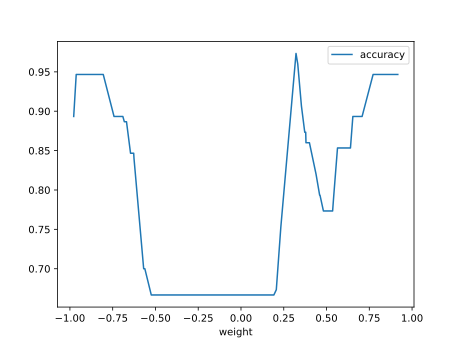

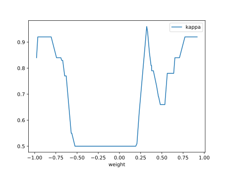

#### Network

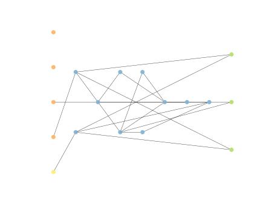

### Individual 11299

| key                    |      value |
|:-----------------------|-----------:|
| mean log_loss:         |   0.827548 |
| mean accuracy:         |   0.8158   |
| mean kappa:            |   0.7237   |
| number of edges        |  33        |
| number of hidden nodes |   6        |
| number of layers       |   5        |
| birth                  | 126        |

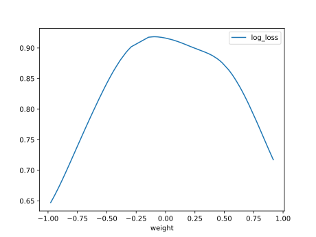

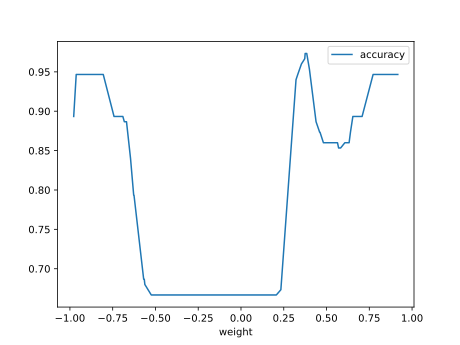

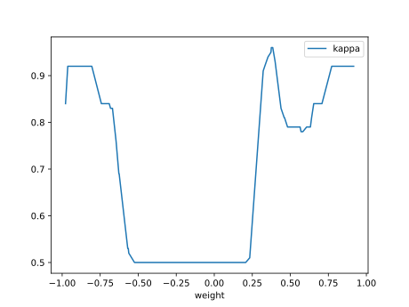

#### Network

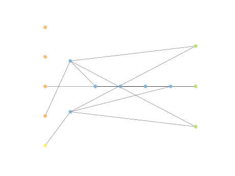

### Individual 11281

| key                    |      value |
|:-----------------------|-----------:|
| mean log_loss:         |   0.826374 |
| mean accuracy:         |   0.809067 |
| mean kappa:            |   0.7136   |
| number of edges        |  32        |
| number of hidden nodes |   6        |
| number of layers       |   5        |
| birth                  | 126        |

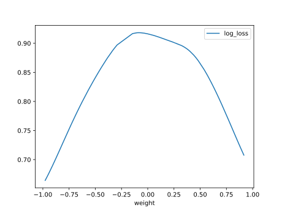

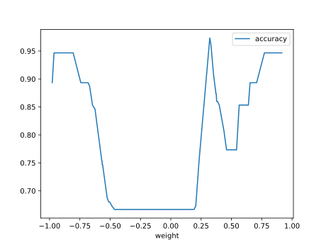

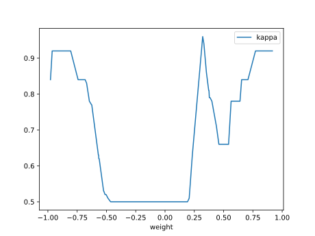

#### Network

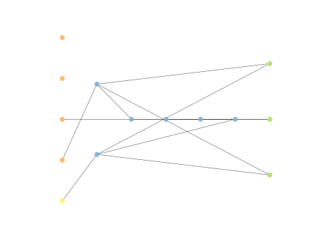

### Individual 14464

| key                    |      value |
|:-----------------------|-----------:|
| mean log_loss:         |   0.823804 |
| mean accuracy:         |   0.803467 |
| mean kappa:            |   0.7052   |
| number of edges        |  40        |
| number of hidden nodes |   9        |
| number of layers       |   7        |
| birth                  | 161        |

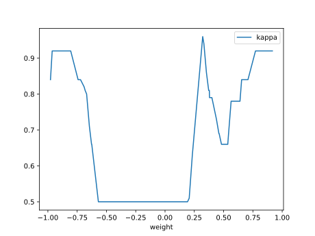

#### Network

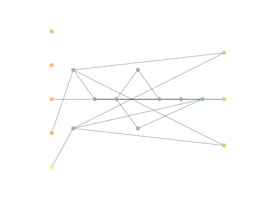

### Individual 11524

| key                    |      value |
|:-----------------------|-----------:|
| mean log_loss:         |   0.82559  |
| mean accuracy:         |   0.810733 |
| mean kappa:            |   0.7161   |
| number of edges        |  37        |
| number of hidden nodes |   8        |
| number of layers       |   7        |
| birth                  | 129        |

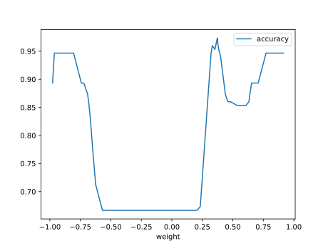

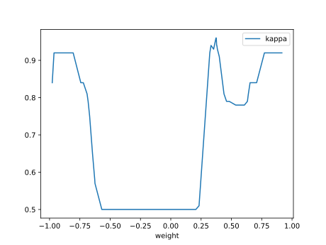

#### Network

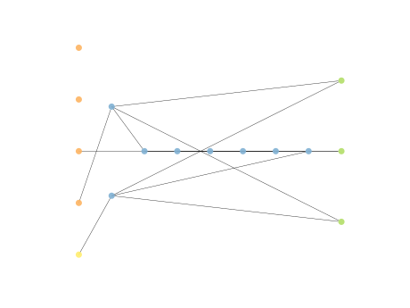

### Individual 11535

| key                    |      value |
|:-----------------------|-----------:|
| mean log_loss:         |   0.825717 |
| mean accuracy:         |   0.810933 |
| mean kappa:            |   0.7164   |
| number of edges        |  35        |
| number of hidden nodes |   7        |
| number of layers       |   6        |
| birth                  | 129        |

#### Network

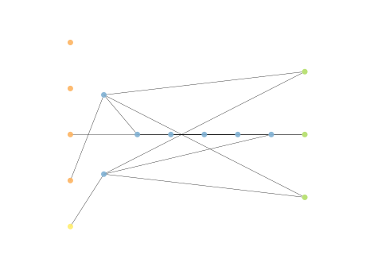

### Individual 13699

| key                    |      value |
|:-----------------------|-----------:|
| mean log_loss:         |   0.826411 |
| mean accuracy:         |   0.8148   |
| mean kappa:            |   0.7222   |
| number of edges        |  38        |
| number of hidden nodes |   8        |
| number of layers       |   7        |
| birth                  | 153        |

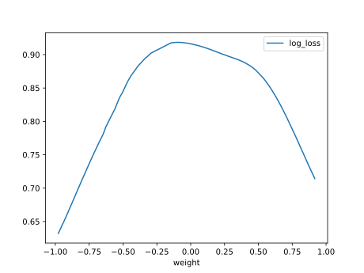

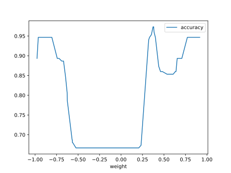

#### Network

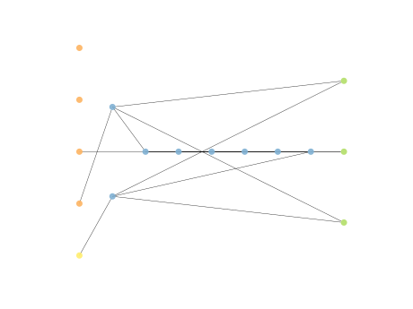

### Individual 13719

| key                    |      value |
|:-----------------------|-----------:|
| mean log_loss:         |   0.823759 |
| mean accuracy:         |   0.804467 |
| mean kappa:            |   0.7067   |
| number of edges        |  40        |
| number of hidden nodes |   9        |
| number of layers       |   7        |
| birth                  | 153        |

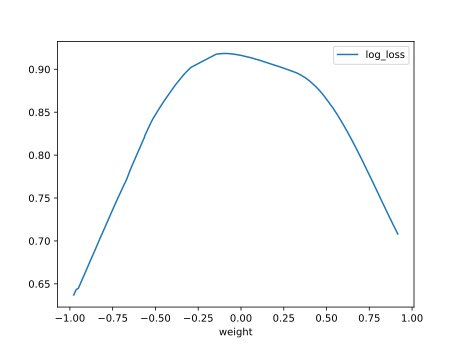

#### Network

### Individual 17324

| key                    |      value |
|:-----------------------|-----------:|
| mean log_loss:         |   0.822715 |
| mean accuracy:         |   0.800733 |
| mean kappa:            |   0.7011   |
| number of edges        |  42        |
| number of hidden nodes |  10        |
| number of layers       |   7        |
| birth                  | 193        |

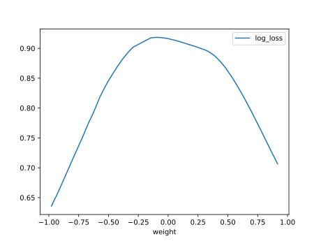

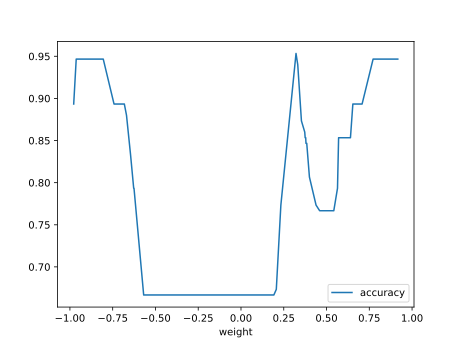

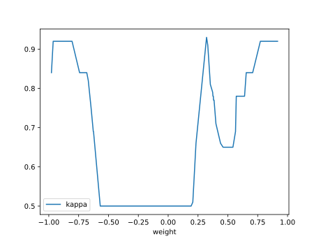

#### Network

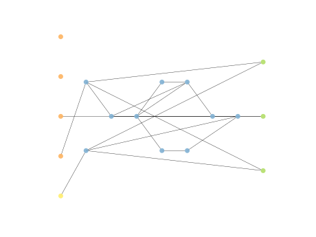

