# Report Iris Uniform Distribution [-1, 1] run 4

## Best results in hall of fame

| measure       |   value |   individual |
|:--------------|--------:|-------------:|
| mean accuracy |  0.7152 |        12615 |
| max accuracy  |  0.96   |        12615 |
| mean kappa    |  0.5728 |        12615 |
| max kappa     |  0.94   |        12615 |

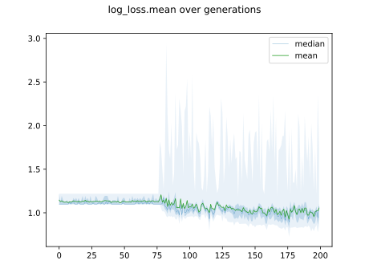

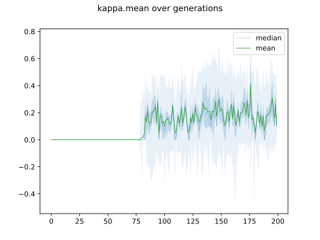

## Individuals in hall of fame

### Individual 12615

| key                    |      value |
|:-----------------------|-----------:|
| mean log_loss:         |   0.855624 |
| mean accuracy:         |   0.7152   |
| mean kappa:            |   0.5728   |
| number of edges        |  30        |
| number of hidden nodes |   6        |
| number of layers       |   2        |
| birth                  | 141        |

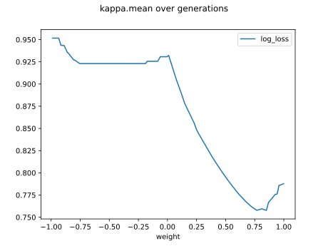

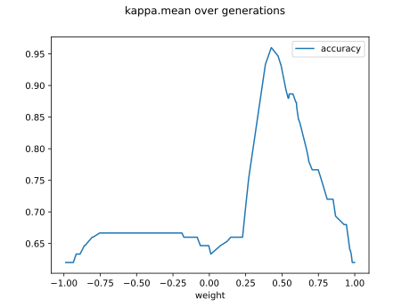

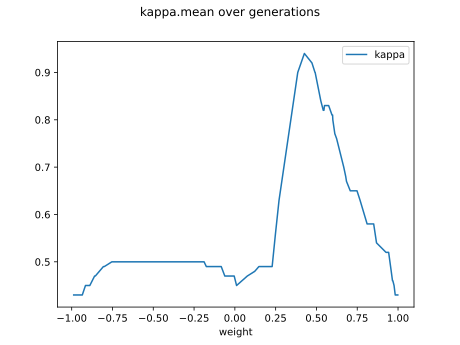

#### Network

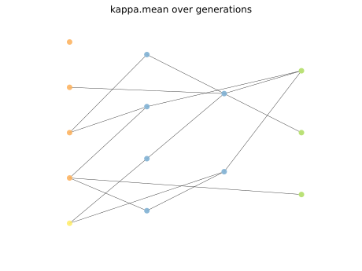

### Individual 13280

| key                    |      value |
|:-----------------------|-----------:|
| mean log_loss:         |   0.860302 |
| mean accuracy:         |   0.7048   |
| mean kappa:            |   0.5572   |
| number of edges        |  28        |
| number of hidden nodes |   5        |
| number of layers       |   2        |
| birth                  | 148        |

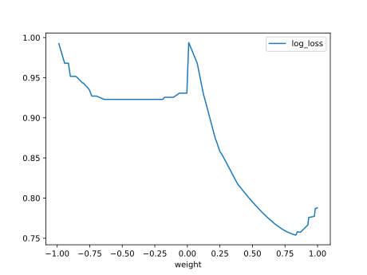

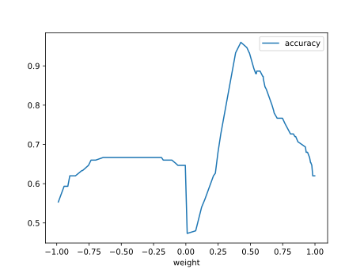

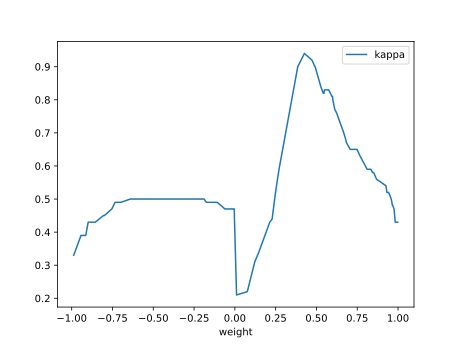

#### Network

### Individual 12210

| key                    |      value |
|:-----------------------|-----------:|
| mean log_loss:         |   0.889478 |
| mean accuracy:         |   0.663867 |
| mean kappa:            |   0.4958   |
| number of edges        |  28        |
| number of hidden nodes |   5        |
| number of layers       |   2        |
| birth                  | 136        |

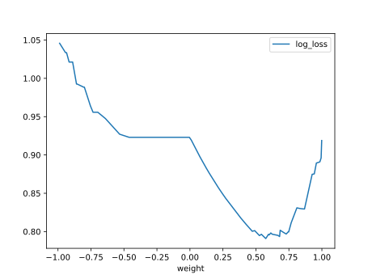

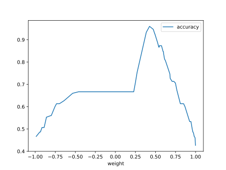

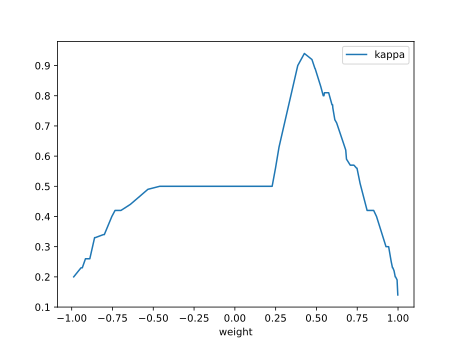

#### Network

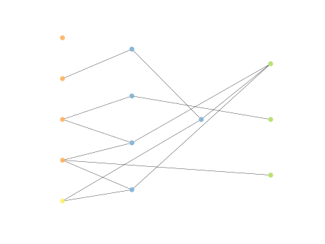

### Individual 12487

| key                    |      value |
|:-----------------------|-----------:|
| mean log_loss:         |   0.863136 |
| mean accuracy:         |   0.697067 |
| mean kappa:            |   0.5456   |
| number of edges        |  28        |
| number of hidden nodes |   5        |
| number of layers       |   2        |
| birth                  | 139        |

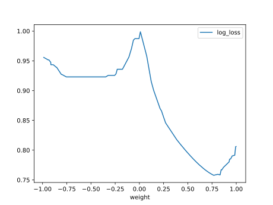

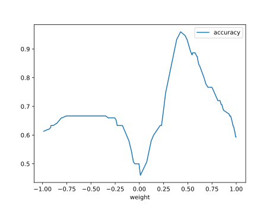

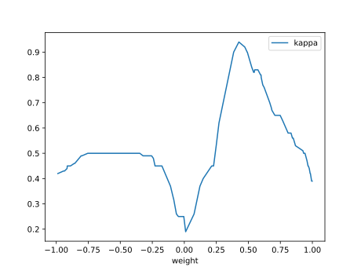

#### Network

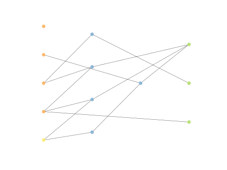

### Individual 12586

| key                    |      value |
|:-----------------------|-----------:|
| mean log_loss:         |   0.860302 |
| mean accuracy:         |   0.7048   |
| mean kappa:            |   0.5572   |
| number of edges        |  28        |
| number of hidden nodes |   5        |
| number of layers       |   2        |
| birth                  | 140        |

#### Network

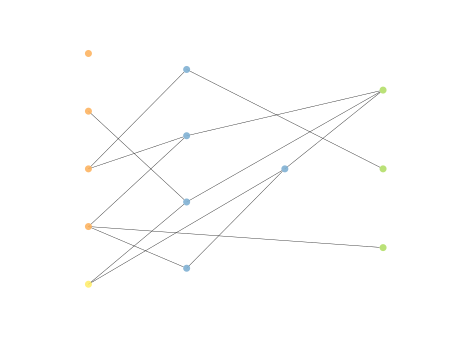

### Individual 11920

| key                    |      value |
|:-----------------------|-----------:|
| mean log_loss:         |   0.870974 |
| mean accuracy:         |   0.6776   |
| mean kappa:            |   0.5164   |
| number of edges        |  28        |
| number of hidden nodes |   5        |
| number of layers       |   2        |
| birth                  | 133        |

#### Network

### Individual 12232

| key                    |      value |
|:-----------------------|-----------:|
| mean log_loss:         |   0.893365 |
| mean accuracy:         |   0.653667 |
| mean kappa:            |   0.4805   |
| number of edges        |  29        |
| number of hidden nodes |   5        |
| number of layers       |   2        |
| birth                  | 136        |

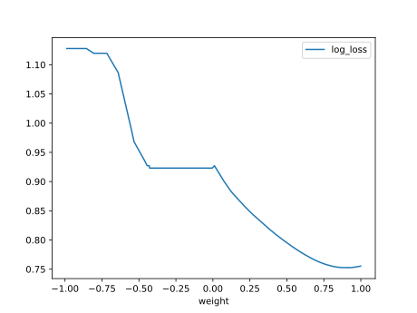

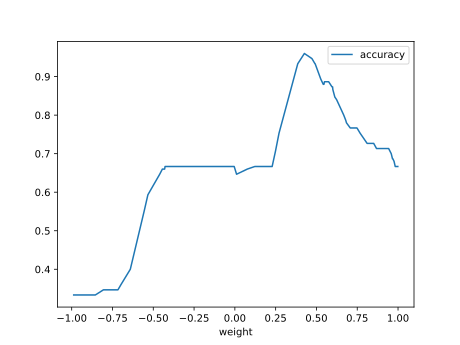

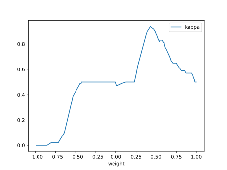

#### Network

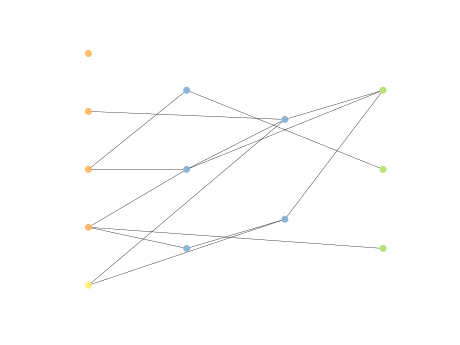

### Individual 11769

| key                    |      value |
|:-----------------------|-----------:|
| mean log_loss:         |   0.871025 |
| mean accuracy:         |   0.677467 |
| mean kappa:            |   0.5162   |
| number of edges        |  26        |
| number of hidden nodes |   4        |
| number of layers       |   1        |
| birth                  | 131        |

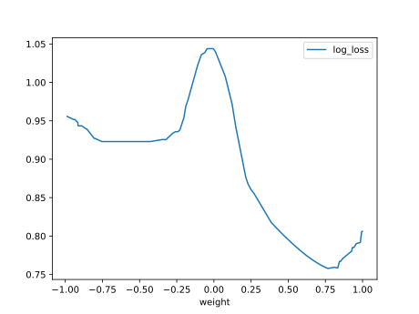

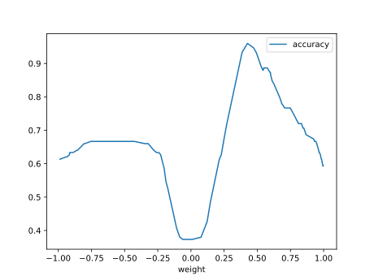

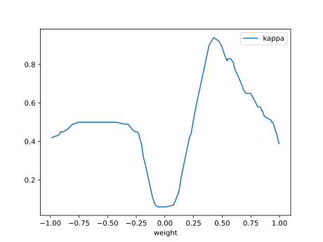

#### Network

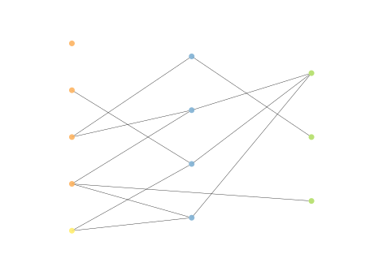

### Individual 12292

| key                    |      value |
|:-----------------------|-----------:|
| mean log_loss:         |   0.893262 |
| mean accuracy:         |   0.653933 |
| mean kappa:            |   0.4809   |
| number of edges        |  29        |
| number of hidden nodes |   5        |
| number of layers       |   2        |
| birth                  | 137        |

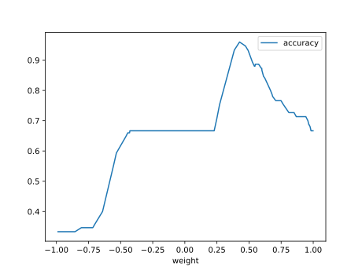

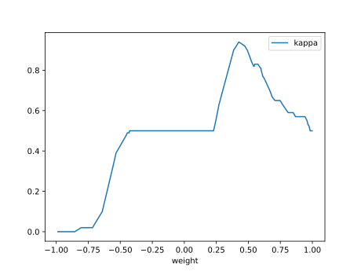

#### Network

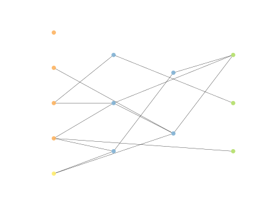

### Individual 12182

| key                    |      value |
|:-----------------------|-----------:|
| mean log_loss:         |   0.895636 |
| mean accuracy:         |   0.647867 |
| mean kappa:            |   0.4718   |
| number of edges        |  27        |
| number of hidden nodes |   4        |
| number of layers       |   2        |
| birth                  | 136        |

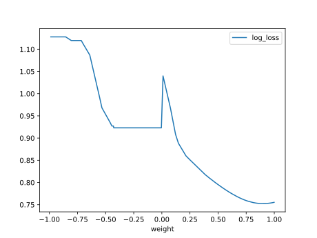

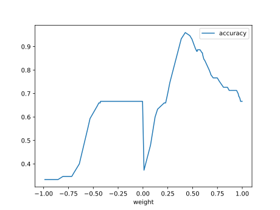

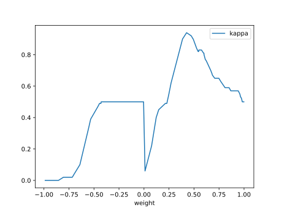

#### Network

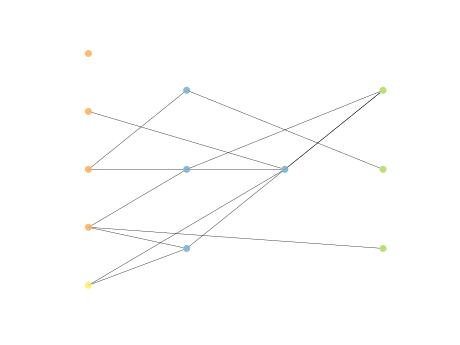

