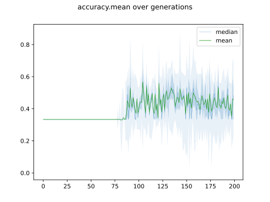
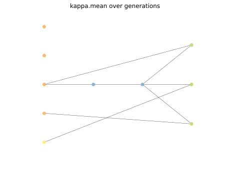
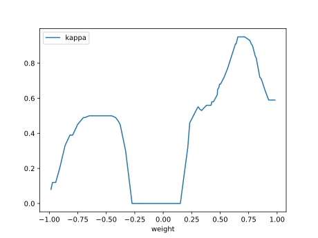

# Report Iris Uniform Distribution [-1, 1] run 5

## Best results in hall of fame

| measure       |    value |   individual |
|:--------------|---------:|-------------:|
| mean accuracy | 0.679067 |        12860 |
| max accuracy  | 0.966667 |        12860 |
| mean kappa    | 0.5186   |        12860 |
| max kappa     | 0.95     |        12860 |

## Individuals in hall of fame

### Individual 12860

| key                    |      value |
|:-----------------------|-----------:|
| mean log_loss:         |   1.02016  |
| mean accuracy:         |   0.679067 |
| mean kappa:            |   0.5186   |
| number of edges        |  21        |
| number of hidden nodes |   2        |
| number of layers       |   2        |
| birth                  | 143        |

#### Network

### Individual 12661

| key                    |      value |
|:-----------------------|-----------:|
| mean log_loss:         |   0.914027 |
| mean accuracy:         |   0.647067 |
| mean kappa:            |   0.4706   |
| number of edges        |  27        |
| number of hidden nodes |   5        |
| number of layers       |   4        |
| birth                  | 141        |

#### Network

### Individual 12485

| key                    |    value |
|:-----------------------|---------:|
| mean log_loss:         |   1.0576 |
| mean accuracy:         |   0.6128 |
| mean kappa:            |   0.4192 |
| number of edges        |  21      |
| number of hidden nodes |   2      |
| number of layers       |   2      |
| birth                  | 139      |

#### Network

### Individual 14311

| key                    |      value |
|:-----------------------|-----------:|
| mean log_loss:         |   1.12997  |
| mean accuracy:         |   0.653667 |
| mean kappa:            |   0.4805   |
| number of edges        |  23        |
| number of hidden nodes |   2        |
| number of layers       |   2        |
| birth                  | 160        |

#### Network

### Individual 12953

| key                    |      value |
|:-----------------------|-----------:|
| mean log_loss:         |   1.01316  |
| mean accuracy:         |   0.647333 |
| mean kappa:            |   0.471    |
| number of edges        |  22        |
| number of hidden nodes |   2        |
| number of layers       |   2        |
| birth                  | 144        |

#### Network

### Individual 12875

| key                    |      value |
|:-----------------------|-----------:|
| mean log_loss:         |   1.01316  |
| mean accuracy:         |   0.647333 |
| mean kappa:            |   0.471    |
| number of edges        |  22        |
| number of hidden nodes |   2        |
| number of layers       |   2        |
| birth                  | 144        |

#### Network

### Individual 11575

| key                    |      value |
|:-----------------------|-----------:|
| mean log_loss:         |   0.921116 |
| mean accuracy:         |   0.641533 |
| mean kappa:            |   0.4623   |
| number of edges        |  22        |
| number of hidden nodes |   3        |
| number of layers       |   2        |
| birth                  | 129        |

#### Network

### Individual 12579

| key                    |      value |
|:-----------------------|-----------:|
| mean log_loss:         |   0.922294 |
| mean accuracy:         |   0.632467 |
| mean kappa:            |   0.4487   |
| number of edges        |  26        |
| number of hidden nodes |   5        |
| number of layers       |   4        |
| birth                  | 140        |

#### Network

### Individual 17199

| key                    |      value |
|:-----------------------|-----------:|
| mean log_loss:         |   0.921853 |
| mean accuracy:         |   0.625267 |
| mean kappa:            |   0.4379   |
| number of edges        |  43        |
| number of hidden nodes |   9        |
| number of layers       |   7        |
| birth                  | 192        |

#### Network

### Individual 12408

| key                    |      value |
|:-----------------------|-----------:|
| mean log_loss:         |   1.05464  |
| mean accuracy:         |   0.593133 |
| mean kappa:            |   0.3897   |
| number of edges        |  21        |
| number of hidden nodes |   2        |
| number of layers       |   2        |
| birth                  | 138        |

#### Network

