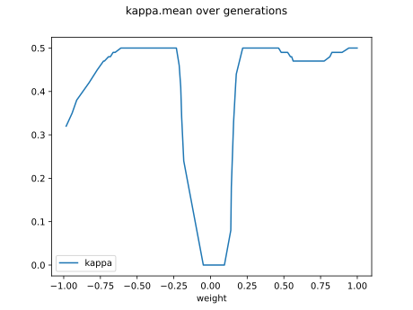

# Report Iris Uniform Distribution [-1, 1] run 6

## Best results in hall of fame

| measure       |    value |   individual |
|:--------------|---------:|-------------:|
| mean accuracy | 0.599667 |        11683 |
| max accuracy  | 0.973333 |        17371 |
| mean kappa    | 0.3995   |        11683 |
| max kappa     | 0.96     |        17371 |

## Individuals in hall of fame

### Individual 11683

| key                    |      value |
|:-----------------------|-----------:|
| mean log_loss:         |   1.14927  |
| mean accuracy:         |   0.599667 |
| mean kappa:            |   0.3995   |
| number of edges        |  18        |
| number of hidden nodes |   1        |
| number of layers       |   1        |
| birth                  | 130        |

#### Network

### Individual 13138

| key                    |     value |
|:-----------------------|----------:|
| mean log_loss:         |   1.00945 |
| mean accuracy:         |   0.5628  |
| mean kappa:            |   0.3442  |
| number of edges        |  28       |
| number of hidden nodes |   5       |
| number of layers       |   2       |
| birth                  | 146       |

#### Network

### Individual 14029

| key                    |      value |
|:-----------------------|-----------:|
| mean log_loss:         |   0.921328 |
| mean accuracy:         |   0.5784   |
| mean kappa:            |   0.3676   |
| number of edges        |  30        |
| number of hidden nodes |   5        |
| number of layers       |   4        |
| birth                  | 156        |

#### Network

### Individual 13963

| key                    |      value |
|:-----------------------|-----------:|
| mean log_loss:         |   0.921328 |
| mean accuracy:         |   0.5784   |
| mean kappa:            |   0.3676   |
| number of edges        |  30        |
| number of hidden nodes |   5        |
| number of layers       |   4        |
| birth                  | 156        |

#### Network

### Individual 17371

| key                    |      value |
|:-----------------------|-----------:|
| mean log_loss:         |   0.961546 |
| mean accuracy:         |   0.5486   |
| mean kappa:            |   0.3229   |
| number of edges        |  38        |
| number of hidden nodes |   8        |
| number of layers       |   5        |
| birth                  | 194        |

#### Network

### Individual 13729

| key                    |      value |
|:-----------------------|-----------:|
| mean log_loss:         |   0.945384 |
| mean accuracy:         |   0.561    |
| mean kappa:            |   0.3415   |
| number of edges        |  30        |
| number of hidden nodes |   5        |
| number of layers       |   4        |
| birth                  | 153        |

#### Network

### Individual 12395

| key                    |      value |
|:-----------------------|-----------:|
| mean log_loss:         |   0.956121 |
| mean accuracy:         |   0.564467 |
| mean kappa:            |   0.3467   |
| number of edges        |  20        |
| number of hidden nodes |   2        |
| number of layers       |   1        |
| birth                  | 138        |

#### Network

### Individual 10797

| key                    |      value |
|:-----------------------|-----------:|
| mean log_loss:         |   0.967235 |
| mean accuracy:         |   0.524733 |
| mean kappa:            |   0.2871   |
| number of edges        |  17        |
| number of hidden nodes |   1        |
| number of layers       |   1        |
| birth                  | 120        |

#### Network

### Individual 11452

| key                    |      value |
|:-----------------------|-----------:|
| mean log_loss:         |   0.956976 |
| mean accuracy:         |   0.573067 |
| mean kappa:            |   0.3596   |
| number of edges        |  20        |
| number of hidden nodes |   2        |
| number of layers       |   1        |
| birth                  | 128        |

#### Network

### Individual 13962

| key                    |      value |
|:-----------------------|-----------:|
| mean log_loss:         |   0.9429   |
| mean accuracy:         |   0.551733 |
| mean kappa:            |   0.3276   |
| number of edges        |  32        |
| number of hidden nodes |   6        |
| number of layers       |   4        |
| birth                  | 156        |

#### Network

