# Report Iris Uniform Distribution [-1, 1] run 7

## Best results in hall of fame

| measure       |    value |   individual |
|:--------------|---------:|-------------:|
| mean accuracy | 0.715933 |         8339 |
| max accuracy  | 0.96     |         8339 |
| mean kappa    | 0.5739   |         8339 |
| max kappa     | 0.94     |         8339 |

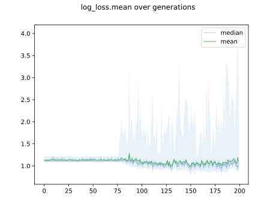

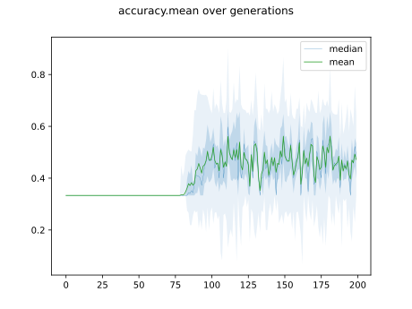

## Individuals in hall of fame

### Individual 8222

| key                    |     value |
|:-----------------------|----------:|
| mean log_loss:         |  1.01688  |
| mean accuracy:         |  0.713467 |
| mean kappa:            |  0.5702   |
| number of edges        | 20        |
| number of hidden nodes |  2        |
| number of layers       |  1        |
| birth                  | 92        |

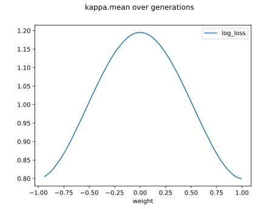

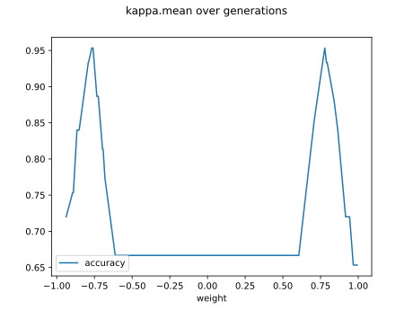

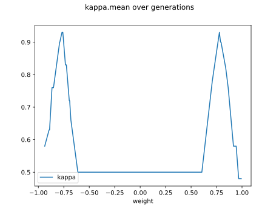

#### Network

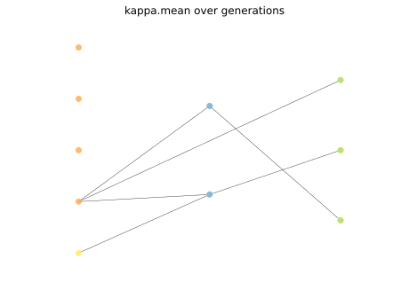

### Individual 8339

| key                    |     value |
|:-----------------------|----------:|
| mean log_loss:         |  1.01333  |
| mean accuracy:         |  0.715933 |
| mean kappa:            |  0.5739   |
| number of edges        | 20        |
| number of hidden nodes |  2        |
| number of layers       |  2        |
| birth                  | 93        |

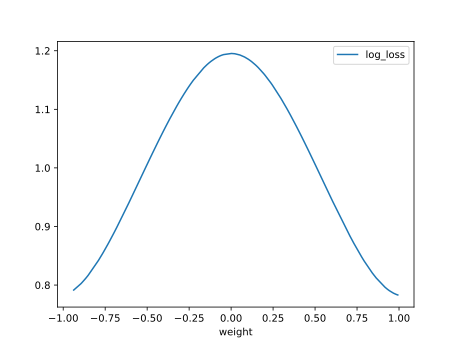

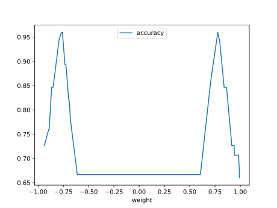

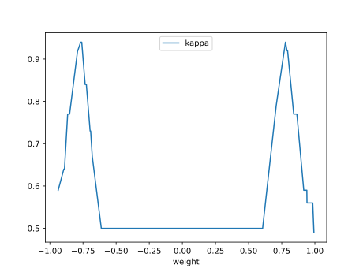

#### Network

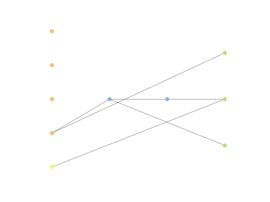

### Individual 8286

| key                    |     value |
|:-----------------------|----------:|
| mean log_loss:         |  1.01333  |
| mean accuracy:         |  0.715933 |
| mean kappa:            |  0.5739   |
| number of edges        | 20        |
| number of hidden nodes |  2        |
| number of layers       |  2        |
| birth                  | 93        |

#### Network

### Individual 8166

| key                    |     value |
|:-----------------------|----------:|
| mean log_loss:         |  1.01933  |
| mean accuracy:         |  0.709533 |
| mean kappa:            |  0.5643   |
| number of edges        | 19        |
| number of hidden nodes |  2        |
| number of layers       |  1        |
| birth                  | 91        |

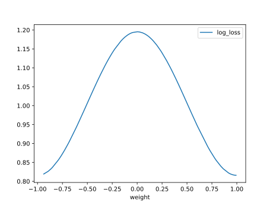

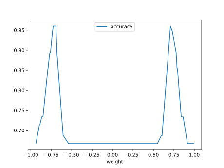

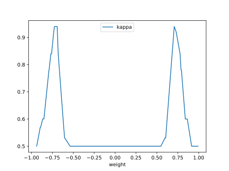

#### Network

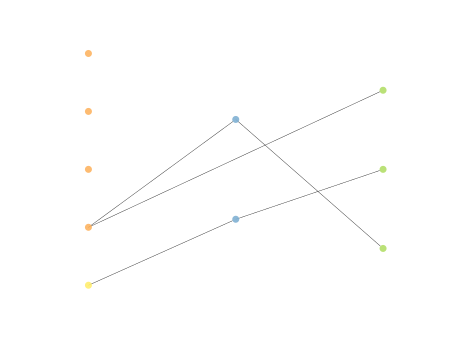

### Individual 8225

| key                    |     value |
|:-----------------------|----------:|
| mean log_loss:         |  1.01905  |
| mean accuracy:         |  0.680733 |
| mean kappa:            |  0.5211   |
| number of edges        | 21        |
| number of hidden nodes |  3        |
| number of layers       |  2        |
| birth                  | 92        |

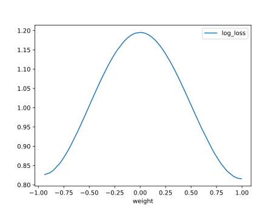

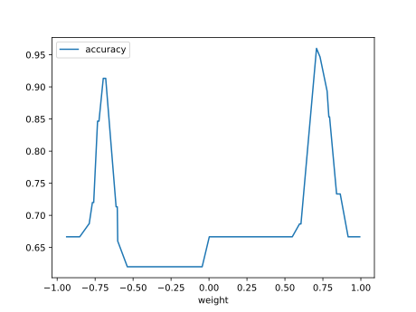

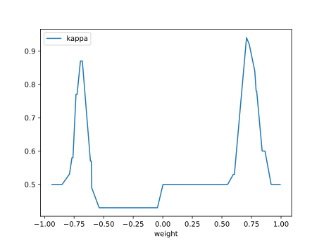

#### Network

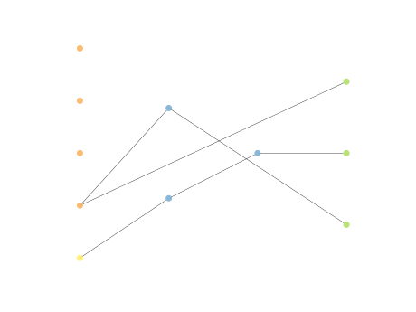

### Individual 8694

| key                    |     value |
|:-----------------------|----------:|
| mean log_loss:         |  1.02476  |
| mean accuracy:         |  0.664467 |
| mean kappa:            |  0.4967   |
| number of edges        | 19        |
| number of hidden nodes |  1        |
| number of layers       |  1        |
| birth                  | 97        |

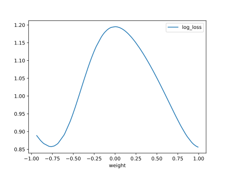

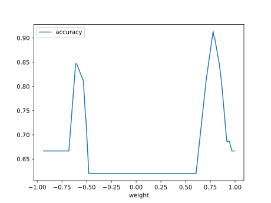

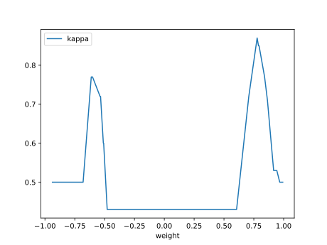

#### Network

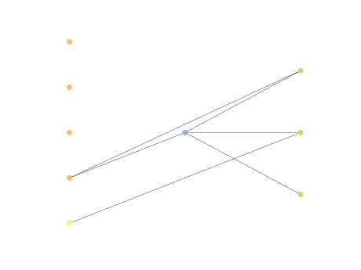

### Individual 8658

| key                    |     value |
|:-----------------------|----------:|
| mean log_loss:         |  1.02476  |
| mean accuracy:         |  0.664467 |
| mean kappa:            |  0.4967   |
| number of edges        | 19        |
| number of hidden nodes |  1        |
| number of layers       |  1        |
| birth                  | 97        |

#### Network

### Individual 16020

| key                    |      value |
|:-----------------------|-----------:|
| mean log_loss:         |   0.98459  |
| mean accuracy:         |   0.662733 |
| mean kappa:            |   0.4941   |
| number of edges        |  17        |
| number of hidden nodes |   1        |
| number of layers       |   1        |
| birth                  | 179        |

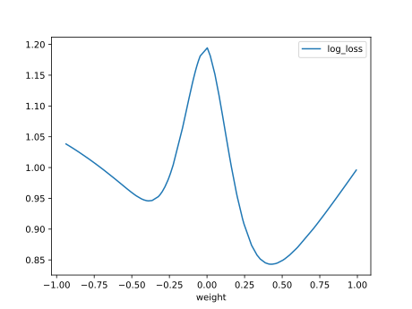

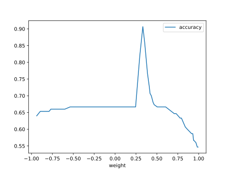

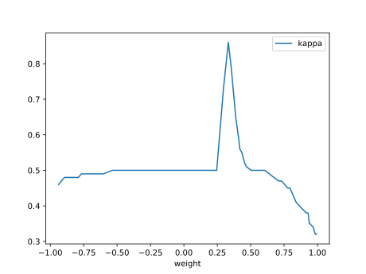

#### Network

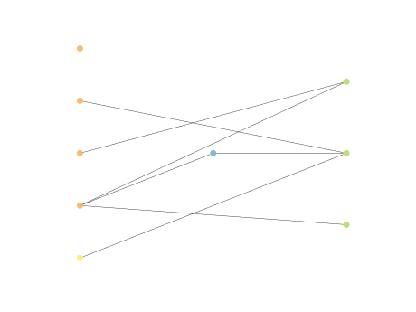

### Individual 16180

| key                    |      value |
|:-----------------------|-----------:|
| mean log_loss:         |   0.988502 |
| mean accuracy:         |   0.660933 |
| mean kappa:            |   0.4914   |
| number of edges        |  17        |
| number of hidden nodes |   1        |
| number of layers       |   1        |
| birth                  | 180        |

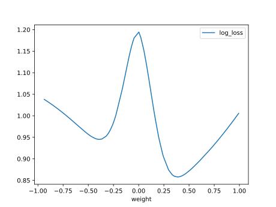

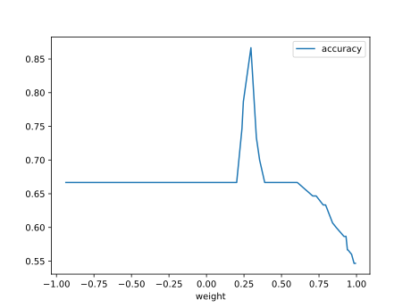

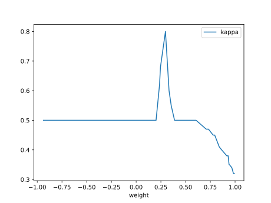

#### Network

### Individual 8723

| key                    |    value |
|:-----------------------|---------:|
| mean log_loss:         |  1.07315 |
| mean accuracy:         |  0.6584  |
| mean kappa:            |  0.4876  |
| number of edges        | 20       |
| number of hidden nodes |  2       |
| number of layers       |  2       |
| birth                  | 97       |

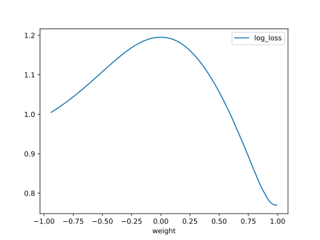

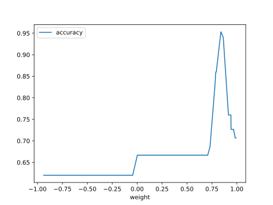

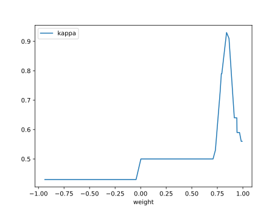

#### Network

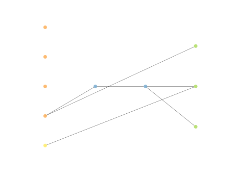

