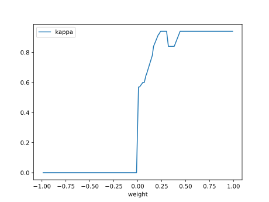

# Report Iris Uniform Distribution [-1, 1] run 8

## Best results in hall of fame

| measure       |    value |   individual |
|:--------------|---------:|-------------:|
| mean accuracy | 0.633333 |        11044 |
| max accuracy  | 0.96     |        16183 |
| mean kappa    | 0.45     |        11044 |
| max kappa     | 0.94     |        16183 |

## Individuals in hall of fame

### Individual 16183

| key                    |      value |
|:-----------------------|-----------:|
| mean log_loss:         |   0.88629  |
| mean accuracy:         |   0.632933 |
| mean kappa:            |   0.4494   |
| number of edges        |  39        |
| number of hidden nodes |   8        |
| number of layers       |   3        |
| birth                  | 180        |

#### Network

### Individual 11044

| key                    |      value |
|:-----------------------|-----------:|
| mean log_loss:         |   0.885376 |
| mean accuracy:         |   0.633333 |
| mean kappa:            |   0.45     |
| number of edges        |  37        |
| number of hidden nodes |   7        |
| number of layers       |   3        |
| birth                  | 123        |

#### Network

### Individual 16345

| key                    |      value |
|:-----------------------|-----------:|
| mean log_loss:         |   0.906001 |
| mean accuracy:         |   0.631467 |
| mean kappa:            |   0.4472   |
| number of edges        |  22        |
| number of hidden nodes |   3        |
| number of layers       |   1        |
| birth                  | 182        |

#### Network

### Individual 16979

| key                    |      value |
|:-----------------------|-----------:|
| mean log_loss:         |   0.906001 |
| mean accuracy:         |   0.631467 |
| mean kappa:            |   0.4472   |
| number of edges        |  22        |
| number of hidden nodes |   3        |
| number of layers       |   1        |
| birth                  | 189        |

#### Network

### Individual 15796

| key                    |      value |
|:-----------------------|-----------:|
| mean log_loss:         |   0.856054 |
| mean accuracy:         |   0.602867 |
| mean kappa:            |   0.4043   |
| number of edges        |  55        |
| number of hidden nodes |  13        |
| number of layers       |   9        |
| birth                  | 176        |

#### Network

### Individual 15391

| key                    |      value |
|:-----------------------|-----------:|
| mean log_loss:         |   0.882387 |
| mean accuracy:         |   0.6284   |
| mean kappa:            |   0.4426   |
| number of edges        |  42        |
| number of hidden nodes |  10        |
| number of layers       |   5        |
| birth                  | 172        |

#### Network

### Individual 15764

| key                    |      value |
|:-----------------------|-----------:|
| mean log_loss:         |   0.854547 |
| mean accuracy:         |   0.605533 |
| mean kappa:            |   0.4083   |
| number of edges        |  58        |
| number of hidden nodes |  14        |
| number of layers       |   9        |
| birth                  | 176        |

#### Network

### Individual 15542

| key                    |      value |
|:-----------------------|-----------:|
| mean log_loss:         |   0.857514 |
| mean accuracy:         |   0.608933 |
| mean kappa:            |   0.4134   |
| number of edges        |  57        |
| number of hidden nodes |  14        |
| number of layers       |   9        |
| birth                  | 173        |

#### Network

### Individual 16973

| key                    |      value |
|:-----------------------|-----------:|
| mean log_loss:         |   0.864588 |
| mean accuracy:         |   0.615533 |
| mean kappa:            |   0.4233   |
| number of edges        |  45        |
| number of hidden nodes |  10        |
| number of layers       |   6        |
| birth                  | 189        |

#### Network

### Individual 15485

| key                    |      value |
|:-----------------------|-----------:|
| mean log_loss:         |   0.857755 |
| mean accuracy:         |   0.602867 |
| mean kappa:            |   0.4043   |
| number of edges        |  55        |
| number of hidden nodes |  13        |
| number of layers       |   9        |
| birth                  | 173        |

#### Network

