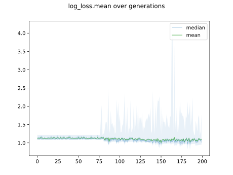
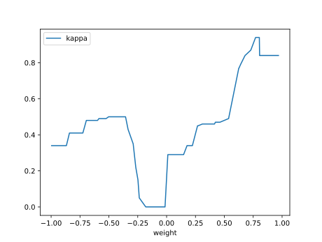
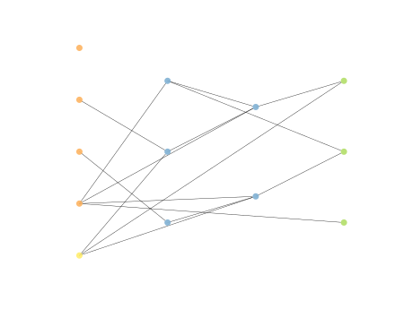

# Report Iris Uniform Distribution [-1, 1] run 9

## Best results in hall of fame

| measure       |    value |   individual |
|:--------------|---------:|-------------:|
| mean accuracy | 0.650467 |        14291 |
| max accuracy  | 0.96     |        13447 |
| mean kappa    | 0.4757   |        14291 |
| max kappa     | 0.94     |        13447 |

## Individuals in hall of fame

### Individual 13409

| key                    |     value |
|:-----------------------|----------:|
| mean log_loss:         |   1.00508 |
| mean accuracy:         |   0.6404  |
| mean kappa:            |   0.4606  |
| number of edges        |  30       |
| number of hidden nodes |   6       |
| number of layers       |   3       |
| birth                  | 149       |

#### Network

### Individual 14291

| key                    |      value |
|:-----------------------|-----------:|
| mean log_loss:         |   1.00911  |
| mean accuracy:         |   0.650467 |
| mean kappa:            |   0.4757   |
| number of edges        |  27        |
| number of hidden nodes |   4        |
| number of layers       |   2        |
| birth                  | 159        |

#### Network

### Individual 13447

| key                    |      value |
|:-----------------------|-----------:|
| mean log_loss:         |   1.00921  |
| mean accuracy:         |   0.646333 |
| mean kappa:            |   0.4695   |
| number of edges        |  27        |
| number of hidden nodes |   4        |
| number of layers       |   2        |
| birth                  | 150        |

#### Network

### Individual 13377

| key                    |      value |
|:-----------------------|-----------:|
| mean log_loss:         |   1.003    |
| mean accuracy:         |   0.635867 |
| mean kappa:            |   0.4538   |
| number of edges        |  27        |
| number of hidden nodes |   4        |
| number of layers       |   2        |
| birth                  | 149        |

#### Network

### Individual 13851

| key                    |      value |
|:-----------------------|-----------:|
| mean log_loss:         |   1.00302  |
| mean accuracy:         |   0.629933 |
| mean kappa:            |   0.4449   |
| number of edges        |  30        |
| number of hidden nodes |   5        |
| number of layers       |   2        |
| birth                  | 154        |

#### Network

### Individual 13426

| key                    |      value |
|:-----------------------|-----------:|
| mean log_loss:         |   1.00957  |
| mean accuracy:         |   0.640933 |
| mean kappa:            |   0.4614   |
| number of edges        |  26        |
| number of hidden nodes |   4        |
| number of layers       |   2        |
| birth                  | 150        |

#### Network

### Individual 13213

| key                    |     value |
|:-----------------------|----------:|
| mean log_loss:         |   1.00373 |
| mean accuracy:         |   0.6268  |
| mean kappa:            |   0.4402  |
| number of edges        |  26       |
| number of hidden nodes |   4       |
| number of layers       |   2       |
| birth                  | 147       |

#### Network

### Individual 13370

| key                    |      value |
|:-----------------------|-----------:|
| mean log_loss:         |   1.00594  |
| mean accuracy:         |   0.617667 |
| mean kappa:            |   0.4265   |
| number of edges        |  28        |
| number of hidden nodes |   5        |
| number of layers       |   2        |
| birth                  | 149        |

#### Network

### Individual 13149

| key                    |      value |
|:-----------------------|-----------:|
| mean log_loss:         |   1.00416  |
| mean accuracy:         |   0.621267 |
| mean kappa:            |   0.4319   |
| number of edges        |  28        |
| number of hidden nodes |   5        |
| number of layers       |   2        |
| birth                  | 147        |

#### Network

### Individual 14214

| key                    |     value |
|:-----------------------|----------:|
| mean log_loss:         |   1.00037 |
| mean accuracy:         |   0.6384  |
| mean kappa:            |   0.4576  |
| number of edges        |  29       |
| number of hidden nodes |   5       |
| number of layers       |   3       |
| birth                  | 158       |

#### Network

