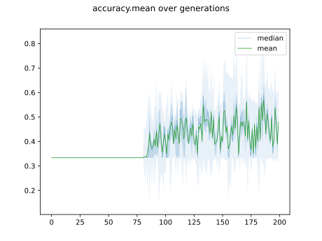
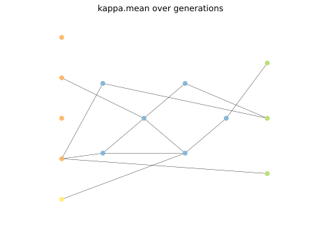
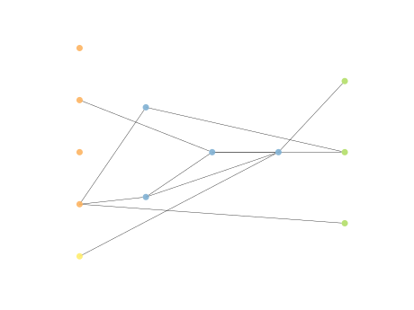

# Report Iris Uniform Distribution [-2, 2] run 0

## Best results in hall of fame

| measure       |    value |   individual |
|:--------------|---------:|-------------:|
| mean accuracy | 0.633333 |        13720 |
| max accuracy  | 0.966667 |        12090 |
| mean kappa    | 0.45     |        13720 |
| max kappa     | 0.95     |        12090 |

## Individuals in hall of fame

### Individual 12090

| key                    |      value |
|:-----------------------|-----------:|
| mean log_loss:         |   0.925658 |
| mean accuracy:         |   0.626867 |
| mean kappa:            |   0.4403   |
| number of edges        |  31        |
| number of hidden nodes |   6        |
| number of layers       |   4        |
| birth                  | 135        |

#### Network

### Individual 13720

| key                    |      value |
|:-----------------------|-----------:|
| mean log_loss:         |   0.929284 |
| mean accuracy:         |   0.633333 |
| mean kappa:            |   0.45     |
| number of edges        |  28        |
| number of hidden nodes |   5        |
| number of layers       |   2        |
| birth                  | 153        |

#### Network

### Individual 14237

| key                    |      value |
|:-----------------------|-----------:|
| mean log_loss:         |   0.929284 |
| mean accuracy:         |   0.633333 |
| mean kappa:            |   0.45     |
| number of edges        |  30        |
| number of hidden nodes |   6        |
| number of layers       |   3        |
| birth                  | 159        |

#### Network

### Individual 14485

| key                    |      value |
|:-----------------------|-----------:|
| mean log_loss:         |   0.929284 |
| mean accuracy:         |   0.633333 |
| mean kappa:            |   0.45     |
| number of edges        |  30        |
| number of hidden nodes |   6        |
| number of layers       |   3        |
| birth                  | 161        |

#### Network

### Individual 14489

| key                    |      value |
|:-----------------------|-----------:|
| mean log_loss:         |   0.929896 |
| mean accuracy:         |   0.632267 |
| mean kappa:            |   0.4484   |
| number of edges        |  28        |
| number of hidden nodes |   5        |
| number of layers       |   2        |
| birth                  | 161        |

#### Network

### Individual 13828

| key                    |      value |
|:-----------------------|-----------:|
| mean log_loss:         |   0.903925 |
| mean accuracy:         |   0.565467 |
| mean kappa:            |   0.3482   |
| number of edges        |  32        |
| number of hidden nodes |   6        |
| number of layers       |   3        |
| birth                  | 154        |

#### Network

### Individual 17961

| key                    |      value |
|:-----------------------|-----------:|
| mean log_loss:         |   0.906493 |
| mean accuracy:         |   0.529067 |
| mean kappa:            |   0.2936   |
| number of edges        |  36        |
| number of hidden nodes |   7        |
| number of layers       |   3        |
| birth                  | 200        |

#### Network

### Individual 11950

| key                    |      value |
|:-----------------------|-----------:|
| mean log_loss:         |   0.966838 |
| mean accuracy:         |   0.5456   |
| mean kappa:            |   0.3184   |
| number of edges        |  27        |
| number of hidden nodes |   4        |
| number of layers       |   3        |
| birth                  | 133        |

#### Network

### Individual 12240

| key                    |      value |
|:-----------------------|-----------:|
| mean log_loss:         |   0.958531 |
| mean accuracy:         |   0.515333 |
| mean kappa:            |   0.273    |
| number of edges        |  31        |
| number of hidden nodes |   6        |
| number of layers       |   3        |
| birth                  | 137        |

#### Network

### Individual 12276

| key                    |      value |
|:-----------------------|-----------:|
| mean log_loss:         |   0.958531 |
| mean accuracy:         |   0.515333 |
| mean kappa:            |   0.273    |
| number of edges        |  30        |
| number of hidden nodes |   5        |
| number of layers       |   3        |
| birth                  | 137        |

#### Network

