# Report Iris Uniform Distribution [-2, 2] run 1

## Best results in hall of fame

| measure       |    value |   individual |
|:--------------|---------:|-------------:|
| mean accuracy | 0.710133 |        14667 |
| max accuracy  | 0.713333 |        14667 |
| mean kappa    | 0.5652   |        14667 |
| max kappa     | 0.57     |        14667 |

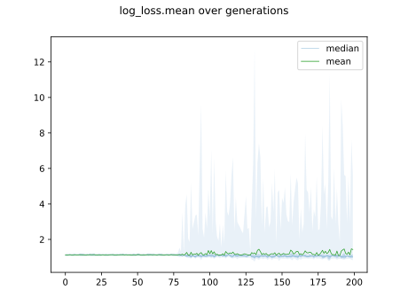

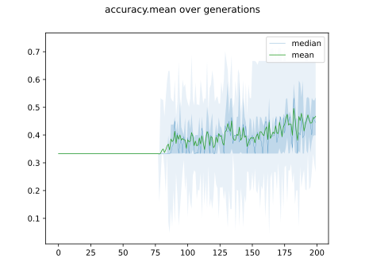

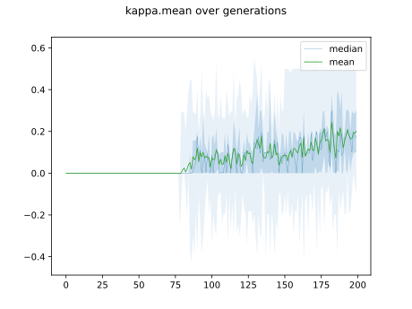

## Individuals in hall of fame

### Individual 14667

| key                    |      value |
|:-----------------------|-----------:|
| mean log_loss:         |   1.03641  |
| mean accuracy:         |   0.710133 |
| mean kappa:            |   0.5652   |
| number of edges        |  15        |
| number of hidden nodes |   0        |
| number of layers       |   0        |
| birth                  | 163        |

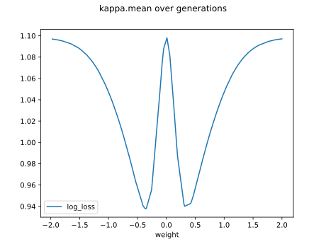

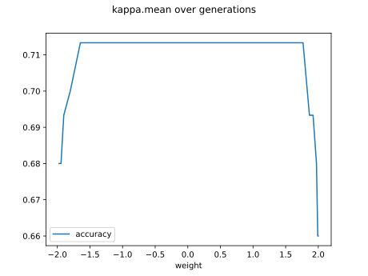

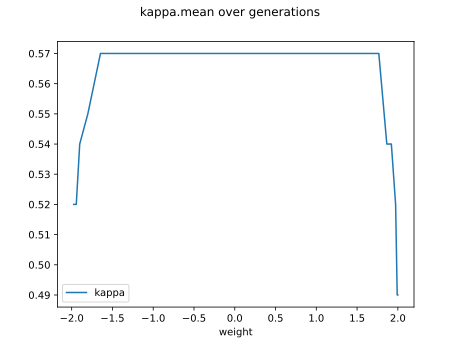

#### Network

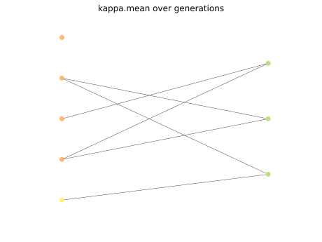

### Individual 14776

| key                    |      value |
|:-----------------------|-----------:|
| mean log_loss:         |   1.03641  |
| mean accuracy:         |   0.710133 |
| mean kappa:            |   0.5652   |
| number of edges        |  15        |
| number of hidden nodes |   0        |
| number of layers       |   0        |
| birth                  | 165        |

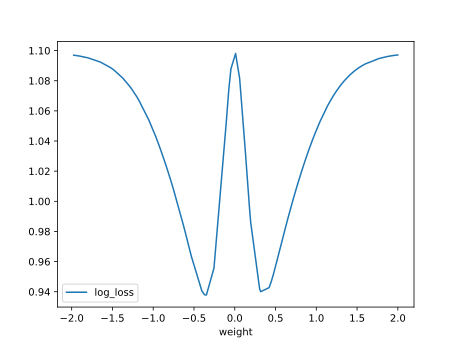

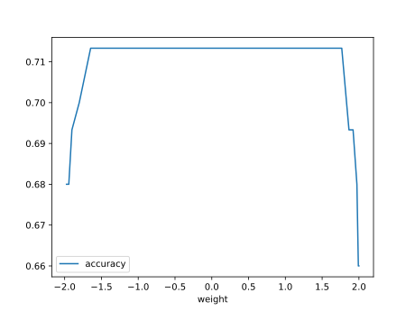

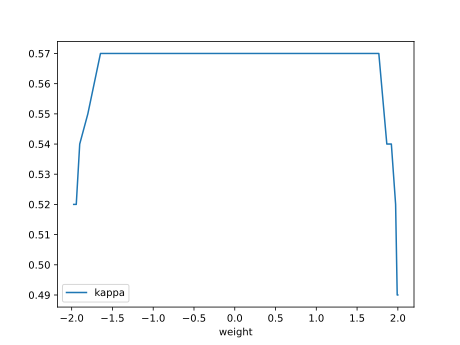

#### Network

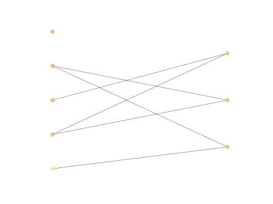

### Individual 15351

| key                    |      value |
|:-----------------------|-----------:|
| mean log_loss:         |   1.03641  |
| mean accuracy:         |   0.710133 |
| mean kappa:            |   0.5652   |
| number of edges        |  15        |
| number of hidden nodes |   0        |
| number of layers       |   0        |
| birth                  | 171        |

#### Network

### Individual 14020

| key                    |      value |
|:-----------------------|-----------:|
| mean log_loss:         |   1.03118  |
| mean accuracy:         |   0.666667 |
| mean kappa:            |   0.5      |
| number of edges        |  15        |
| number of hidden nodes |   0        |
| number of layers       |   0        |
| birth                  | 156        |

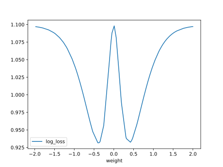

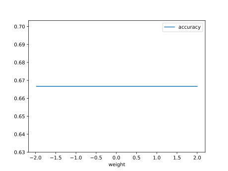

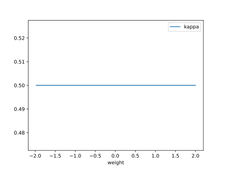

#### Network

### Individual 15730

| key                    |      value |
|:-----------------------|-----------:|
| mean log_loss:         |   1.03118  |
| mean accuracy:         |   0.666667 |
| mean kappa:            |   0.5      |
| number of edges        |  15        |
| number of hidden nodes |   0        |
| number of layers       |   0        |
| birth                  | 175        |

#### Network

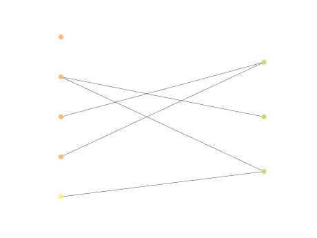

### Individual 14625

| key                    |      value |
|:-----------------------|-----------:|
| mean log_loss:         |   1.03703  |
| mean accuracy:         |   0.666667 |
| mean kappa:            |   0.5      |
| number of edges        |  15        |
| number of hidden nodes |   0        |
| number of layers       |   0        |
| birth                  | 163        |

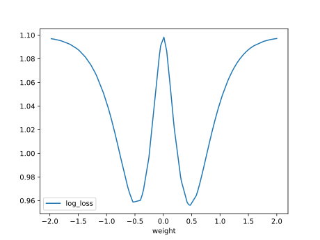

#### Network

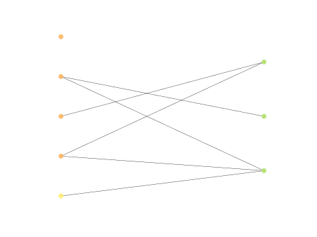

### Individual 14850

| key                    |      value |
|:-----------------------|-----------:|
| mean log_loss:         |   1.03703  |
| mean accuracy:         |   0.666667 |
| mean kappa:            |   0.5      |
| number of edges        |  15        |
| number of hidden nodes |   0        |
| number of layers       |   0        |
| birth                  | 166        |

#### Network

### Individual 16300

| key                    |      value |
|:-----------------------|-----------:|
| mean log_loss:         |   1.03375  |
| mean accuracy:         |   0.666667 |
| mean kappa:            |   0.5      |
| number of edges        |  17        |
| number of hidden nodes |   1        |
| number of layers       |   1        |
| birth                  | 182        |

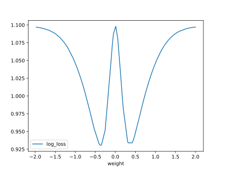

#### Network

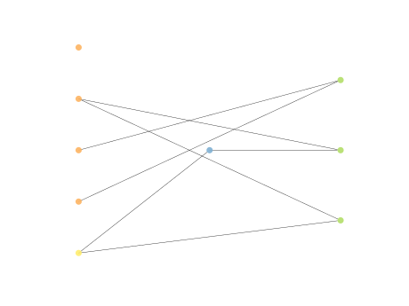

### Individual 16323

| key                    |     value |
|:-----------------------|----------:|
| mean log_loss:         |   1.04052 |
| mean accuracy:         |   0.6662  |
| mean kappa:            |   0.4993  |
| number of edges        |  15       |
| number of hidden nodes |   0       |
| number of layers       |   0       |
| birth                  | 182       |

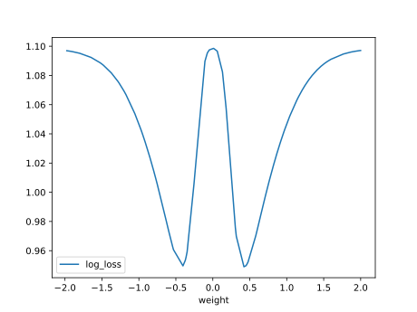

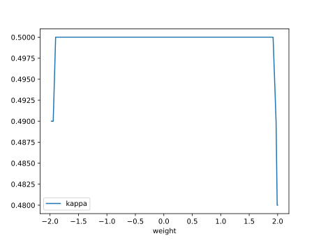

#### Network

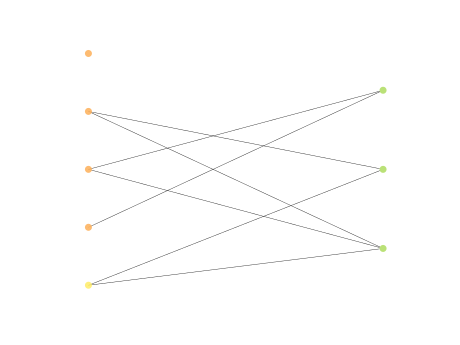

### Individual 16291

| key                    |     value |
|:-----------------------|----------:|
| mean log_loss:         |   1.06434 |
| mean accuracy:         |   0.6662  |
| mean kappa:            |   0.4993  |
| number of edges        |  15       |
| number of hidden nodes |   0       |
| number of layers       |   0       |
| birth                  | 182       |

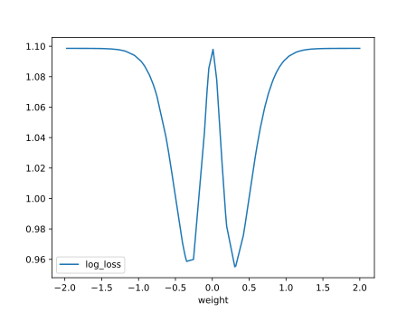

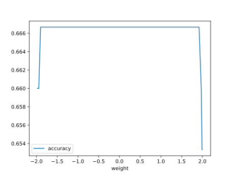

#### Network

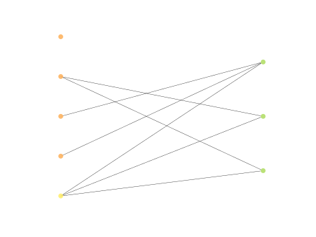

