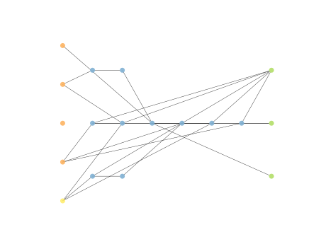
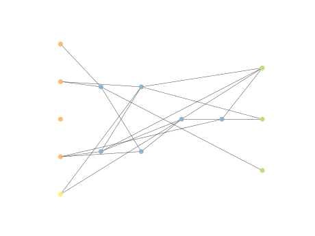

# Report Iris Uniform Distribution [-2, 2] run 2

## Best results in hall of fame

| measure       |    value |   individual |
|:--------------|---------:|-------------:|
| mean accuracy | 0.671267 |        17488 |
| max accuracy  | 0.96     |        16395 |
| mean kappa    | 0.5069   |        17488 |
| max kappa     | 0.94     |        16395 |

## Individuals in hall of fame

### Individual 17488

| key                    |      value |
|:-----------------------|-----------:|
| mean log_loss:         |   0.801014 |
| mean accuracy:         |   0.671267 |
| mean kappa:            |   0.5069   |
| number of edges        |  48        |
| number of hidden nodes |  10        |
| number of layers       |   6        |
| birth                  | 195        |

#### Network

### Individual 16395

| key                    |      value |
|:-----------------------|-----------:|
| mean log_loss:         |   0.819799 |
| mean accuracy:         |   0.648533 |
| mean kappa:            |   0.4728   |
| number of edges        |  47        |
| number of hidden nodes |  10        |
| number of layers       |   6        |
| birth                  | 183        |

#### Network

### Individual 15045

| key                    |      value |
|:-----------------------|-----------:|
| mean log_loss:         |   0.823521 |
| mean accuracy:         |   0.646067 |
| mean kappa:            |   0.4691   |
| number of edges        |  37        |
| number of hidden nodes |   6        |
| number of layers       |   4        |
| birth                  | 168        |

#### Network

### Individual 16474

| key                    |      value |
|:-----------------------|-----------:|
| mean log_loss:         |   0.819339 |
| mean accuracy:         |   0.648133 |
| mean kappa:            |   0.4722   |
| number of edges        |  48        |
| number of hidden nodes |  10        |
| number of layers       |   6        |
| birth                  | 184        |

#### Network

### Individual 15691

| key                    |     value |
|:-----------------------|----------:|
| mean log_loss:         |   0.81575 |
| mean accuracy:         |   0.6506  |
| mean kappa:            |   0.4759  |
| number of edges        |  42       |
| number of hidden nodes |   8       |
| number of layers       |   5       |
| birth                  | 175       |

#### Network

### Individual 15133

| key                    |      value |
|:-----------------------|-----------:|
| mean log_loss:         |   0.826013 |
| mean accuracy:         |   0.6432   |
| mean kappa:            |   0.4648   |
| number of edges        |  38        |
| number of hidden nodes |   6        |
| number of layers       |   4        |
| birth                  | 169        |

#### Network

### Individual 17959

| key                    |      value |
|:-----------------------|-----------:|
| mean log_loss:         |   0.78896  |
| mean accuracy:         |   0.667467 |
| mean kappa:            |   0.5012   |
| number of edges        |  50        |
| number of hidden nodes |  11        |
| number of layers       |   6        |
| birth                  | 200        |

#### Network

### Individual 16774

| key                    |      value |
|:-----------------------|-----------:|
| mean log_loss:         |   0.821721 |
| mean accuracy:         |   0.645    |
| mean kappa:            |   0.4675   |
| number of edges        |  48        |
| number of hidden nodes |  10        |
| number of layers       |   6        |
| birth                  | 187        |

#### Network

### Individual 16782

| key                    |      value |
|:-----------------------|-----------:|
| mean log_loss:         |   0.789103 |
| mean accuracy:         |   0.6668   |
| mean kappa:            |   0.5002   |
| number of edges        |  48        |
| number of hidden nodes |  10        |
| number of layers       |   6        |
| birth                  | 187        |

#### Network

### Individual 15825

| key                    |      value |
|:-----------------------|-----------:|
| mean log_loss:         |   0.815067 |
| mean accuracy:         |   0.651067 |
| mean kappa:            |   0.4766   |
| number of edges        |  42        |
| number of hidden nodes |   8        |
| number of layers       |   5        |
| birth                  | 176        |

#### Network

