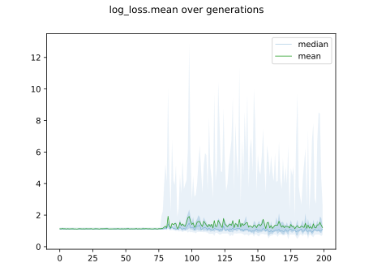
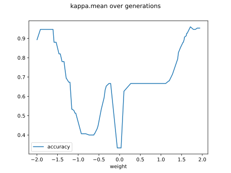
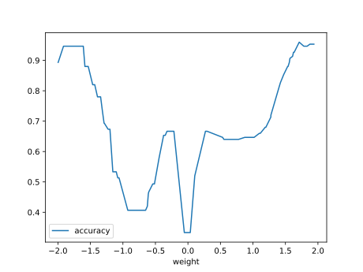

# Report Iris Uniform Distribution [-2, 2] run 3

## Best results in hall of fame

| measure       |    value |   individual |
|:--------------|---------:|-------------:|
| mean accuracy | 0.720333 |        17826 |
| max accuracy  | 0.96     |        16784 |
| mean kappa    | 0.5805   |        17826 |
| max kappa     | 0.94     |        16784 |

## Individuals in hall of fame

### Individual 16784

| key                    |      value |
|:-----------------------|-----------:|
| mean log_loss:         |   0.769829 |
| mean accuracy:         |   0.6778   |
| mean kappa:            |   0.5167   |
| number of edges        |  51        |
| number of hidden nodes |  13        |
| number of layers       |  10        |
| birth                  | 187        |

#### Network

### Individual 15272

| key                    |      value |
|:-----------------------|-----------:|
| mean log_loss:         |   0.732386 |
| mean accuracy:         |   0.693533 |
| mean kappa:            |   0.5403   |
| number of edges        |  48        |
| number of hidden nodes |  12        |
| number of layers       |  10        |
| birth                  | 170        |

#### Network

### Individual 17826

| key                    |      value |
|:-----------------------|-----------:|
| mean log_loss:         |   0.780597 |
| mean accuracy:         |   0.720333 |
| mean kappa:            |   0.5805   |
| number of edges        |  53        |
| number of hidden nodes |  14        |
| number of layers       |  10        |
| birth                  | 199        |

#### Network

### Individual 17003

| key                    |      value |
|:-----------------------|-----------:|
| mean log_loss:         |   0.76806  |
| mean accuracy:         |   0.677667 |
| mean kappa:            |   0.5165   |
| number of edges        |  53        |
| number of hidden nodes |  15        |
| number of layers       |  12        |
| birth                  | 189        |

#### Network

### Individual 17753

| key                    |      value |
|:-----------------------|-----------:|
| mean log_loss:         |   0.806065 |
| mean accuracy:         |   0.681667 |
| mean kappa:            |   0.5225   |
| number of edges        |  52        |
| number of hidden nodes |  14        |
| number of layers       |  10        |
| birth                  | 198        |

#### Network

### Individual 15287

| key                    |      value |
|:-----------------------|-----------:|
| mean log_loss:         |   0.742376 |
| mean accuracy:         |   0.683933 |
| mean kappa:            |   0.5259   |
| number of edges        |  47        |
| number of hidden nodes |  11        |
| number of layers       |   9        |
| birth                  | 170        |

#### Network

### Individual 13611

| key                    |      value |
|:-----------------------|-----------:|
| mean log_loss:         |   0.866842 |
| mean accuracy:         |   0.702467 |
| mean kappa:            |   0.5537   |
| number of edges        |  38        |
| number of hidden nodes |   8        |
| number of layers       |   7        |
| birth                  | 152        |

#### Network

### Individual 14933

| key                    |      value |
|:-----------------------|-----------:|
| mean log_loss:         |   0.776574 |
| mean accuracy:         |   0.674667 |
| mean kappa:            |   0.512    |
| number of edges        |  46        |
| number of hidden nodes |  11        |
| number of layers       |   9        |
| birth                  | 166        |

#### Network

### Individual 16130

| key                    |      value |
|:-----------------------|-----------:|
| mean log_loss:         |   0.770008 |
| mean accuracy:         |   0.682267 |
| mean kappa:            |   0.5234   |
| number of edges        |  50        |
| number of hidden nodes |  13        |
| number of layers       |  10        |
| birth                  | 180        |

#### Network

### Individual 16975

| key                    |      value |
|:-----------------------|-----------:|
| mean log_loss:         |   0.757681 |
| mean accuracy:         |   0.705667 |
| mean kappa:            |   0.5585   |
| number of edges        |  50        |
| number of hidden nodes |  13        |
| number of layers       |  10        |
| birth                  | 189        |

#### Network

