# Report Iris Uniform Distribution [-2, 2] run 4

## Best results in hall of fame

| measure       |    value |   individual |
|:--------------|---------:|-------------:|
| mean accuracy | 0.674933 |        17615 |
| max accuracy  | 0.973333 |        17615 |
| mean kappa    | 0.5124   |        17615 |
| max kappa     | 0.96     |        17615 |

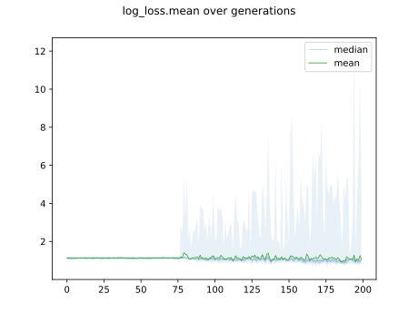

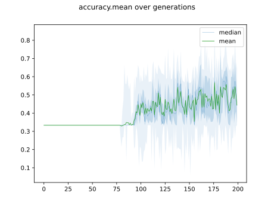

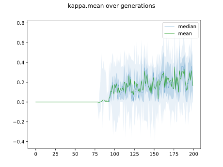

## Individuals in hall of fame

### Individual 17615

| key                    |      value |
|:-----------------------|-----------:|
| mean log_loss:         |   0.81097  |
| mean accuracy:         |   0.674933 |
| mean kappa:            |   0.5124   |
| number of edges        |  54        |
| number of hidden nodes |  15        |
| number of layers       |  10        |
| birth                  | 196        |

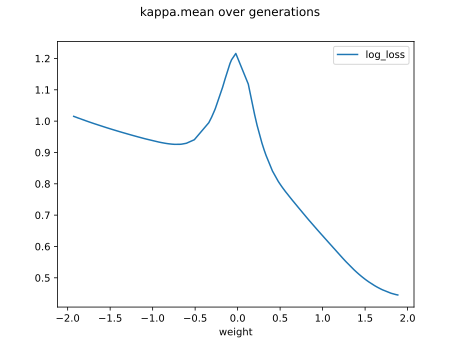

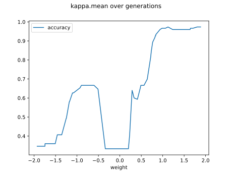

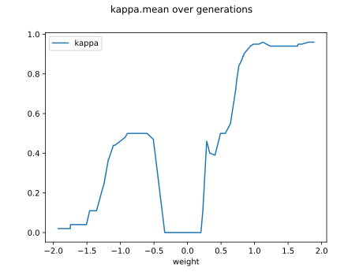

#### Network

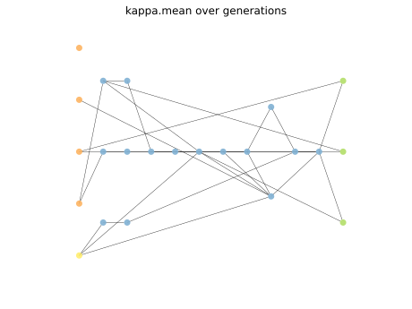

### Individual 17587

| key                    |      value |
|:-----------------------|-----------:|
| mean log_loss:         |   0.808057 |
| mean accuracy:         |   0.6708   |
| mean kappa:            |   0.5062   |
| number of edges        |  55        |
| number of hidden nodes |  15        |
| number of layers       |  10        |
| birth                  | 196        |

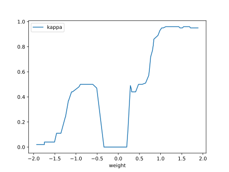

#### Network

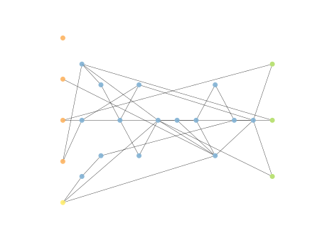

### Individual 16908

| key                    |      value |
|:-----------------------|-----------:|
| mean log_loss:         |   0.810105 |
| mean accuracy:         |   0.650267 |
| mean kappa:            |   0.4754   |
| number of edges        |  50        |
| number of hidden nodes |  13        |
| number of layers       |   8        |
| birth                  | 188        |

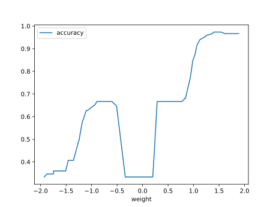

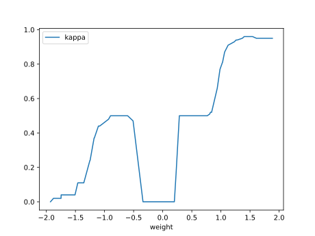

#### Network

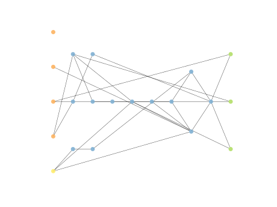

### Individual 17289

| key                    |      value |
|:-----------------------|-----------:|
| mean log_loss:         |   0.810951 |
| mean accuracy:         |   0.6494   |
| mean kappa:            |   0.4741   |
| number of edges        |  52        |
| number of hidden nodes |  14        |
| number of layers       |   9        |
| birth                  | 193        |

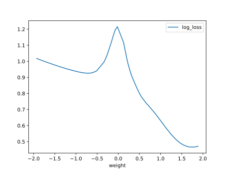

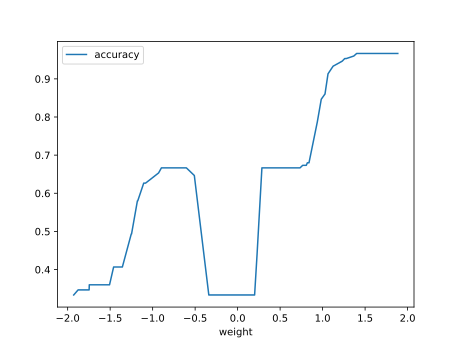

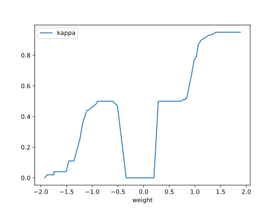

#### Network

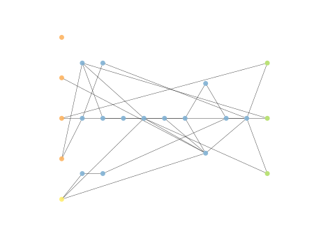

### Individual 17802

| key                    |      value |
|:-----------------------|-----------:|
| mean log_loss:         |   0.807575 |
| mean accuracy:         |   0.666733 |
| mean kappa:            |   0.5001   |
| number of edges        |  56        |
| number of hidden nodes |  15        |
| number of layers       |  12        |
| birth                  | 198        |

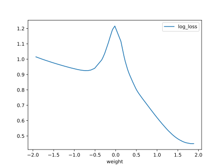

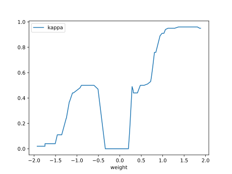

#### Network

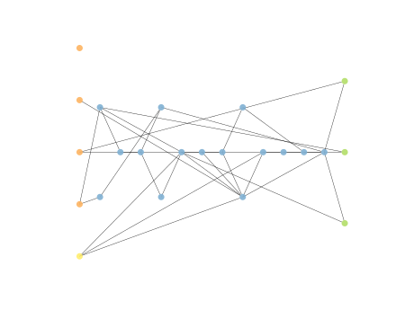

### Individual 17652

| key                    |      value |
|:-----------------------|-----------:|
| mean log_loss:         |   0.808731 |
| mean accuracy:         |   0.652533 |
| mean kappa:            |   0.4788   |
| number of edges        |  55        |
| number of hidden nodes |  15        |
| number of layers       |  10        |
| birth                  | 197        |

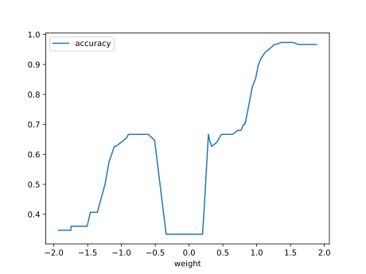

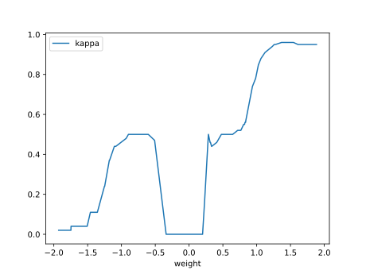

#### Network

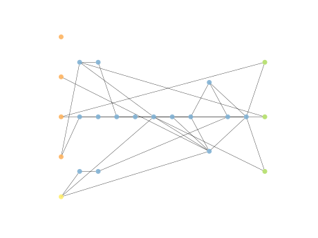

### Individual 17744

| key                    |      value |
|:-----------------------|-----------:|
| mean log_loss:         |   0.868293 |
| mean accuracy:         |   0.654267 |
| mean kappa:            |   0.4814   |
| number of edges        |  50        |
| number of hidden nodes |  13        |
| number of layers       |   8        |
| birth                  | 198        |

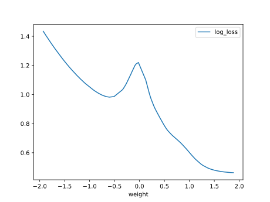

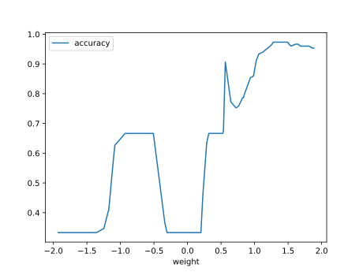

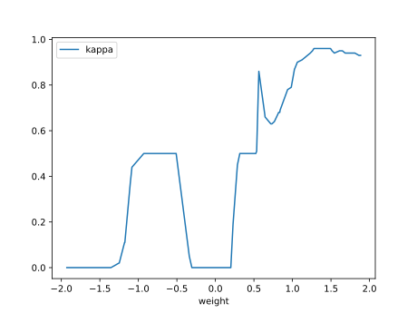

#### Network

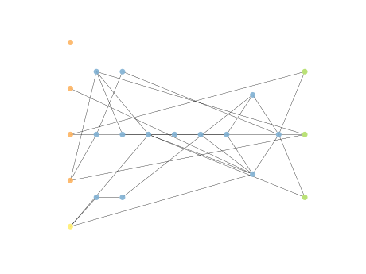

### Individual 17168

| key                    |      value |
|:-----------------------|-----------:|
| mean log_loss:         |   0.809756 |
| mean accuracy:         |   0.6518   |
| mean kappa:            |   0.4777   |
| number of edges        |  53        |
| number of hidden nodes |  14        |
| number of layers       |   9        |
| birth                  | 191        |

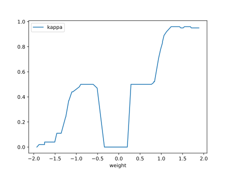

#### Network

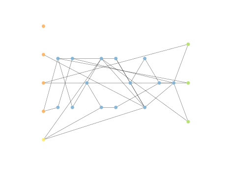

### Individual 15056

| key                    |      value |
|:-----------------------|-----------:|
| mean log_loss:         |   0.826888 |
| mean accuracy:         |   0.624067 |
| mean kappa:            |   0.4361   |
| number of edges        |  46        |
| number of hidden nodes |  11        |
| number of layers       |   7        |
| birth                  | 168        |

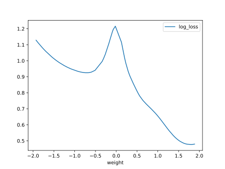

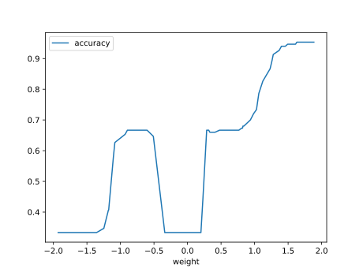

#### Network

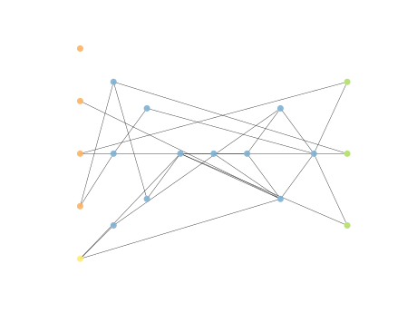

### Individual 14605

| key                    |      value |
|:-----------------------|-----------:|
| mean log_loss:         |   0.82447  |
| mean accuracy:         |   0.628667 |
| mean kappa:            |   0.443    |
| number of edges        |  43        |
| number of hidden nodes |  10        |
| number of layers       |   7        |
| birth                  | 163        |

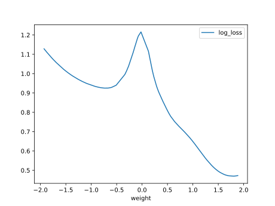

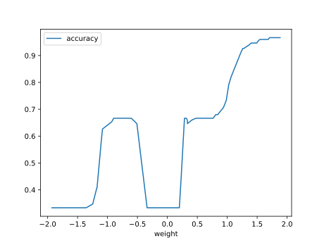

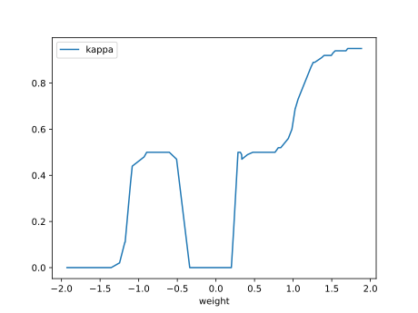

#### Network

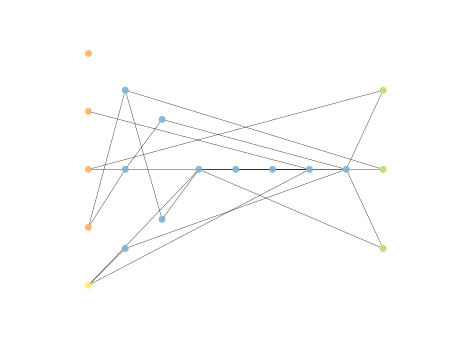

