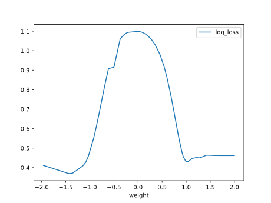
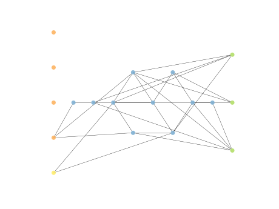

# Report Iris Uniform Distribution [-2, 2] run 5

## Best results in hall of fame

| measure       |    value |   individual |
|:--------------|---------:|-------------:|
| mean accuracy | 0.721467 |        17560 |
| max accuracy  | 0.96     |        16712 |
| mean kappa    | 0.5822   |        17560 |
| max kappa     | 0.94     |        16712 |

## Individuals in hall of fame

### Individual 16712

| key                    |      value |
|:-----------------------|-----------:|
| mean log_loss:         |   0.673859 |
| mean accuracy:         |   0.6942   |
| mean kappa:            |   0.5413   |
| number of edges        |  54        |
| number of hidden nodes |  11        |
| number of layers       |   8        |
| birth                  | 186        |

#### Network

### Individual 16701

| key                    |      value |
|:-----------------------|-----------:|
| mean log_loss:         |   0.65638  |
| mean accuracy:         |   0.715533 |
| mean kappa:            |   0.5733   |
| number of edges        |  54        |
| number of hidden nodes |  11        |
| number of layers       |   8        |
| birth                  | 186        |

#### Network

### Individual 17675

| key                    |      value |
|:-----------------------|-----------:|
| mean log_loss:         |   0.659928 |
| mean accuracy:         |   0.715867 |
| mean kappa:            |   0.5738   |
| number of edges        |  58        |
| number of hidden nodes |  12        |
| number of layers       |   8        |
| birth                  | 197        |

#### Network

### Individual 17003

| key                    |      value |
|:-----------------------|-----------:|
| mean log_loss:         |   0.664669 |
| mean accuracy:         |   0.716    |
| mean kappa:            |   0.574    |
| number of edges        |  56        |
| number of hidden nodes |  12        |
| number of layers       |   9        |
| birth                  | 189        |

#### Network

### Individual 15808

| key                    |      value |
|:-----------------------|-----------:|
| mean log_loss:         |   0.684696 |
| mean accuracy:         |   0.708267 |
| mean kappa:            |   0.5624   |
| number of edges        |  50        |
| number of hidden nodes |  10        |
| number of layers       |   8        |
| birth                  | 176        |

#### Network

### Individual 17560

| key                    |      value |
|:-----------------------|-----------:|
| mean log_loss:         |   0.655446 |
| mean accuracy:         |   0.721467 |
| mean kappa:            |   0.5822   |
| number of edges        |  57        |
| number of hidden nodes |  12        |
| number of layers       |   8        |
| birth                  | 196        |

#### Network

### Individual 17802

| key                    |      value |
|:-----------------------|-----------:|
| mean log_loss:         |   0.661437 |
| mean accuracy:         |   0.684733 |
| mean kappa:            |   0.5271   |
| number of edges        |  58        |
| number of hidden nodes |  12        |
| number of layers       |   8        |
| birth                  | 198        |

#### Network

### Individual 16573

| key                    |      value |
|:-----------------------|-----------:|
| mean log_loss:         |   0.664289 |
| mean accuracy:         |   0.6992   |
| mean kappa:            |   0.5488   |
| number of edges        |  54        |
| number of hidden nodes |  11        |
| number of layers       |   8        |
| birth                  | 185        |

#### Network

### Individual 15241

| key                    |      value |
|:-----------------------|-----------:|
| mean log_loss:         |   0.701561 |
| mean accuracy:         |   0.6576   |
| mean kappa:            |   0.4864   |
| number of edges        |  49        |
| number of hidden nodes |   9        |
| number of layers       |   7        |
| birth                  | 170        |

#### Network

### Individual 17380

| key                    |      value |
|:-----------------------|-----------:|
| mean log_loss:         |   0.671125 |
| mean accuracy:         |   0.6522   |
| mean kappa:            |   0.4783   |
| number of edges        |  57        |
| number of hidden nodes |  12        |
| number of layers       |   8        |
| birth                  | 194        |

#### Network

