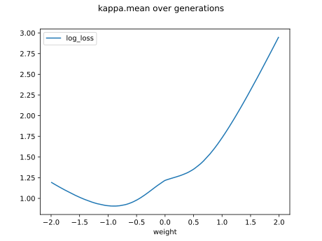

# Report Iris Uniform Distribution [-2, 2] run 6

## Best results in hall of fame

| measure       |    value |   individual |
|:--------------|---------:|-------------:|
| mean accuracy | 0.562067 |        11615 |
| max accuracy  | 0.666667 |        11615 |
| mean kappa    | 0.3431   |        11615 |
| max kappa     | 0.5      |        11615 |

## Individuals in hall of fame

### Individual 11615

| key                    |      value |
|:-----------------------|-----------:|
| mean log_loss:         |   1.40625  |
| mean accuracy:         |   0.562067 |
| mean kappa:            |   0.3431   |
| number of edges        |  15        |
| number of hidden nodes |   0        |
| number of layers       |   0        |
| birth                  | 130        |

#### Network

### Individual 12196

| key                    |      value |
|:-----------------------|-----------:|
| mean log_loss:         |   1.40625  |
| mean accuracy:         |   0.562067 |
| mean kappa:            |   0.3431   |
| number of edges        |  15        |
| number of hidden nodes |   0        |
| number of layers       |   0        |
| birth                  | 136        |

#### Network

### Individual 8280

| key                    |     value |
|:-----------------------|----------:|
| mean log_loss:         |  1.40625  |
| mean accuracy:         |  0.562067 |
| mean kappa:            |  0.3431   |
| number of edges        | 15        |
| number of hidden nodes |  0        |
| number of layers       |  0        |
| birth                  | 93        |

#### Network

### Individual 8201

| key                    |     value |
|:-----------------------|----------:|
| mean log_loss:         |  1.40625  |
| mean accuracy:         |  0.562067 |
| mean kappa:            |  0.3431   |
| number of edges        | 15        |
| number of hidden nodes |  0        |
| number of layers       |  0        |
| birth                  | 92        |

#### Network

### Individual 16356

| key                    |      value |
|:-----------------------|-----------:|
| mean log_loss:         |   0.965749 |
| mean accuracy:         |   0.533133 |
| mean kappa:            |   0.2997   |
| number of edges        |  17        |
| number of hidden nodes |   1        |
| number of layers       |   1        |
| birth                  | 182        |

#### Network

### Individual 14783

| key                    |      value |
|:-----------------------|-----------:|
| mean log_loss:         |   0.971799 |
| mean accuracy:         |   0.540667 |
| mean kappa:            |   0.311    |
| number of edges        |  17        |
| number of hidden nodes |   1        |
| number of layers       |   1        |
| birth                  | 165        |

#### Network

### Individual 11034

| key                    |      value |
|:-----------------------|-----------:|
| mean log_loss:         |   0.965749 |
| mean accuracy:         |   0.533133 |
| mean kappa:            |   0.2997   |
| number of edges        |  17        |
| number of hidden nodes |   1        |
| number of layers       |   1        |
| birth                  | 123        |

#### Network

### Individual 11026

| key                    |      value |
|:-----------------------|-----------:|
| mean log_loss:         |   0.965749 |
| mean accuracy:         |   0.533133 |
| mean kappa:            |   0.2997   |
| number of edges        |  17        |
| number of hidden nodes |   1        |
| number of layers       |   1        |
| birth                  | 123        |

#### Network

### Individual 14607

| key                    |      value |
|:-----------------------|-----------:|
| mean log_loss:         |   0.971799 |
| mean accuracy:         |   0.540667 |
| mean kappa:            |   0.311    |
| number of edges        |  17        |
| number of hidden nodes |   1        |
| number of layers       |   1        |
| birth                  | 163        |

#### Network

### Individual 17367

| key                    |      value |
|:-----------------------|-----------:|
| mean log_loss:         |   0.971799 |
| mean accuracy:         |   0.540667 |
| mean kappa:            |   0.311    |
| number of edges        |  17        |
| number of hidden nodes |   1        |
| number of layers       |   1        |
| birth                  | 193        |

#### Network

