# Report Iris Uniform Distribution [-2, 2] run 7

## Best results in hall of fame

| measure       |    value |   individual |
|:--------------|---------:|-------------:|
| mean accuracy | 0.747067 |        17241 |
| max accuracy  | 0.96     |        17241 |
| mean kappa    | 0.6206   |        17241 |
| max kappa     | 0.94     |        17241 |

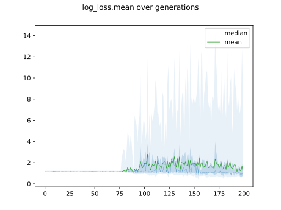

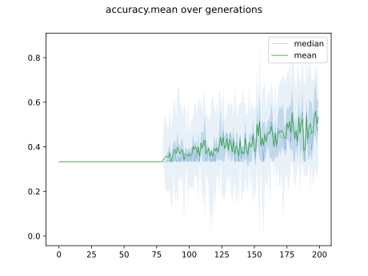

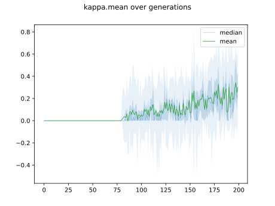

## Individuals in hall of fame

### Individual 17241

| key                    |      value |
|:-----------------------|-----------:|
| mean log_loss:         |   0.663343 |
| mean accuracy:         |   0.747067 |
| mean kappa:            |   0.6206   |
| number of edges        |  61        |
| number of hidden nodes |  18        |
| number of layers       |  11        |
| birth                  | 192        |

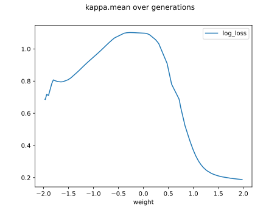

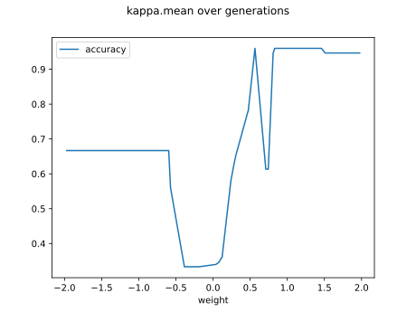

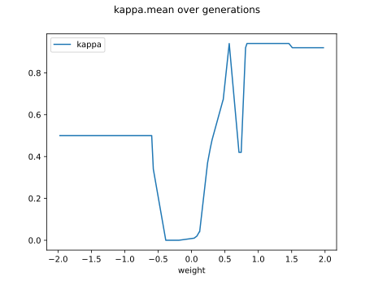

#### Network

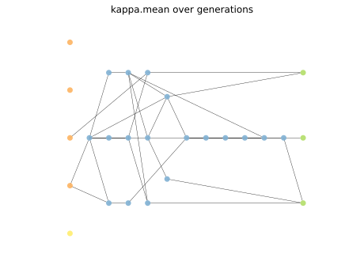

### Individual 17216

| key                    |     value |
|:-----------------------|----------:|
| mean log_loss:         |   0.66579 |
| mean accuracy:         |   0.737   |
| mean kappa:            |   0.6055  |
| number of edges        |  62       |
| number of hidden nodes |  18       |
| number of layers       |  11       |
| birth                  | 192       |

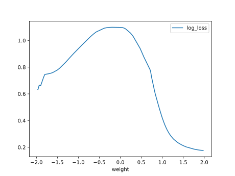

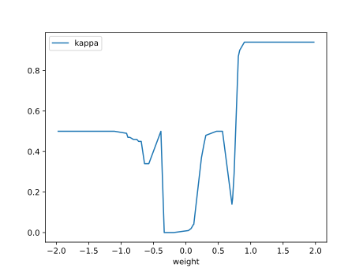

#### Network

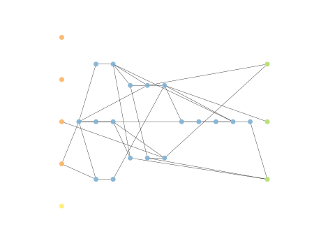

### Individual 17388

| key                    |      value |
|:-----------------------|-----------:|
| mean log_loss:         |   0.672185 |
| mean accuracy:         |   0.739467 |
| mean kappa:            |   0.6092   |
| number of edges        |  64        |
| number of hidden nodes |  19        |
| number of layers       |  11        |
| birth                  | 194        |

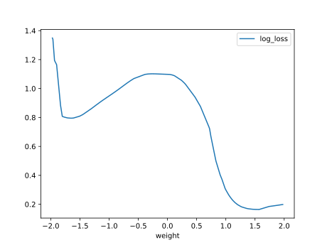

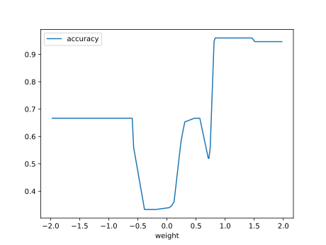

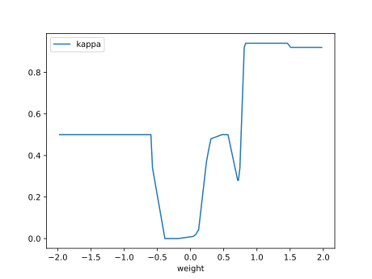

#### Network

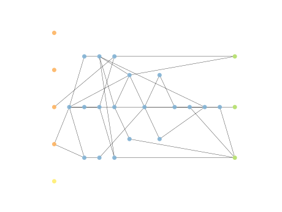

### Individual 17168

| key                    |      value |
|:-----------------------|-----------:|
| mean log_loss:         |   0.670435 |
| mean accuracy:         |   0.735867 |
| mean kappa:            |   0.6038   |
| number of edges        |  61        |
| number of hidden nodes |  18        |
| number of layers       |  11        |
| birth                  | 191        |

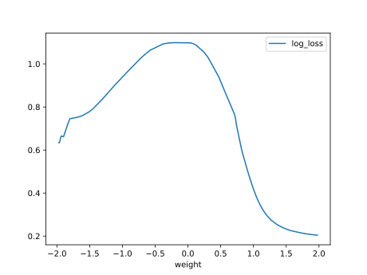

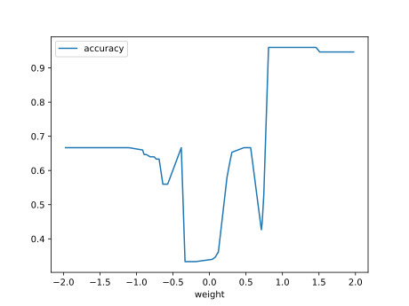

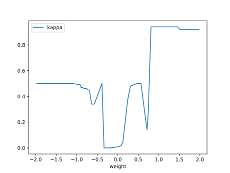

#### Network

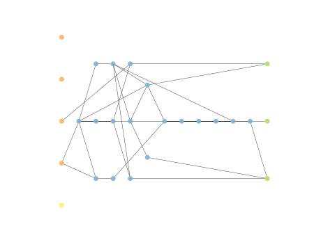

### Individual 17351

| key                    |      value |
|:-----------------------|-----------:|
| mean log_loss:         |   0.670561 |
| mean accuracy:         |   0.7286   |
| mean kappa:            |   0.5929   |
| number of edges        |  63        |
| number of hidden nodes |  19        |
| number of layers       |  11        |
| birth                  | 193        |

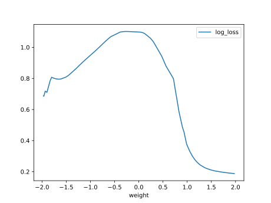

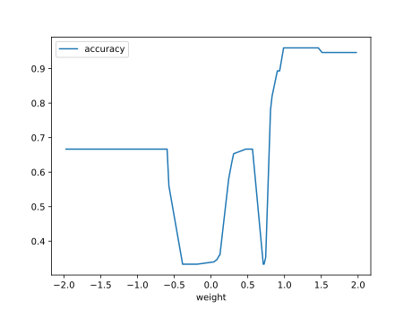

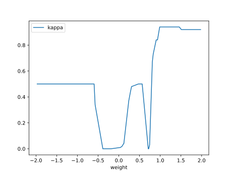

#### Network

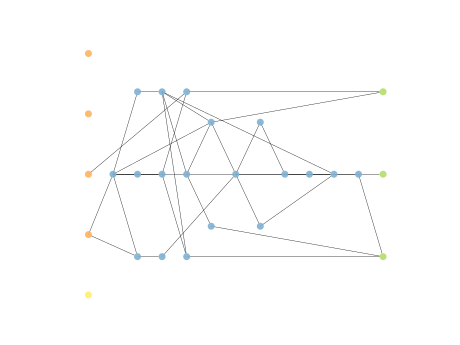

### Individual 16760

| key                    |      value |
|:-----------------------|-----------:|
| mean log_loss:         |   0.623362 |
| mean accuracy:         |   0.724533 |
| mean kappa:            |   0.5868   |
| number of edges        |  61        |
| number of hidden nodes |  18        |
| number of layers       |  11        |
| birth                  | 187        |

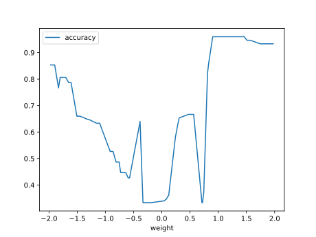

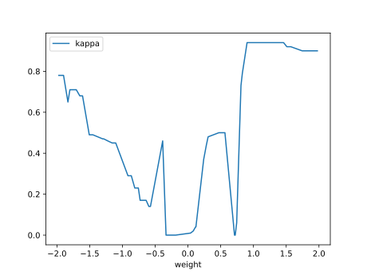

#### Network

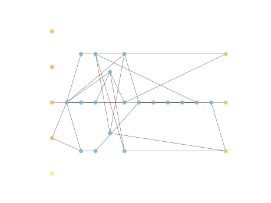

### Individual 16498

| key                    |      value |
|:-----------------------|-----------:|
| mean log_loss:         |   0.63052  |
| mean accuracy:         |   0.716333 |
| mean kappa:            |   0.5745   |
| number of edges        |  57        |
| number of hidden nodes |  16        |
| number of layers       |  10        |
| birth                  | 184        |

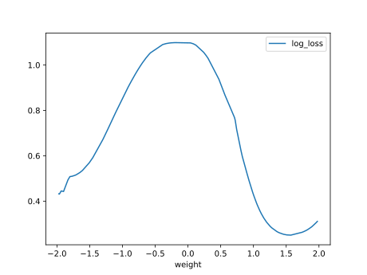

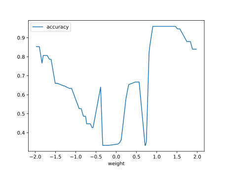

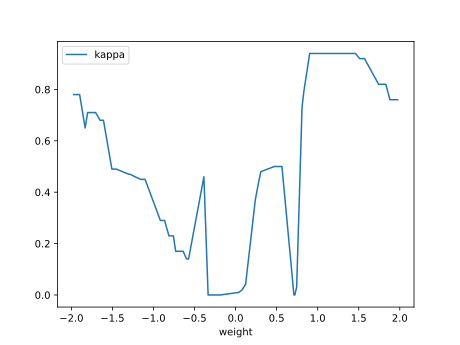

#### Network

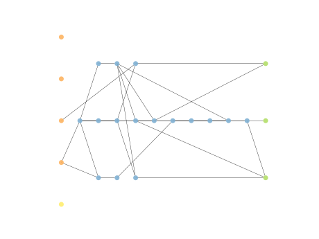

### Individual 16828

| key                    |      value |
|:-----------------------|-----------:|
| mean log_loss:         |   0.621689 |
| mean accuracy:         |   0.732467 |
| mean kappa:            |   0.5987   |
| number of edges        |  59        |
| number of hidden nodes |  17        |
| number of layers       |  11        |
| birth                  | 187        |

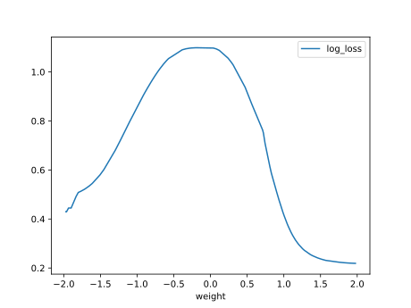

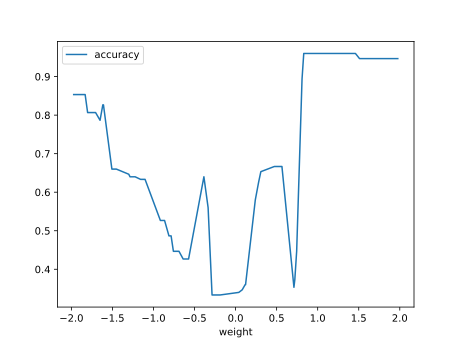

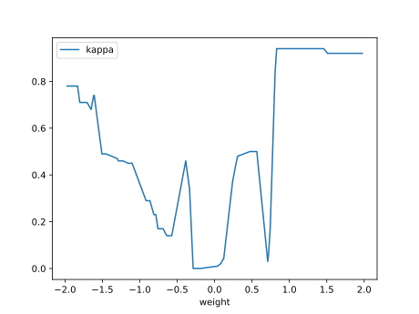

#### Network

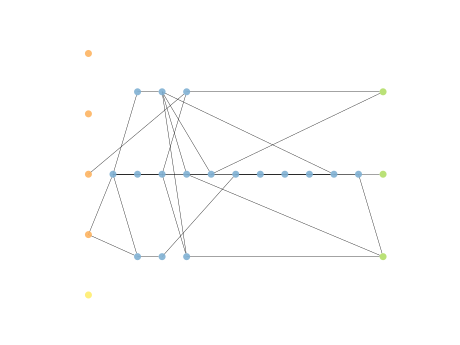

### Individual 15719

| key                    |      value |
|:-----------------------|-----------:|
| mean log_loss:         |   0.681441 |
| mean accuracy:         |   0.688933 |
| mean kappa:            |   0.5334   |
| number of edges        |  51        |
| number of hidden nodes |  14        |
| number of layers       |   6        |
| birth                  | 175        |

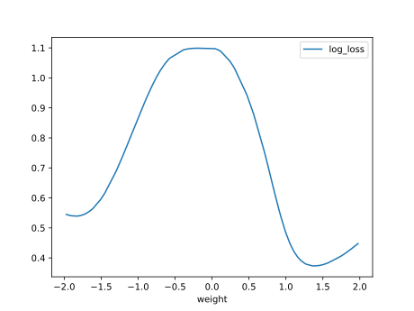

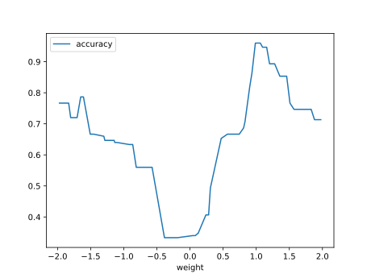

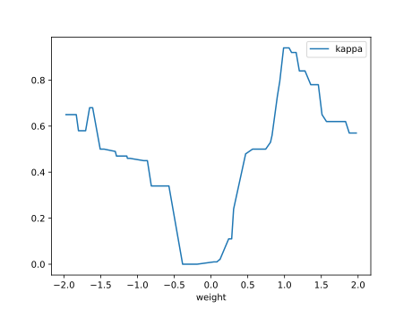

#### Network

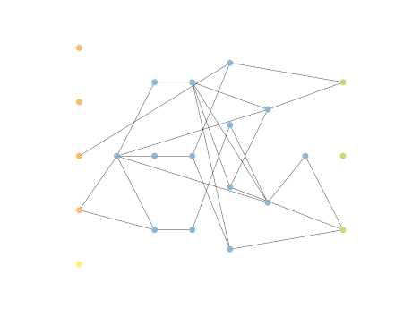

### Individual 16471

| key                    |      value |
|:-----------------------|-----------:|
| mean log_loss:         |   0.64178  |
| mean accuracy:         |   0.703133 |
| mean kappa:            |   0.5547   |
| number of edges        |  59        |
| number of hidden nodes |  17        |
| number of layers       |  10        |
| birth                  | 184        |

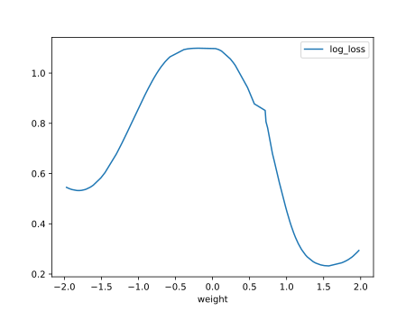

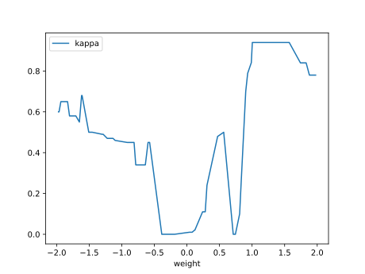

#### Network

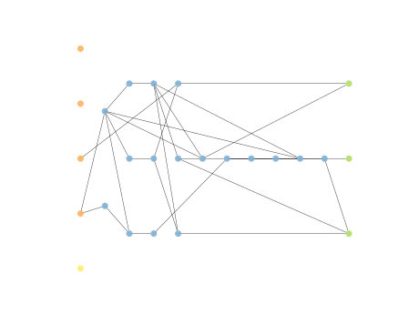

