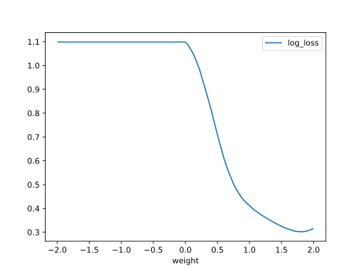

# Report Iris Uniform Distribution [-2, 2] run 8

## Best results in hall of fame

| measure       |    value |   individual |
|:--------------|---------:|-------------:|
| mean accuracy | 0.605267 |        16286 |
| max accuracy  | 0.96     |        16286 |
| mean kappa    | 0.4079   |        16286 |
| max kappa     | 0.94     |        16286 |

## Individuals in hall of fame

### Individual 16886

| key                    |      value |
|:-----------------------|-----------:|
| mean log_loss:         |   0.875918 |
| mean accuracy:         |   0.556733 |
| mean kappa:            |   0.3351   |
| number of edges        |  34        |
| number of hidden nodes |   5        |
| number of layers       |   2        |
| birth                  | 188        |

#### Network

### Individual 16416

| key                    |      value |
|:-----------------------|-----------:|
| mean log_loss:         |   0.866469 |
| mean accuracy:         |   0.5728   |
| mean kappa:            |   0.3592   |
| number of edges        |  34        |
| number of hidden nodes |   5        |
| number of layers       |   2        |
| birth                  | 183        |

#### Network

### Individual 16286

| key                    |      value |
|:-----------------------|-----------:|
| mean log_loss:         |   0.817493 |
| mean accuracy:         |   0.605267 |
| mean kappa:            |   0.4079   |
| number of edges        |  41        |
| number of hidden nodes |  10        |
| number of layers       |   6        |
| birth                  | 181        |

#### Network

### Individual 13530

| key                    |      value |
|:-----------------------|-----------:|
| mean log_loss:         |   0.813977 |
| mean accuracy:         |   0.5486   |
| mean kappa:            |   0.3229   |
| number of edges        |  46        |
| number of hidden nodes |  11        |
| number of layers       |   5        |
| birth                  | 151        |

#### Network

### Individual 9260

| key                    |      value |
|:-----------------------|-----------:|
| mean log_loss:         |   0.814491 |
| mean accuracy:         |   0.535    |
| mean kappa:            |   0.3025   |
| number of edges        |  41        |
| number of hidden nodes |   9        |
| number of layers       |   6        |
| birth                  | 103        |

#### Network

### Individual 16887

| key                    |      value |
|:-----------------------|-----------:|
| mean log_loss:         |   0.822438 |
| mean accuracy:         |   0.5412   |
| mean kappa:            |   0.3118   |
| number of edges        |  44        |
| number of hidden nodes |   9        |
| number of layers       |   3        |
| birth                  | 188        |

#### Network

### Individual 17203

| key                    |      value |
|:-----------------------|-----------:|
| mean log_loss:         |   0.822429 |
| mean accuracy:         |   0.5412   |
| mean kappa:            |   0.3118   |
| number of edges        |  47        |
| number of hidden nodes |  10        |
| number of layers       |   4        |
| birth                  | 192        |

#### Network

### Individual 9186

| key                    |      value |
|:-----------------------|-----------:|
| mean log_loss:         |   0.814491 |
| mean accuracy:         |   0.535    |
| mean kappa:            |   0.3025   |
| number of edges        |  41        |
| number of hidden nodes |   9        |
| number of layers       |   6        |
| birth                  | 103        |

#### Network

### Individual 16908

| key                    |      value |
|:-----------------------|-----------:|
| mean log_loss:         |   0.824728 |
| mean accuracy:         |   0.531733 |
| mean kappa:            |   0.2976   |
| number of edges        |  42        |
| number of hidden nodes |  10        |
| number of layers       |   6        |
| birth                  | 188        |

#### Network

### Individual 12257

| key                    |      value |
|:-----------------------|-----------:|
| mean log_loss:         |   0.81102  |
| mean accuracy:         |   0.548733 |
| mean kappa:            |   0.3231   |
| number of edges        |  45        |
| number of hidden nodes |  10        |
| number of layers       |   6        |
| birth                  | 137        |

#### Network

