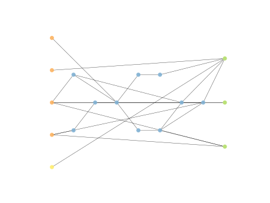
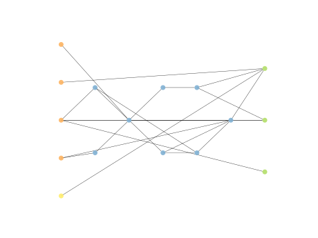

# Report Iris Uniform Distribution [-2, 2] run 9

## Best results in hall of fame

| measure       |    value |   individual |
|:--------------|---------:|-------------:|
| mean accuracy | 0.649467 |        17362 |
| max accuracy  | 0.98     |        16985 |
| mean kappa    | 0.4742   |        17362 |
| max kappa     | 0.97     |        16985 |

## Individuals in hall of fame

### Individual 16985

| key                    |      value |
|:-----------------------|-----------:|
| mean log_loss:         |   0.754586 |
| mean accuracy:         |   0.646133 |
| mean kappa:            |   0.4692   |
| number of edges        |  42        |
| number of hidden nodes |  10        |
| number of layers       |   7        |
| birth                  | 189        |

#### Network

### Individual 17362

| key                    |      value |
|:-----------------------|-----------:|
| mean log_loss:         |   0.725362 |
| mean accuracy:         |   0.649467 |
| mean kappa:            |   0.4742   |
| number of edges        |  44        |
| number of hidden nodes |  11        |
| number of layers       |   8        |
| birth                  | 193        |

#### Network

### Individual 17868

| key                    |      value |
|:-----------------------|-----------:|
| mean log_loss:         |   0.749253 |
| mean accuracy:         |   0.645867 |
| mean kappa:            |   0.4688   |
| number of edges        |  42        |
| number of hidden nodes |  10        |
| number of layers       |   7        |
| birth                  | 199        |

#### Network

### Individual 17622

| key                    |      value |
|:-----------------------|-----------:|
| mean log_loss:         |   0.840143 |
| mean accuracy:         |   0.6128   |
| mean kappa:            |   0.4192   |
| number of edges        |  42        |
| number of hidden nodes |  10        |
| number of layers       |   7        |
| birth                  | 196        |

#### Network

### Individual 17227

| key                    |      value |
|:-----------------------|-----------:|
| mean log_loss:         |   0.725362 |
| mean accuracy:         |   0.649467 |
| mean kappa:            |   0.4742   |
| number of edges        |  44        |
| number of hidden nodes |  11        |
| number of layers       |   8        |
| birth                  | 192        |

#### Network

### Individual 17206

| key                    |      value |
|:-----------------------|-----------:|
| mean log_loss:         |   0.754586 |
| mean accuracy:         |   0.646133 |
| mean kappa:            |   0.4692   |
| number of edges        |  43        |
| number of hidden nodes |  10        |
| number of layers       |   7        |
| birth                  | 192        |

#### Network

### Individual 17438

| key                    |      value |
|:-----------------------|-----------:|
| mean log_loss:         |   0.720465 |
| mean accuracy:         |   0.6492   |
| mean kappa:            |   0.4738   |
| number of edges        |  44        |
| number of hidden nodes |  11        |
| number of layers       |   8        |
| birth                  | 194        |

#### Network

### Individual 16723

| key                    |      value |
|:-----------------------|-----------:|
| mean log_loss:         |   0.851612 |
| mean accuracy:         |   0.5674   |
| mean kappa:            |   0.3511   |
| number of edges        |  42        |
| number of hidden nodes |  10        |
| number of layers       |   6        |
| birth                  | 186        |

#### Network

### Individual 17874

| key                    |      value |
|:-----------------------|-----------:|
| mean log_loss:         |   0.74956  |
| mean accuracy:         |   0.603733 |
| mean kappa:            |   0.4056   |
| number of edges        |  42        |
| number of hidden nodes |  10        |
| number of layers       |   7        |
| birth                  | 199        |

#### Network

### Individual 16316

| key                    |      value |
|:-----------------------|-----------:|
| mean log_loss:         |   0.839902 |
| mean accuracy:         |   0.5678   |
| mean kappa:            |   0.3517   |
| number of edges        |  38        |
| number of hidden nodes |   8        |
| number of layers       |   5        |
| birth                  | 182        |

#### Network

