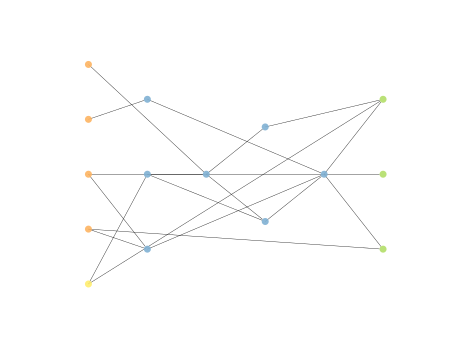
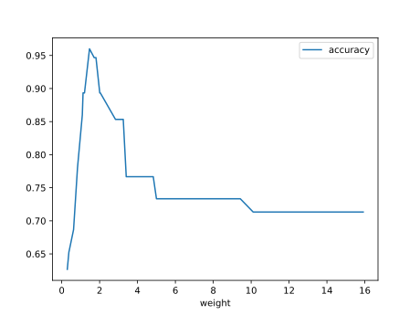
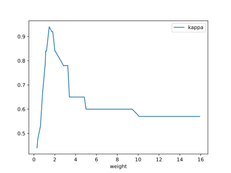

# Report Iris Uniform Distribution [0, 16] run 0

## Best results in hall of fame

| measure       |   value |   individual |
|:--------------|--------:|-------------:|
| mean accuracy |  0.7468 |        14622 |
| max accuracy  |  0.96   |        14530 |
| mean kappa    |  0.6202 |        14622 |
| max kappa     |  0.94   |        14530 |

## Individuals in hall of fame

### Individual 14530

| key                    |      value |
|:-----------------------|-----------:|
| mean log_loss:         |   0.843222 |
| mean accuracy:         |   0.746467 |
| mean kappa:            |   0.6197   |
| number of edges        |  36        |
| number of hidden nodes |   7        |
| number of layers       |   4        |
| birth                  | 162        |

#### Network

### Individual 12800

| key                    |      value |
|:-----------------------|-----------:|
| mean log_loss:         |   0.843231 |
| mean accuracy:         |   0.744933 |
| mean kappa:            |   0.6174   |
| number of edges        |  36        |
| number of hidden nodes |   7        |
| number of layers       |   5        |
| birth                  | 143        |

#### Network

### Individual 14550

| key                    |      value |
|:-----------------------|-----------:|
| mean log_loss:         |   0.843216 |
| mean accuracy:         |   0.746267 |
| mean kappa:            |   0.6194   |
| number of edges        |  34        |
| number of hidden nodes |   6        |
| number of layers       |   4        |
| birth                  | 162        |

#### Network

### Individual 16850

| key                    |      value |
|:-----------------------|-----------:|
| mean log_loss:         |   0.843377 |
| mean accuracy:         |   0.745867 |
| mean kappa:            |   0.6188   |
| number of edges        |  36        |
| number of hidden nodes |   7        |
| number of layers       |   4        |
| birth                  | 188        |

#### Network

### Individual 14310

| key                    |      value |
|:-----------------------|-----------:|
| mean log_loss:         |   0.843236 |
| mean accuracy:         |   0.744533 |
| mean kappa:            |   0.6168   |
| number of edges        |  34        |
| number of hidden nodes |   6        |
| number of layers       |   4        |
| birth                  | 160        |

#### Network

### Individual 16246

| key                    |      value |
|:-----------------------|-----------:|
| mean log_loss:         |   0.843222 |
| mean accuracy:         |   0.746467 |
| mean kappa:            |   0.6197   |
| number of edges        |  36        |
| number of hidden nodes |   7        |
| number of layers       |   4        |
| birth                  | 181        |

#### Network

### Individual 14789

| key                    |      value |
|:-----------------------|-----------:|
| mean log_loss:         |   0.843266 |
| mean accuracy:         |   0.743933 |
| mean kappa:            |   0.6159   |
| number of edges        |  35        |
| number of hidden nodes |   6        |
| number of layers       |   4        |
| birth                  | 165        |

#### Network

### Individual 13233

| key                    |      value |
|:-----------------------|-----------:|
| mean log_loss:         |   0.843747 |
| mean accuracy:         |   0.739867 |
| mean kappa:            |   0.6098   |
| number of edges        |  34        |
| number of hidden nodes |   6        |
| number of layers       |   4        |
| birth                  | 148        |

#### Network

### Individual 15909

| key                    |      value |
|:-----------------------|-----------:|
| mean log_loss:         |   0.843359 |
| mean accuracy:         |   0.746267 |
| mean kappa:            |   0.6194   |
| number of edges        |  35        |
| number of hidden nodes |   6        |
| number of layers       |   4        |
| birth                  | 177        |

#### Network

### Individual 14622

| key                    |      value |
|:-----------------------|-----------:|
| mean log_loss:         |   0.843082 |
| mean accuracy:         |   0.7468   |
| mean kappa:            |   0.6202   |
| number of edges        |  36        |
| number of hidden nodes |   7        |
| number of layers       |   4        |
| birth                  | 163        |

#### Network

