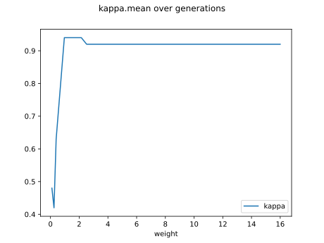
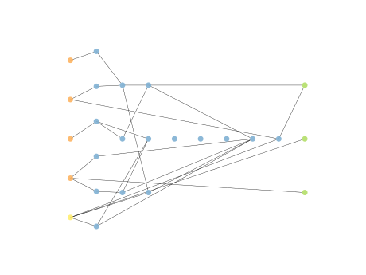
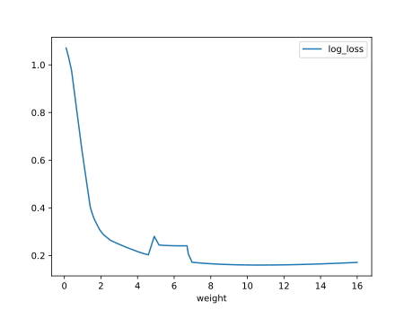

# Report Iris Uniform Distribution [0, 16] run 1

## Best results in hall of fame

| measure       |    value |   individual |
|:--------------|---------:|-------------:|
| mean accuracy | 0.940067 |        16951 |
| max accuracy  | 0.96     |        16951 |
| mean kappa    | 0.9101   |        16951 |
| max kappa     | 0.94     |        16951 |

## Individuals in hall of fame

### Individual 16951

| key                    |      value |
|:-----------------------|-----------:|
| mean log_loss:         |   0.223857 |
| mean accuracy:         |   0.940067 |
| mean kappa:            |   0.9101   |
| number of edges        |  63        |
| number of hidden nodes |  19        |
| number of layers       |   8        |
| birth                  | 189        |

#### Network

### Individual 17596

| key                    |      value |
|:-----------------------|-----------:|
| mean log_loss:         |   0.227241 |
| mean accuracy:         |   0.932533 |
| mean kappa:            |   0.8988   |
| number of edges        |  64        |
| number of hidden nodes |  19        |
| number of layers       |   8        |
| birth                  | 196        |

#### Network

### Individual 15847

| key                    |      value |
|:-----------------------|-----------:|
| mean log_loss:         |   0.225793 |
| mean accuracy:         |   0.934867 |
| mean kappa:            |   0.9023   |
| number of edges        |  61        |
| number of hidden nodes |  18        |
| number of layers       |   7        |
| birth                  | 177        |

#### Network

### Individual 16654

| key                    |      value |
|:-----------------------|-----------:|
| mean log_loss:         |   0.227347 |
| mean accuracy:         |   0.932467 |
| mean kappa:            |   0.8987   |
| number of edges        |  60        |
| number of hidden nodes |  17        |
| number of layers       |   8        |
| birth                  | 186        |

#### Network

### Individual 16685

| key                    |      value |
|:-----------------------|-----------:|
| mean log_loss:         |   0.227347 |
| mean accuracy:         |   0.932467 |
| mean kappa:            |   0.8987   |
| number of edges        |  61        |
| number of hidden nodes |  18        |
| number of layers       |   8        |
| birth                  | 186        |

#### Network

### Individual 14265

| key                    |      value |
|:-----------------------|-----------:|
| mean log_loss:         |   0.224967 |
| mean accuracy:         |   0.934267 |
| mean kappa:            |   0.9014   |
| number of edges        |  48        |
| number of hidden nodes |  12        |
| number of layers       |   6        |
| birth                  | 159        |

#### Network

### Individual 15378

| key                    |      value |
|:-----------------------|-----------:|
| mean log_loss:         |   0.22672  |
| mean accuracy:         |   0.939067 |
| mean kappa:            |   0.9086   |
| number of edges        |  54        |
| number of hidden nodes |  15        |
| number of layers       |   7        |
| birth                  | 171        |

#### Network

### Individual 16699

| key                    |      value |
|:-----------------------|-----------:|
| mean log_loss:         |   0.229329 |
| mean accuracy:         |   0.932    |
| mean kappa:            |   0.898    |
| number of edges        |  59        |
| number of hidden nodes |  17        |
| number of layers       |   8        |
| birth                  | 186        |

#### Network

### Individual 16727

| key                    |      value |
|:-----------------------|-----------:|
| mean log_loss:         |   0.227241 |
| mean accuracy:         |   0.932533 |
| mean kappa:            |   0.8988   |
| number of edges        |  61        |
| number of hidden nodes |  18        |
| number of layers       |   8        |
| birth                  | 186        |

#### Network

### Individual 17494

| key                    |      value |
|:-----------------------|-----------:|
| mean log_loss:         |   0.234835 |
| mean accuracy:         |   0.938133 |
| mean kappa:            |   0.9072   |
| number of edges        |  64        |
| number of hidden nodes |  19        |
| number of layers       |   8        |
| birth                  | 195        |

#### Network

