# Report Iris Uniform Distribution [0, 16] run 2

## Best results in hall of fame

| measure       |    value |   individual |
|:--------------|---------:|-------------:|
| mean accuracy | 0.6666   |        15920 |
| max accuracy  | 0.666667 |        15920 |
| mean kappa    | 0.4999   |        15920 |
| max kappa     | 0.5      |        17934 |

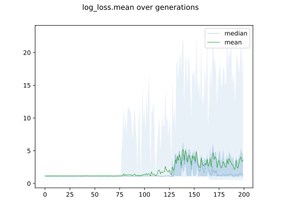

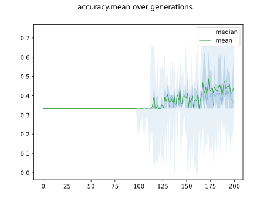

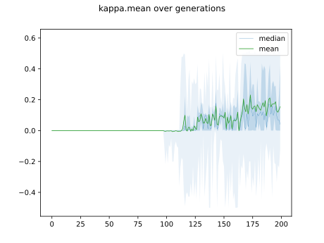

## Individuals in hall of fame

### Individual 15920

| key                    |      value |
|:-----------------------|-----------:|
| mean log_loss:         |   0.537545 |
| mean accuracy:         |   0.6666   |
| mean kappa:            |   0.4999   |
| number of edges        |  27        |
| number of hidden nodes |   4        |
| number of layers       |   3        |
| birth                  | 177        |

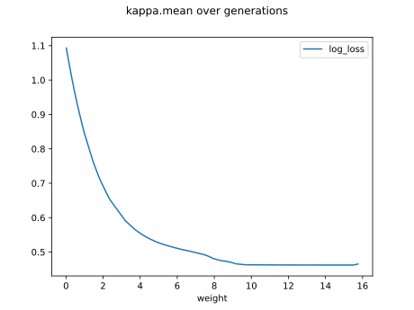

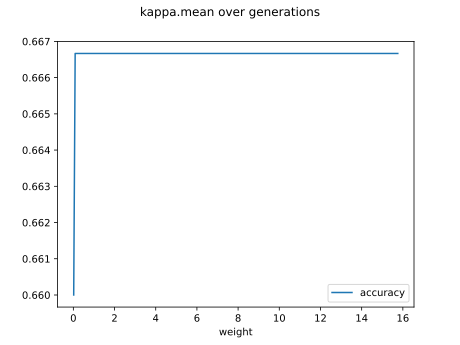

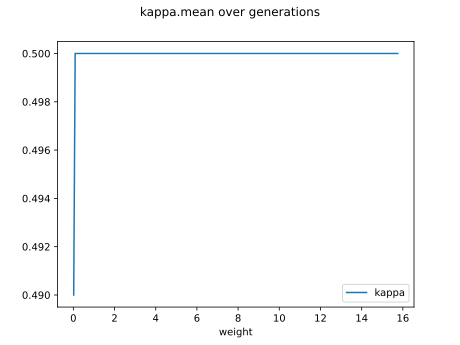

#### Network

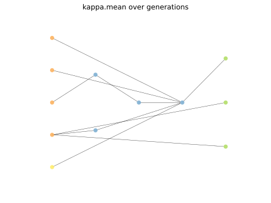

### Individual 15689

| key                    |      value |
|:-----------------------|-----------:|
| mean log_loss:         |   0.537539 |
| mean accuracy:         |   0.6666   |
| mean kappa:            |   0.4999   |
| number of edges        |  25        |
| number of hidden nodes |   3        |
| number of layers       |   2        |
| birth                  | 175        |

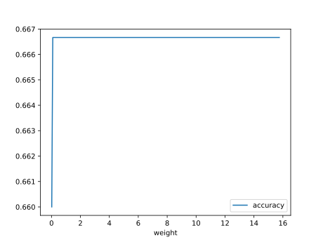

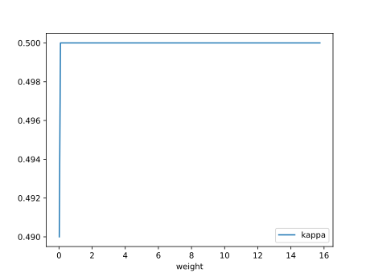

#### Network

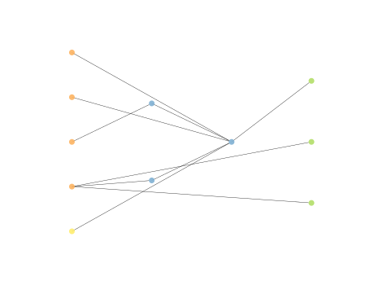

### Individual 16077

| key                    |      value |
|:-----------------------|-----------:|
| mean log_loss:         |   0.537555 |
| mean accuracy:         |   0.6666   |
| mean kappa:            |   0.4999   |
| number of edges        |  27        |
| number of hidden nodes |   4        |
| number of layers       |   3        |
| birth                  | 179        |

#### Network

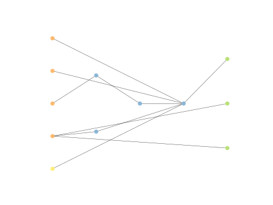

### Individual 16056

| key                    |     value |
|:-----------------------|----------:|
| mean log_loss:         |   0.55387 |
| mean accuracy:         |   0.6642  |
| mean kappa:            |   0.4963  |
| number of edges        |  29       |
| number of hidden nodes |   5       |
| number of layers       |   3       |
| birth                  | 179       |

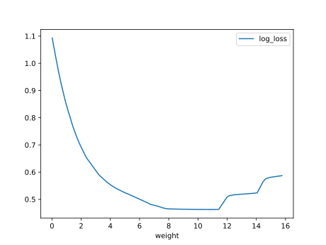

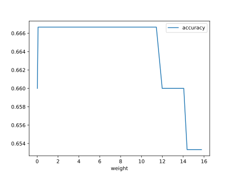

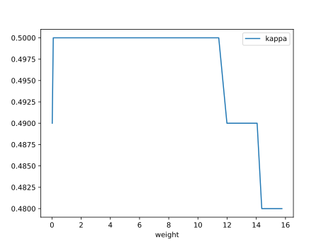

#### Network

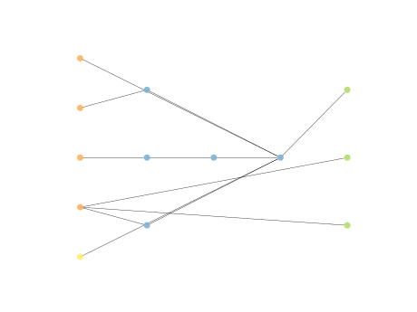

### Individual 14999

| key                    |      value |
|:-----------------------|-----------:|
| mean log_loss:         |   0.551552 |
| mean accuracy:         |   0.6592   |
| mean kappa:            |   0.4888   |
| number of edges        |  23        |
| number of hidden nodes |   2        |
| number of layers       |   2        |
| birth                  | 167        |

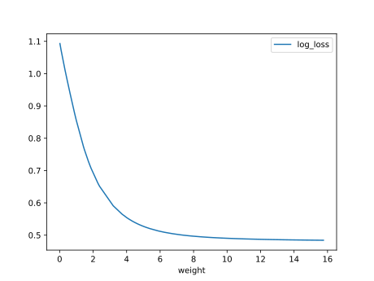

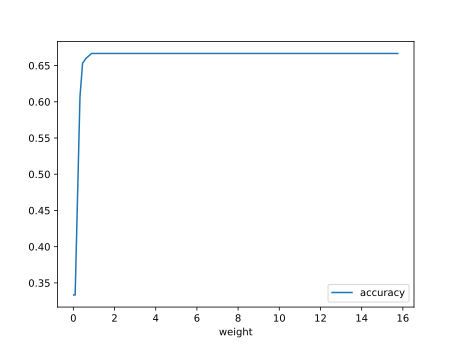

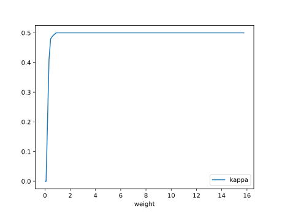

#### Network

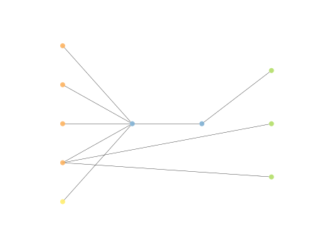

### Individual 16732

| key                    |      value |
|:-----------------------|-----------:|
| mean log_loss:         |   0.531533 |
| mean accuracy:         |   0.6562   |
| mean kappa:            |   0.4843   |
| number of edges        |  31        |
| number of hidden nodes |   5        |
| number of layers       |   3        |
| birth                  | 186        |

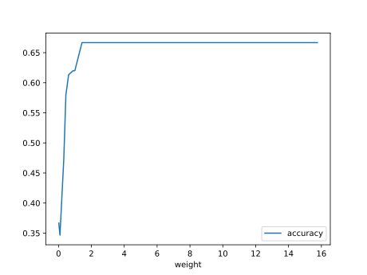

#### Network

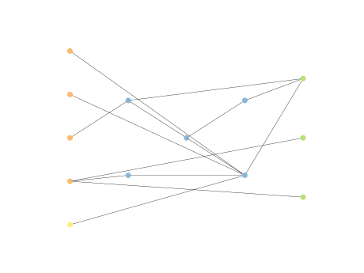

### Individual 15513

| key                    |      value |
|:-----------------------|-----------:|
| mean log_loss:         |   0.537875 |
| mean accuracy:         |   0.6588   |
| mean kappa:            |   0.4882   |
| number of edges        |  25        |
| number of hidden nodes |   3        |
| number of layers       |   2        |
| birth                  | 173        |

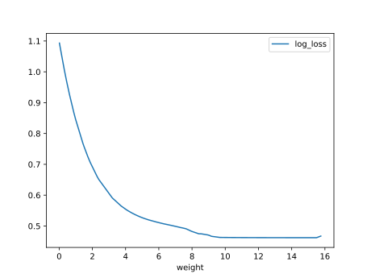

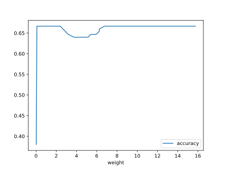

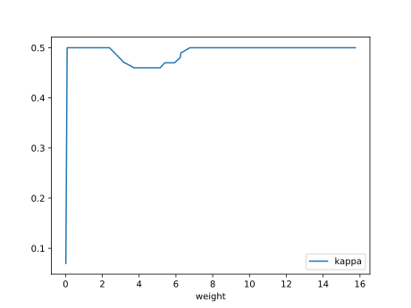

#### Network

### Individual 16521

| key                    |      value |
|:-----------------------|-----------:|
| mean log_loss:         |   0.531738 |
| mean accuracy:         |   0.655867 |
| mean kappa:            |   0.4838   |
| number of edges        |  29        |
| number of hidden nodes |   4        |
| number of layers       |   3        |
| birth                  | 184        |

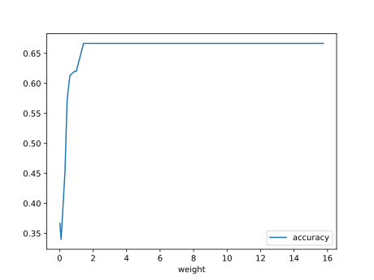

#### Network

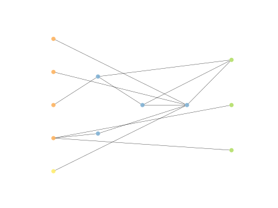

### Individual 17934

| key                    |      value |
|:-----------------------|-----------:|
| mean log_loss:         |   0.537002 |
| mean accuracy:         |   0.654867 |
| mean kappa:            |   0.4823   |
| number of edges        |  38        |
| number of hidden nodes |   8        |
| number of layers       |   4        |
| birth                  | 200        |

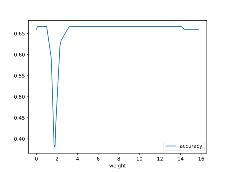

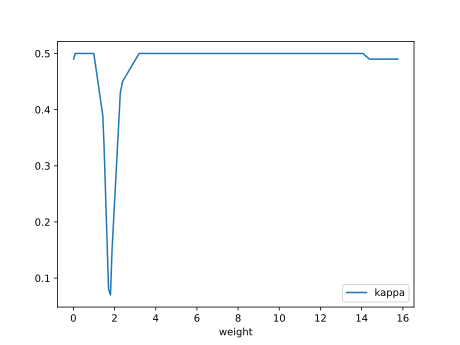

#### Network

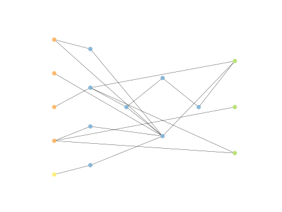

### Individual 17783

| key                    |      value |
|:-----------------------|-----------:|
| mean log_loss:         |   0.535234 |
| mean accuracy:         |   0.6556   |
| mean kappa:            |   0.4834   |
| number of edges        |  38        |
| number of hidden nodes |   8        |
| number of layers       |   4        |
| birth                  | 198        |

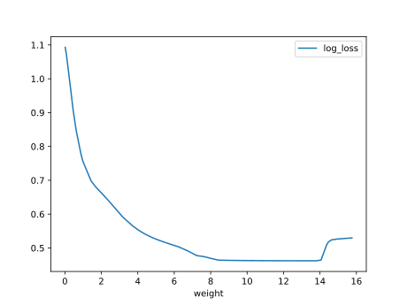

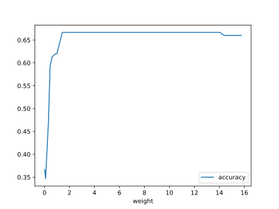

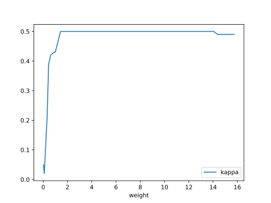

#### Network

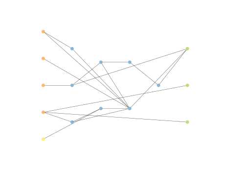

