# Report Iris Uniform Distribution [0, 16] run 3

## Best results in hall of fame

| measure       |   value |   individual |
|:--------------|--------:|-------------:|
| mean accuracy |  0.945  |        16893 |
| max accuracy  |  0.96   |        16723 |
| mean kappa    |  0.9175 |        16893 |
| max kappa     |  0.94   |        16723 |

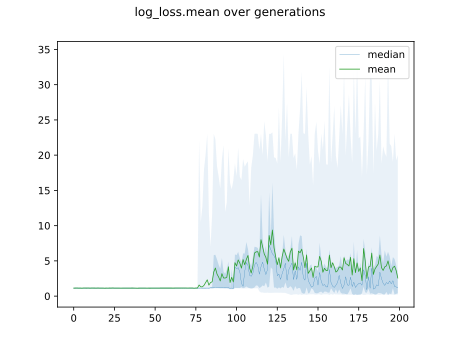

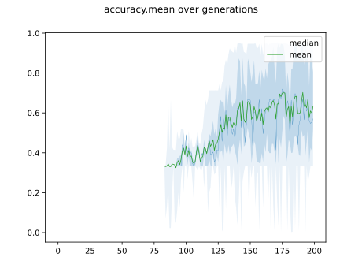

## Individuals in hall of fame

### Individual 16723

| key                    |      value |
|:-----------------------|-----------:|
| mean log_loss:         |   0.198981 |
| mean accuracy:         |   0.943133 |
| mean kappa:            |   0.9147   |
| number of edges        |  47        |
| number of hidden nodes |  15        |
| number of layers       |   8        |
| birth                  | 186        |

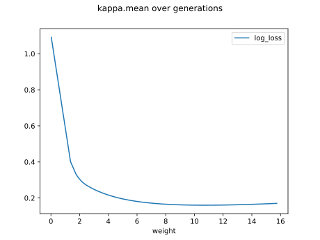

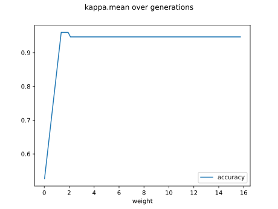

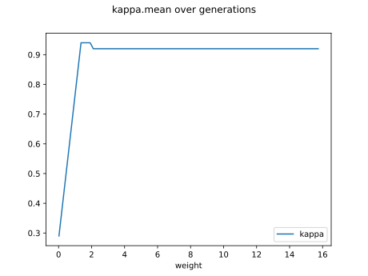

#### Network

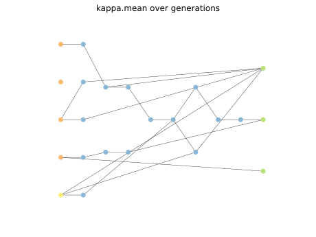

### Individual 15214

| key                    |      value |
|:-----------------------|-----------:|
| mean log_loss:         |   0.199121 |
| mean accuracy:         |   0.942867 |
| mean kappa:            |   0.9143   |
| number of edges        |  45        |
| number of hidden nodes |  14        |
| number of layers       |   7        |
| birth                  | 170        |

#### Network

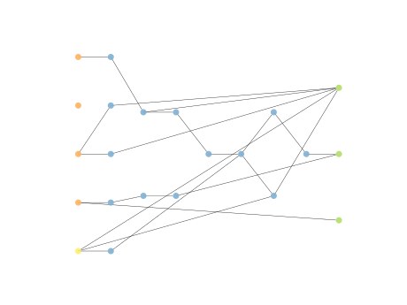

### Individual 16893

| key                    |      value |
|:-----------------------|-----------:|
| mean log_loss:         |   0.195247 |
| mean accuracy:         |   0.945    |
| mean kappa:            |   0.9175   |
| number of edges        |  49        |
| number of hidden nodes |  16        |
| number of layers       |   9        |
| birth                  | 188        |

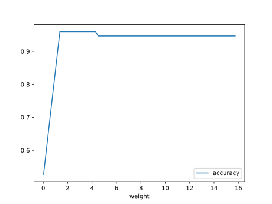

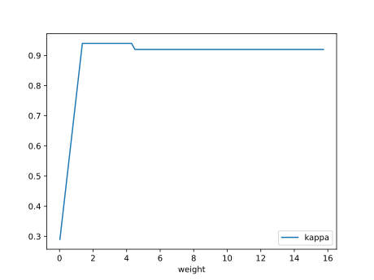

#### Network

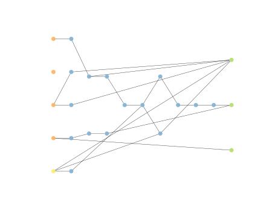

### Individual 17065

| key                    |     value |
|:-----------------------|----------:|
| mean log_loss:         |   0.19522 |
| mean accuracy:         |   0.945   |
| mean kappa:            |   0.9175  |
| number of edges        |  49       |
| number of hidden nodes |  16       |
| number of layers       |   9       |
| birth                  | 190       |

#### Network

### Individual 16935

| key                    |      value |
|:-----------------------|-----------:|
| mean log_loss:         |   0.199037 |
| mean accuracy:         |   0.943133 |
| mean kappa:            |   0.9147   |
| number of edges        |  47        |
| number of hidden nodes |  15        |
| number of layers       |   8        |
| birth                  | 189        |

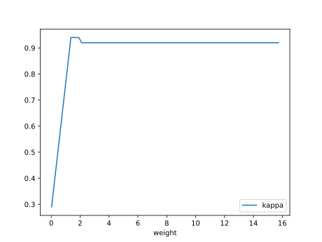

#### Network

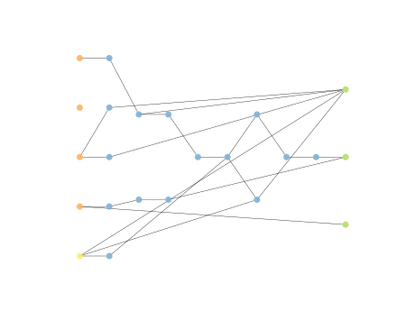

### Individual 17253

| key                    |      value |
|:-----------------------|-----------:|
| mean log_loss:         |   0.198948 |
| mean accuracy:         |   0.943133 |
| mean kappa:            |   0.9147   |
| number of edges        |  48        |
| number of hidden nodes |  15        |
| number of layers       |   8        |
| birth                  | 192        |

#### Network

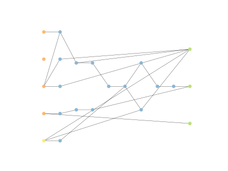

### Individual 17224

| key                    |      value |
|:-----------------------|-----------:|
| mean log_loss:         |   0.198948 |
| mean accuracy:         |   0.943133 |
| mean kappa:            |   0.9147   |
| number of edges        |  49        |
| number of hidden nodes |  16        |
| number of layers       |   8        |
| birth                  | 192        |

#### Network

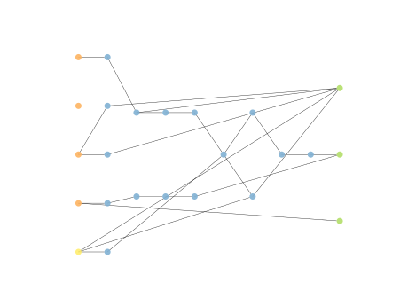

### Individual 16894

| key                    |      value |
|:-----------------------|-----------:|
| mean log_loss:         |   0.198987 |
| mean accuracy:         |   0.943133 |
| mean kappa:            |   0.9147   |
| number of edges        |  49        |
| number of hidden nodes |  16        |
| number of layers       |   8        |
| birth                  | 188        |

#### Network

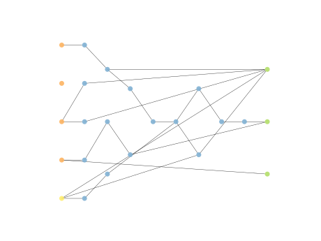

### Individual 15737

| key                    |      value |
|:-----------------------|-----------:|
| mean log_loss:         |   0.199125 |
| mean accuracy:         |   0.943    |
| mean kappa:            |   0.9145   |
| number of edges        |  45        |
| number of hidden nodes |  14        |
| number of layers       |   7        |
| birth                  | 175        |

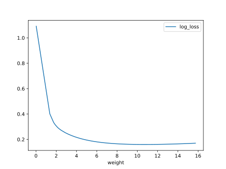

#### Network

### Individual 15578

| key                    |      value |
|:-----------------------|-----------:|
| mean log_loss:         |   0.198948 |
| mean accuracy:         |   0.943133 |
| mean kappa:            |   0.9147   |
| number of edges        |  47        |
| number of hidden nodes |  15        |
| number of layers       |   8        |
| birth                  | 174        |

#### Network

