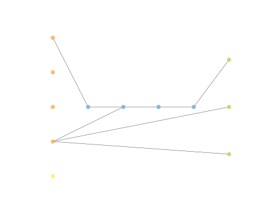
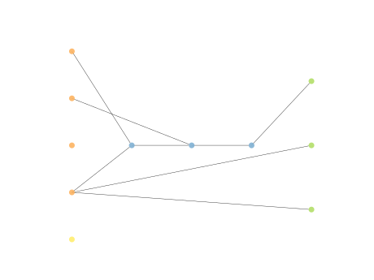

# Report Iris Uniform Distribution [0, 16] run 4

## Best results in hall of fame

| measure       |    value |   individual |
|:--------------|---------:|-------------:|
| mean accuracy | 0.666667 |        15953 |
| max accuracy  | 0.666667 |        15803 |
| mean kappa    | 0.5      |        15953 |
| max kappa     | 0.5      |        15803 |

## Individuals in hall of fame

### Individual 15803

| key                    |      value |
|:-----------------------|-----------:|
| mean log_loss:         |   0.546339 |
| mean accuracy:         |   0.666533 |
| mean kappa:            |   0.4998   |
| number of edges        |  22        |
| number of hidden nodes |   3        |
| number of layers       |   3        |
| birth                  | 176        |

#### Network

### Individual 15141

| key                    |      value |
|:-----------------------|-----------:|
| mean log_loss:         |   0.56771  |
| mean accuracy:         |   0.666533 |
| mean kappa:            |   0.4998   |
| number of edges        |  17        |
| number of hidden nodes |   1        |
| number of layers       |   1        |
| birth                  | 169        |

#### Network

### Individual 15279

| key                    |      value |
|:-----------------------|-----------:|
| mean log_loss:         |   0.549517 |
| mean accuracy:         |   0.666533 |
| mean kappa:            |   0.4998   |
| number of edges        |  19        |
| number of hidden nodes |   2        |
| number of layers       |   2        |
| birth                  | 170        |

#### Network

### Individual 15783

| key                    |      value |
|:-----------------------|-----------:|
| mean log_loss:         |   0.546416 |
| mean accuracy:         |   0.666533 |
| mean kappa:            |   0.4998   |
| number of edges        |  24        |
| number of hidden nodes |   4        |
| number of layers       |   4        |
| birth                  | 176        |

#### Network

### Individual 15953

| key                    |      value |
|:-----------------------|-----------:|
| mean log_loss:         |   0.545947 |
| mean accuracy:         |   0.666667 |
| mean kappa:            |   0.5      |
| number of edges        |  23        |
| number of hidden nodes |   3        |
| number of layers       |   3        |
| birth                  | 178        |

#### Network

### Individual 15496

| key                    |      value |
|:-----------------------|-----------:|
| mean log_loss:         |   0.546409 |
| mean accuracy:         |   0.666533 |
| mean kappa:            |   0.4998   |
| number of edges        |  22        |
| number of hidden nodes |   3        |
| number of layers       |   3        |
| birth                  | 173        |

#### Network

### Individual 15255

| key                    |      value |
|:-----------------------|-----------:|
| mean log_loss:         |   0.549517 |
| mean accuracy:         |   0.666533 |
| mean kappa:            |   0.4998   |
| number of edges        |  19        |
| number of hidden nodes |   2        |
| number of layers       |   2        |
| birth                  | 170        |

#### Network

### Individual 15549

| key                    |      value |
|:-----------------------|-----------:|
| mean log_loss:         |   0.546413 |
| mean accuracy:         |   0.666533 |
| mean kappa:            |   0.4998   |
| number of edges        |  22        |
| number of hidden nodes |   3        |
| number of layers       |   3        |
| birth                  | 173        |

#### Network

### Individual 15405

| key                    |      value |
|:-----------------------|-----------:|
| mean log_loss:         |   0.545947 |
| mean accuracy:         |   0.666667 |
| mean kappa:            |   0.5      |
| number of edges        |  19        |
| number of hidden nodes |   2        |
| number of layers       |   2        |
| birth                  | 172        |

#### Network

### Individual 17293

| key                    |      value |
|:-----------------------|-----------:|
| mean log_loss:         |   0.545956 |
| mean accuracy:         |   0.666667 |
| mean kappa:            |   0.5      |
| number of edges        |  28        |
| number of hidden nodes |   5        |
| number of layers       |   4        |
| birth                  | 193        |

#### Network

