# Report Iris Uniform Distribution [0, 16] run 5

## Best results in hall of fame

| measure       |    value |   individual |
|:--------------|---------:|-------------:|
| mean accuracy | 0.4192   |        16987 |
| max accuracy  | 0.666667 |        17836 |
| mean kappa    | 0.1288   |        16987 |
| max kappa     | 0.5      |        17836 |

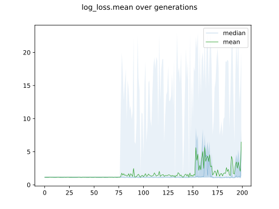

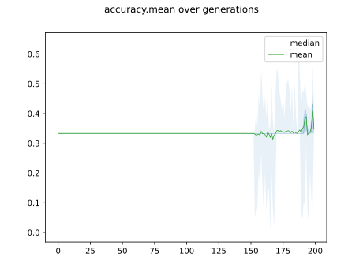

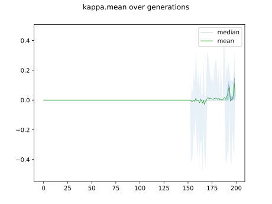

## Individuals in hall of fame

### Individual 17836

| key                    |     value |
|:-----------------------|----------:|
| mean log_loss:         |   1.10265 |
| mean accuracy:         |   0.4154  |
| mean kappa:            |   0.1231  |
| number of edges        |  17       |
| number of hidden nodes |   1       |
| number of layers       |   1       |
| birth                  | 199       |

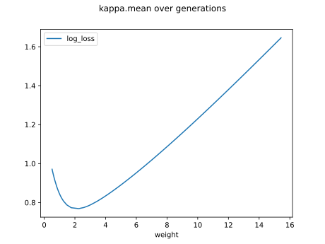

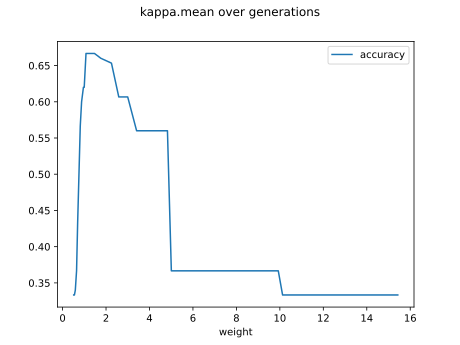

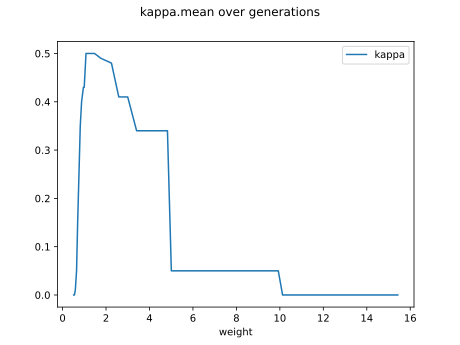

#### Network

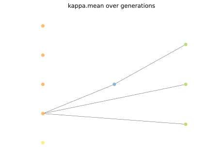

### Individual 17866

| key                    |     value |
|:-----------------------|----------:|
| mean log_loss:         |   1.10265 |
| mean accuracy:         |   0.4154  |
| mean kappa:            |   0.1231  |
| number of edges        |  15       |
| number of hidden nodes |   0       |
| number of layers       |   0       |
| birth                  | 199       |

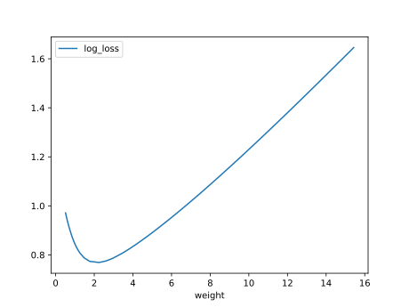

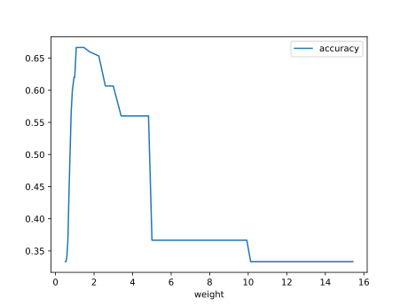

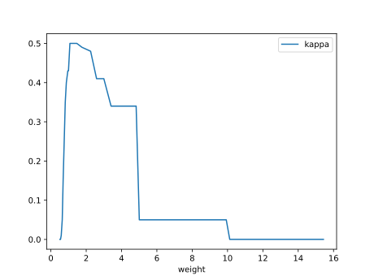

#### Network

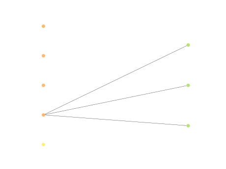

### Individual 17885

| key                    |     value |
|:-----------------------|----------:|
| mean log_loss:         |   1.10265 |
| mean accuracy:         |   0.4154  |
| mean kappa:            |   0.1231  |
| number of edges        |  15       |
| number of hidden nodes |   0       |
| number of layers       |   0       |
| birth                  | 199       |

#### Network

### Individual 17853

| key                    |     value |
|:-----------------------|----------:|
| mean log_loss:         |   1.10265 |
| mean accuracy:         |   0.4154  |
| mean kappa:            |   0.1231  |
| number of edges        |  15       |
| number of hidden nodes |   0       |
| number of layers       |   0       |
| birth                  | 199       |

#### Network

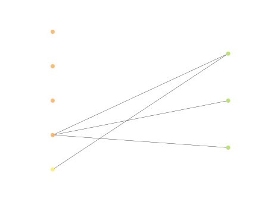

### Individual 17874

| key                    |     value |
|:-----------------------|----------:|
| mean log_loss:         |   1.10265 |
| mean accuracy:         |   0.4154  |
| mean kappa:            |   0.1231  |
| number of edges        |  17       |
| number of hidden nodes |   1       |
| number of layers       |   1       |
| birth                  | 199       |

#### Network

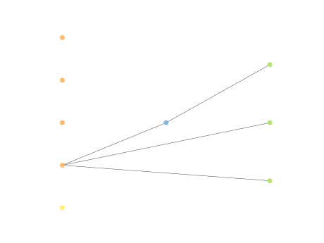

### Individual 17530

| key                    |      value |
|:-----------------------|-----------:|
| mean log_loss:         |   1.05764  |
| mean accuracy:         |   0.404467 |
| mean kappa:            |   0.1067   |
| number of edges        |  15        |
| number of hidden nodes |   0        |
| number of layers       |   0        |
| birth                  | 195        |

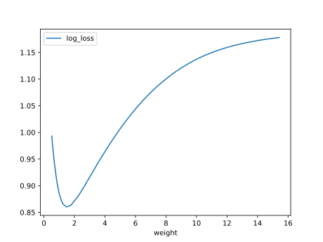

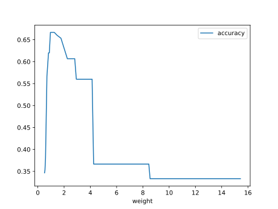

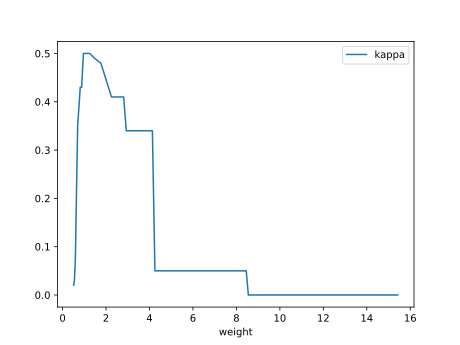

#### Network

### Individual 17482

| key                    |      value |
|:-----------------------|-----------:|
| mean log_loss:         |   1.05764  |
| mean accuracy:         |   0.404467 |
| mean kappa:            |   0.1067   |
| number of edges        |  15        |
| number of hidden nodes |   0        |
| number of layers       |   0        |
| birth                  | 195        |

#### Network

### Individual 16987

| key                    |     value |
|:-----------------------|----------:|
| mean log_loss:         |   1.10296 |
| mean accuracy:         |   0.4192  |
| mean kappa:            |   0.1288  |
| number of edges        |  15       |
| number of hidden nodes |   0       |
| number of layers       |   0       |
| birth                  | 189       |

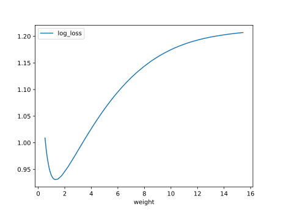

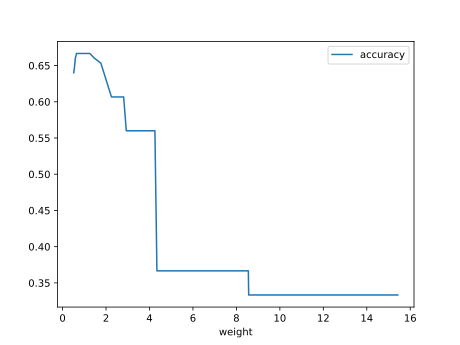

#### Network

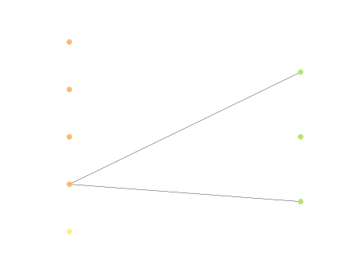

### Individual 17135

| key                    |      value |
|:-----------------------|-----------:|
| mean log_loss:         |   1.06325  |
| mean accuracy:         |   0.416933 |
| mean kappa:            |   0.1254   |
| number of edges        |  15        |
| number of hidden nodes |   0        |
| number of layers       |   0        |
| birth                  | 191        |

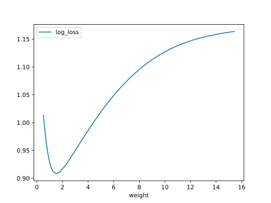

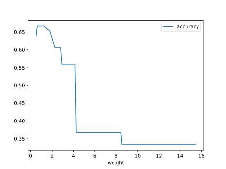

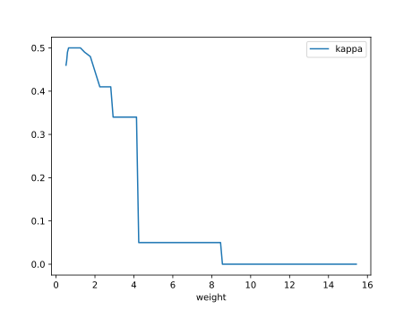

#### Network

### Individual 17898

| key                    |      value |
|:-----------------------|-----------:|
| mean log_loss:         |   1.05656  |
| mean accuracy:         |   0.407867 |
| mean kappa:            |   0.1118   |
| number of edges        |  15        |
| number of hidden nodes |   0        |
| number of layers       |   0        |
| birth                  | 199        |

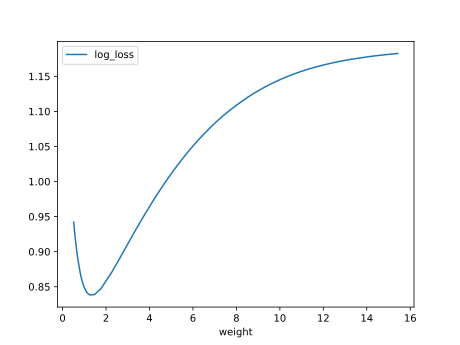

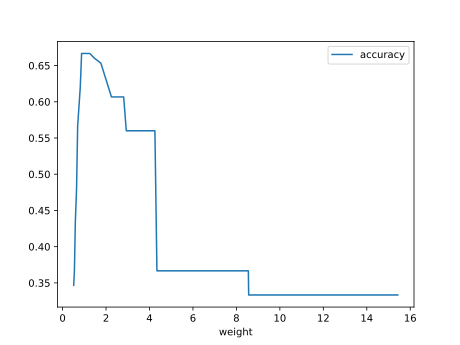

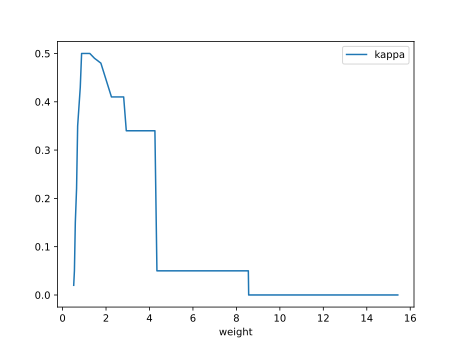

#### Network

