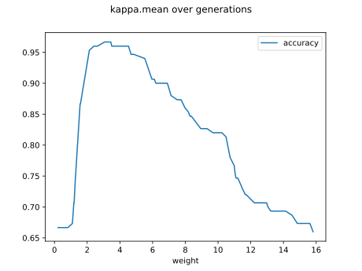

# Report Iris Uniform Distribution [0, 16] run 6

## Best results in hall of fame

| measure       |    value |   individual |
|:--------------|---------:|-------------:|
| mean accuracy | 0.812933 |        17558 |
| max accuracy  | 0.966667 |        17614 |
| mean kappa    | 0.7194   |        17558 |
| max kappa     | 0.95     |        17614 |

## Individuals in hall of fame

### Individual 16423

| key                    |      value |
|:-----------------------|-----------:|
| mean log_loss:         |   4.12876  |
| mean accuracy:         |   0.809733 |
| mean kappa:            |   0.7146   |
| number of edges        |  41        |
| number of hidden nodes |   9        |
| number of layers       |   6        |
| birth                  | 183        |

#### Network

### Individual 17558

| key                    |      value |
|:-----------------------|-----------:|
| mean log_loss:         |   4.12519  |
| mean accuracy:         |   0.812933 |
| mean kappa:            |   0.7194   |
| number of edges        |  41        |
| number of hidden nodes |   9        |
| number of layers       |   6        |
| birth                  | 196        |

#### Network

### Individual 17614

| key                    |      value |
|:-----------------------|-----------:|
| mean log_loss:         |   1.04397  |
| mean accuracy:         |   0.729667 |
| mean kappa:            |   0.5945   |
| number of edges        |  27        |
| number of hidden nodes |   4        |
| number of layers       |   3        |
| birth                  | 196        |

#### Network

### Individual 17896

| key                    |      value |
|:-----------------------|-----------:|
| mean log_loss:         |   1.04397  |
| mean accuracy:         |   0.729667 |
| mean kappa:            |   0.5945   |
| number of edges        |  27        |
| number of hidden nodes |   4        |
| number of layers       |   3        |
| birth                  | 199        |

#### Network

### Individual 14212

| key                    |      value |
|:-----------------------|-----------:|
| mean log_loss:         |  10.003    |
| mean accuracy:         |   0.665467 |
| mean kappa:            |   0.4982   |
| number of edges        |  30        |
| number of hidden nodes |   5        |
| number of layers       |   3        |
| birth                  | 158        |

#### Network

### Individual 14291

| key                    |      value |
|:-----------------------|-----------:|
| mean log_loss:         |  10.0045   |
| mean accuracy:         |   0.661733 |
| mean kappa:            |   0.4926   |
| number of edges        |  29        |
| number of hidden nodes |   5        |
| number of layers       |   3        |
| birth                  | 159        |

#### Network

### Individual 12515

| key                    |      value |
|:-----------------------|-----------:|
| mean log_loss:         |   8.79115  |
| mean accuracy:         |   0.660667 |
| mean kappa:            |   0.491    |
| number of edges        |  23        |
| number of hidden nodes |   2        |
| number of layers       |   2        |
| birth                  | 140        |

#### Network

### Individual 13120

| key                    |      value |
|:-----------------------|-----------:|
| mean log_loss:         |   9.92019  |
| mean accuracy:         |   0.659133 |
| mean kappa:            |   0.4887   |
| number of edges        |  29        |
| number of hidden nodes |   5        |
| number of layers       |   3        |
| birth                  | 146        |

#### Network

### Individual 16333

| key                    |      value |
|:-----------------------|-----------:|
| mean log_loss:         |   3.51745  |
| mean accuracy:         |   0.669467 |
| mean kappa:            |   0.5042   |
| number of edges        |  27        |
| number of hidden nodes |   4        |
| number of layers       |   3        |
| birth                  | 182        |

#### Network

### Individual 17086

| key                    |      value |
|:-----------------------|-----------:|
| mean log_loss:         |   3.52173  |
| mean accuracy:         |   0.663533 |
| mean kappa:            |   0.4953   |
| number of edges        |  27        |
| number of hidden nodes |   4        |
| number of layers       |   3        |
| birth                  | 190        |

#### Network

