# Report Iris Uniform Distribution [0, 16] run 7

## Best results in hall of fame

| measure       |    value |   individual |
|:--------------|---------:|-------------:|
| mean accuracy | 0.666667 |        12565 |
| max accuracy  | 0.666667 |        12565 |
| mean kappa    | 0.5      |        12565 |
| max kappa     | 0.5      |        12565 |

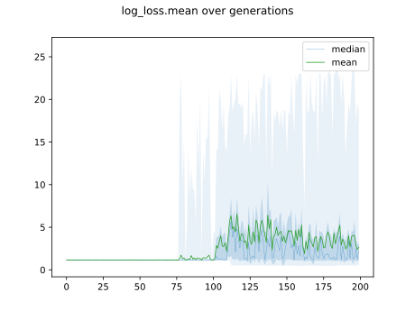

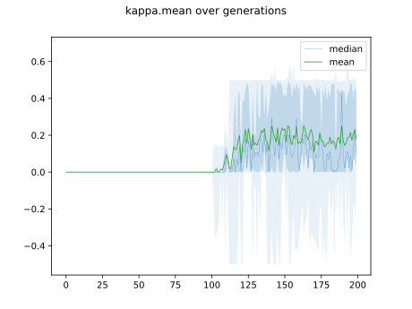

## Individuals in hall of fame

### Individual 12565

| key                    |      value |
|:-----------------------|-----------:|
| mean log_loss:         |   0.511933 |
| mean accuracy:         |   0.666667 |
| mean kappa:            |   0.5      |
| number of edges        |  30        |
| number of hidden nodes |   6        |
| number of layers       |   5        |
| birth                  | 140        |

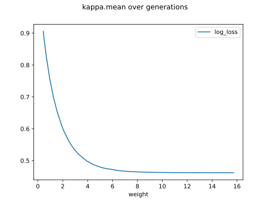

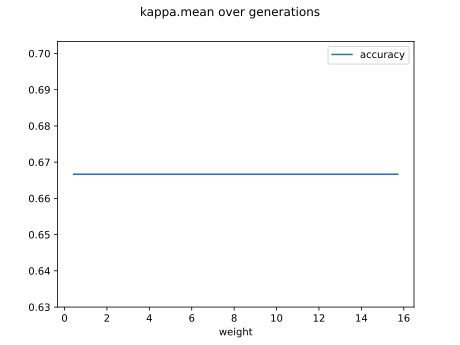

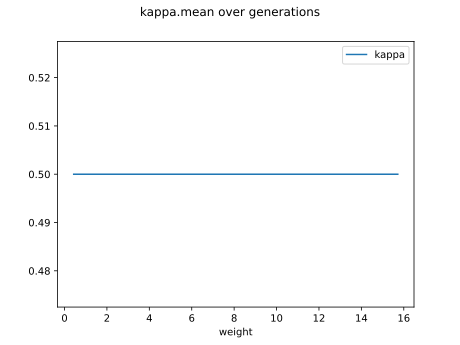

#### Network

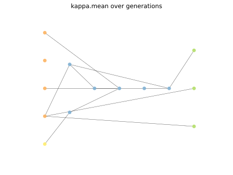

### Individual 12477

| key                    |      value |
|:-----------------------|-----------:|
| mean log_loss:         |   0.511933 |
| mean accuracy:         |   0.666667 |
| mean kappa:            |   0.5      |
| number of edges        |  28        |
| number of hidden nodes |   5        |
| number of layers       |   5        |
| birth                  | 139        |

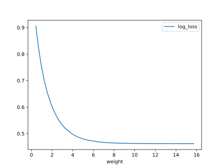

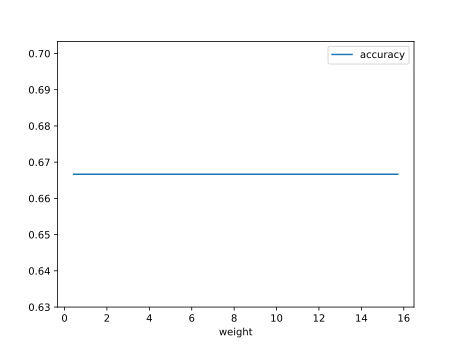

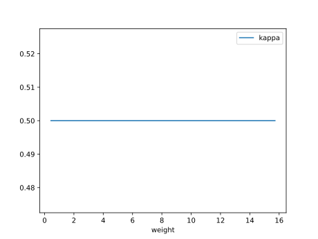

#### Network

### Individual 13218

| key                    |      value |
|:-----------------------|-----------:|
| mean log_loss:         |   0.511933 |
| mean accuracy:         |   0.666667 |
| mean kappa:            |   0.5      |
| number of edges        |  31        |
| number of hidden nodes |   6        |
| number of layers       |   5        |
| birth                  | 147        |

#### Network

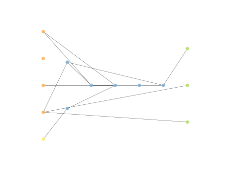

### Individual 13258

| key                    |      value |
|:-----------------------|-----------:|
| mean log_loss:         |   0.511933 |
| mean accuracy:         |   0.666667 |
| mean kappa:            |   0.5      |
| number of edges        |  32        |
| number of hidden nodes |   7        |
| number of layers       |   5        |
| birth                  | 148        |

#### Network

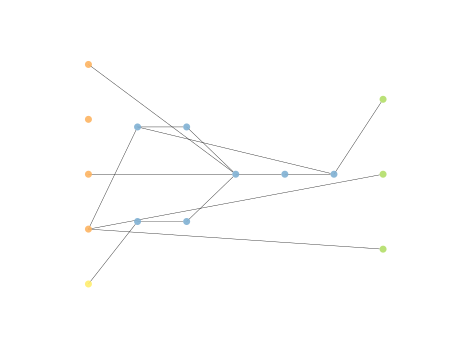

### Individual 13264

| key                    |      value |
|:-----------------------|-----------:|
| mean log_loss:         |   0.511933 |
| mean accuracy:         |   0.666667 |
| mean kappa:            |   0.5      |
| number of edges        |  32        |
| number of hidden nodes |   7        |
| number of layers       |   5        |
| birth                  | 148        |

#### Network

### Individual 12692

| key                    |      value |
|:-----------------------|-----------:|
| mean log_loss:         |   0.511933 |
| mean accuracy:         |   0.666667 |
| mean kappa:            |   0.5      |
| number of edges        |  32        |
| number of hidden nodes |   7        |
| number of layers       |   5        |
| birth                  | 142        |

#### Network

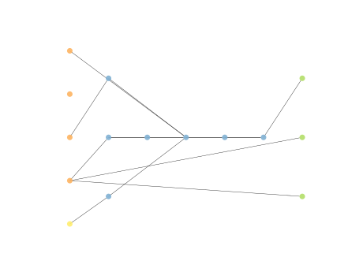

### Individual 11893

| key                    |      value |
|:-----------------------|-----------:|
| mean log_loss:         |   0.551371 |
| mean accuracy:         |   0.666667 |
| mean kappa:            |   0.5      |
| number of edges        |  26        |
| number of hidden nodes |   4        |
| number of layers       |   4        |
| birth                  | 133        |

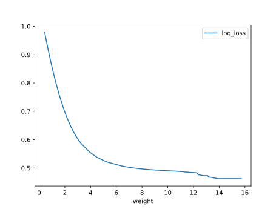

#### Network

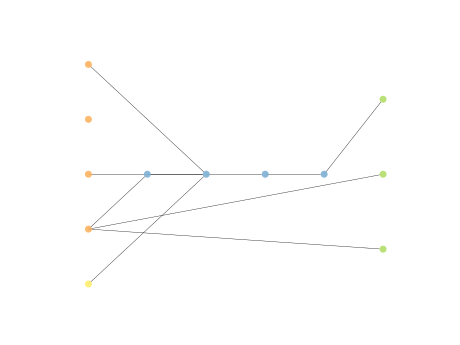

### Individual 10665

| key                    |      value |
|:-----------------------|-----------:|
| mean log_loss:         |   0.556091 |
| mean accuracy:         |   0.666467 |
| mean kappa:            |   0.4997   |
| number of edges        |  23        |
| number of hidden nodes |   3        |
| number of layers       |   3        |
| birth                  | 119        |

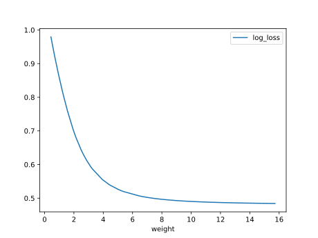

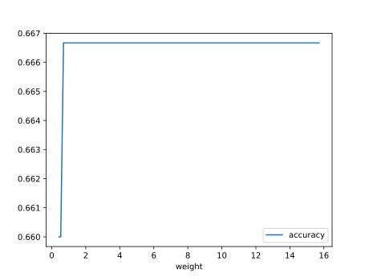

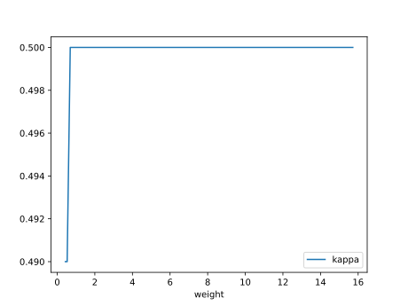

#### Network

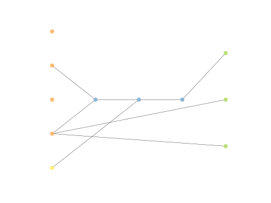

### Individual 10701

| key                    |      value |
|:-----------------------|-----------:|
| mean log_loss:         |   0.556091 |
| mean accuracy:         |   0.666467 |
| mean kappa:            |   0.4997   |
| number of edges        |  23        |
| number of hidden nodes |   3        |
| number of layers       |   3        |
| birth                  | 119        |

#### Network

### Individual 10658

| key                    |      value |
|:-----------------------|-----------:|
| mean log_loss:         |   0.556461 |
| mean accuracy:         |   0.666467 |
| mean kappa:            |   0.4997   |
| number of edges        |  24        |
| number of hidden nodes |   4        |
| number of layers       |   4        |
| birth                  | 119        |

#### Network

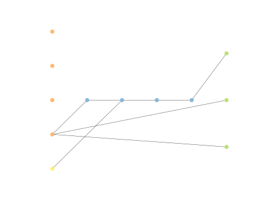

