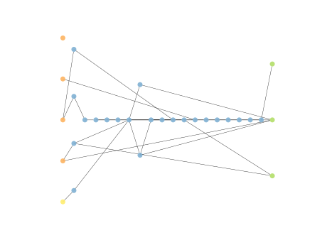

# Report Iris Uniform Distribution [0, 16] run 8

## Best results in hall of fame

| measure       |    value |   individual |
|:--------------|---------:|-------------:|
| mean accuracy | 0.907933 |        16708 |
| max accuracy  | 0.96     |        17859 |
| mean kappa    | 0.8619   |        16708 |
| max kappa     | 0.94     |        17859 |

## Individuals in hall of fame

### Individual 17859

| key                    |      value |
|:-----------------------|-----------:|
| mean log_loss:         |   0.575839 |
| mean accuracy:         |   0.895733 |
| mean kappa:            |   0.8436   |
| number of edges        |  69        |
| number of hidden nodes |  24        |
| number of layers       |  20        |
| birth                  | 199        |

#### Network

### Individual 16957

| key                    |      value |
|:-----------------------|-----------:|
| mean log_loss:         |   0.573304 |
| mean accuracy:         |   0.904067 |
| mean kappa:            |   0.8561   |
| number of edges        |  69        |
| number of hidden nodes |  24        |
| number of layers       |  20        |
| birth                  | 189        |

#### Network

### Individual 16226

| key                    |      value |
|:-----------------------|-----------:|
| mean log_loss:         |   0.57658  |
| mean accuracy:         |   0.907067 |
| mean kappa:            |   0.8606   |
| number of edges        |  69        |
| number of hidden nodes |  24        |
| number of layers       |  20        |
| birth                  | 181        |

#### Network

### Individual 16708

| key                    |      value |
|:-----------------------|-----------:|
| mean log_loss:         |   0.57298  |
| mean accuracy:         |   0.907933 |
| mean kappa:            |   0.8619   |
| number of edges        |  69        |
| number of hidden nodes |  24        |
| number of layers       |  20        |
| birth                  | 186        |

#### Network

### Individual 12867

| key                    |      value |
|:-----------------------|-----------:|
| mean log_loss:         |   0.867654 |
| mean accuracy:         |   0.8694   |
| mean kappa:            |   0.8041   |
| number of edges        |  66        |
| number of hidden nodes |  22        |
| number of layers       |  18        |
| birth                  | 143        |

#### Network

### Individual 17379

| key                    |      value |
|:-----------------------|-----------:|
| mean log_loss:         |   0.576233 |
| mean accuracy:         |   0.907333 |
| mean kappa:            |   0.861    |
| number of edges        |  70        |
| number of hidden nodes |  24        |
| number of layers       |  20        |
| birth                  | 194        |

#### Network

### Individual 16137

| key                    |      value |
|:-----------------------|-----------:|
| mean log_loss:         |   0.57658  |
| mean accuracy:         |   0.907067 |
| mean kappa:            |   0.8606   |
| number of edges        |  69        |
| number of hidden nodes |  24        |
| number of layers       |  20        |
| birth                  | 180        |

#### Network

### Individual 16198

| key                    |      value |
|:-----------------------|-----------:|
| mean log_loss:         |   0.601859 |
| mean accuracy:         |   0.9068   |
| mean kappa:            |   0.8602   |
| number of edges        |  67        |
| number of hidden nodes |  23        |
| number of layers       |  19        |
| birth                  | 180        |

#### Network

### Individual 17025

| key                    |      value |
|:-----------------------|-----------:|
| mean log_loss:         |   0.575839 |
| mean accuracy:         |   0.895733 |
| mean kappa:            |   0.8436   |
| number of edges        |  69        |
| number of hidden nodes |  24        |
| number of layers       |  20        |
| birth                  | 190        |

#### Network

### Individual 12551

| key                    |      value |
|:-----------------------|-----------:|
| mean log_loss:         |   0.851588 |
| mean accuracy:         |   0.886133 |
| mean kappa:            |   0.8292   |
| number of edges        |  63        |
| number of hidden nodes |  21        |
| number of layers       |  17        |
| birth                  | 140        |

#### Network

