# Report Iris Uniform Distribution [0, 16] run 9

## Best results in hall of fame

| measure       |    value |   individual |
|:--------------|---------:|-------------:|
| mean accuracy | 0.7092   |        14200 |
| max accuracy  | 0.953333 |        13352 |
| mean kappa    | 0.5638   |        14200 |
| max kappa     | 0.93     |        13352 |

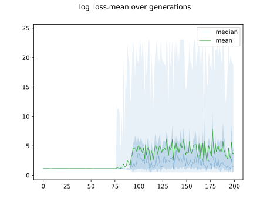

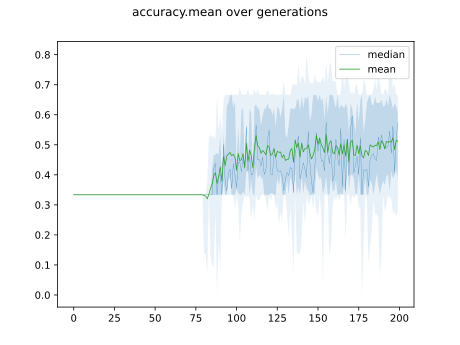

## Individuals in hall of fame

### Individual 13352

| key                    |      value |
|:-----------------------|-----------:|
| mean log_loss:         |   2.2825   |
| mean accuracy:         |   0.708467 |
| mean kappa:            |   0.5627   |
| number of edges        |  29        |
| number of hidden nodes |   6        |
| number of layers       |   5        |
| birth                  | 149        |

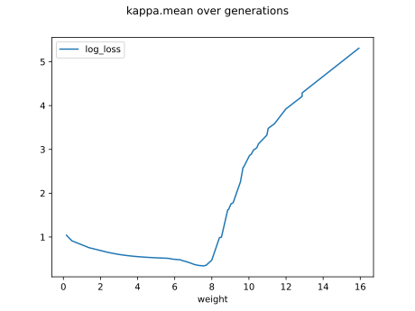

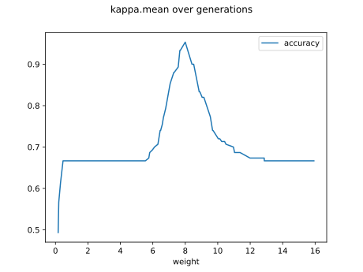

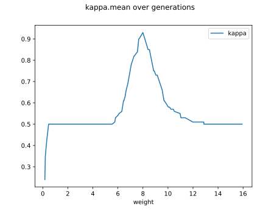

#### Network

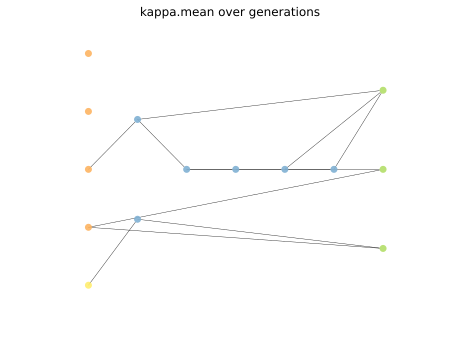

### Individual 14200

| key                    |     value |
|:-----------------------|----------:|
| mean log_loss:         |   2.28251 |
| mean accuracy:         |   0.7092  |
| mean kappa:            |   0.5638  |
| number of edges        |  31       |
| number of hidden nodes |   7       |
| number of layers       |   6       |
| birth                  | 158       |

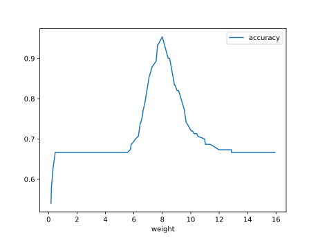

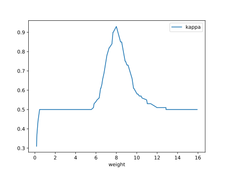

#### Network

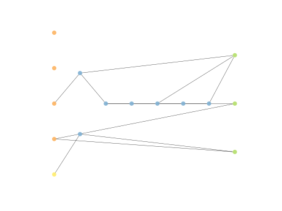

### Individual 12239

| key                    |      value |
|:-----------------------|-----------:|
| mean log_loss:         |   2.28236  |
| mean accuracy:         |   0.708467 |
| mean kappa:            |   0.5627   |
| number of edges        |  27        |
| number of hidden nodes |   5        |
| number of layers       |   5        |
| birth                  | 136        |

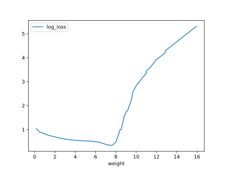

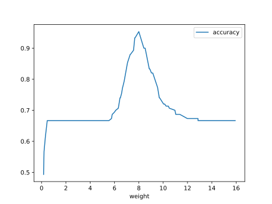

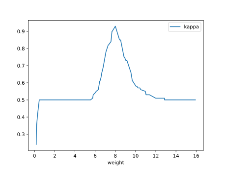

#### Network

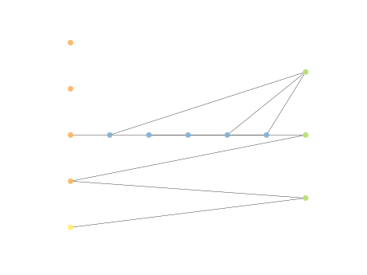

### Individual 14178

| key                    |      value |
|:-----------------------|-----------:|
| mean log_loss:         |   0.882213 |
| mean accuracy:         |   0.690267 |
| mean kappa:            |   0.5354   |
| number of edges        |  31        |
| number of hidden nodes |   7        |
| number of layers       |   5        |
| birth                  | 158        |

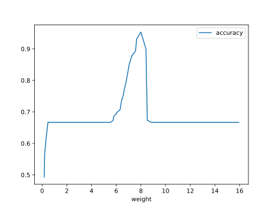

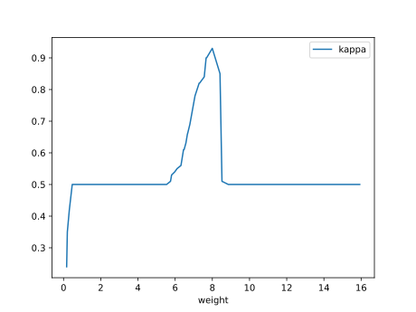

#### Network

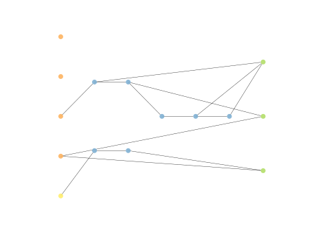

### Individual 13835

| key                    |      value |
|:-----------------------|-----------:|
| mean log_loss:         |   0.879626 |
| mean accuracy:         |   0.692533 |
| mean kappa:            |   0.5388   |
| number of edges        |  31        |
| number of hidden nodes |   7        |
| number of layers       |   5        |
| birth                  | 154        |

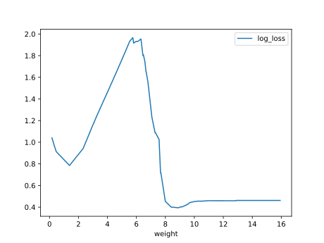

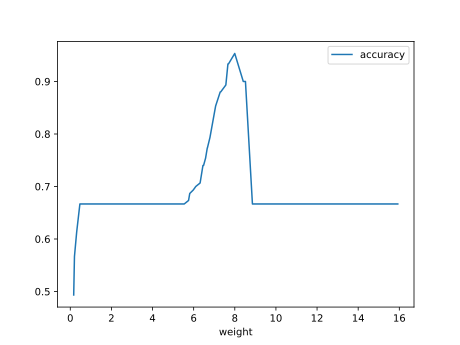

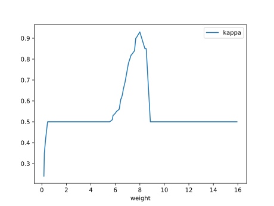

#### Network

### Individual 14080

| key                    |      value |
|:-----------------------|-----------:|
| mean log_loss:         |   0.882213 |
| mean accuracy:         |   0.690267 |
| mean kappa:            |   0.5354   |
| number of edges        |  33        |
| number of hidden nodes |   8        |
| number of layers       |   6        |
| birth                  | 157        |

#### Network

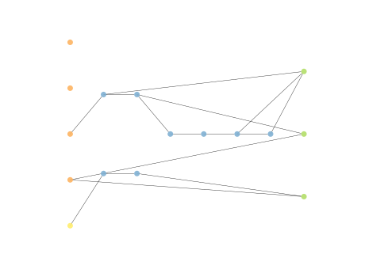

### Individual 13007

| key                    |      value |
|:-----------------------|-----------:|
| mean log_loss:         |   0.882502 |
| mean accuracy:         |   0.690267 |
| mean kappa:            |   0.5354   |
| number of edges        |  29        |
| number of hidden nodes |   6        |
| number of layers       |   5        |
| birth                  | 145        |

#### Network

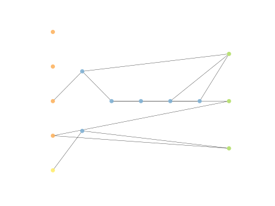

### Individual 13826

| key                    |      value |
|:-----------------------|-----------:|
| mean log_loss:         |   0.879716 |
| mean accuracy:         |   0.692533 |
| mean kappa:            |   0.5388   |
| number of edges        |  31        |
| number of hidden nodes |   7        |
| number of layers       |   5        |
| birth                  | 154        |

#### Network

### Individual 13570

| key                    |      value |
|:-----------------------|-----------:|
| mean log_loss:         |   0.882502 |
| mean accuracy:         |   0.690267 |
| mean kappa:            |   0.5354   |
| number of edges        |  30        |
| number of hidden nodes |   6        |
| number of layers       |   5        |
| birth                  | 151        |

#### Network

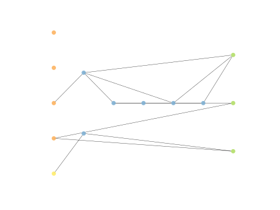

### Individual 13620

| key                    |      value |
|:-----------------------|-----------:|
| mean log_loss:         |   0.882502 |
| mean accuracy:         |   0.690267 |
| mean kappa:            |   0.5354   |
| number of edges        |  31        |
| number of hidden nodes |   7        |
| number of layers       |   6        |
| birth                  | 152        |

#### Network

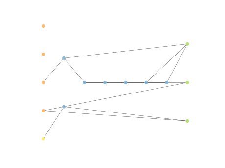

