# Report Iris Uniform Distribution [0, 2] run 0

## Best results in hall of fame

| measure       |    value |   individual |
|:--------------|---------:|-------------:|
| mean accuracy | 0.635133 |        14278 |
| max accuracy  | 0.853333 |        14278 |
| mean kappa    | 0.4527   |        14278 |
| max kappa     | 0.78     |        14278 |

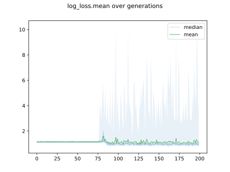

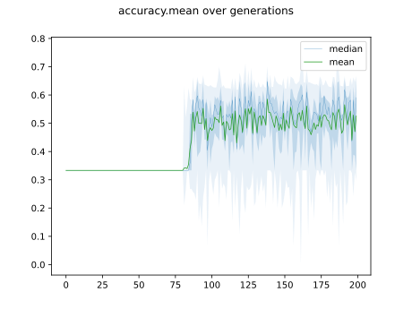

## Individuals in hall of fame

### Individual 14278

| key                    |      value |
|:-----------------------|-----------:|
| mean log_loss:         |   0.820914 |
| mean accuracy:         |   0.635133 |
| mean kappa:            |   0.4527   |
| number of edges        |  19        |
| number of hidden nodes |   2        |
| number of layers       |   2        |
| birth                  | 159        |

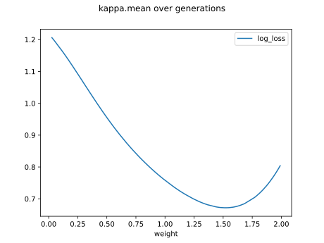

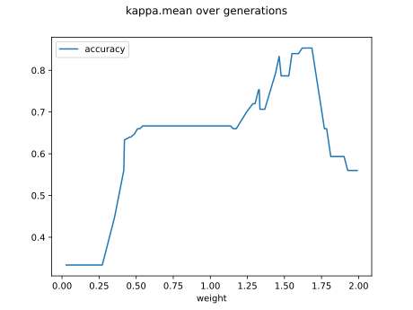

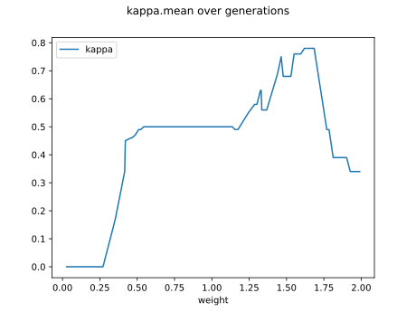

#### Network

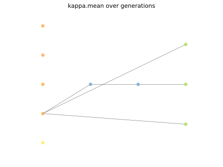

### Individual 14171

| key                    |      value |
|:-----------------------|-----------:|
| mean log_loss:         |   0.867129 |
| mean accuracy:         |   0.621067 |
| mean kappa:            |   0.4316   |
| number of edges        |  19        |
| number of hidden nodes |   2        |
| number of layers       |   2        |
| birth                  | 158        |

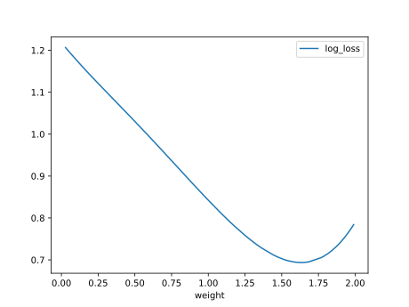

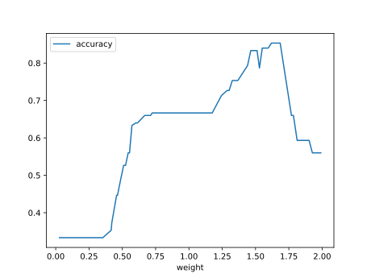

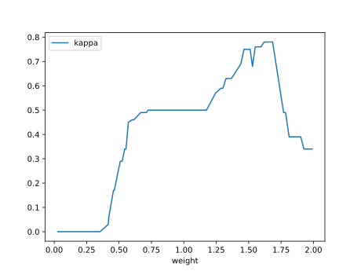

#### Network

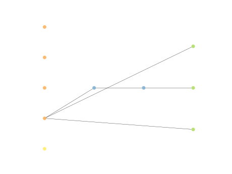

### Individual 17617

| key                    |      value |
|:-----------------------|-----------:|
| mean log_loss:         |   0.839352 |
| mean accuracy:         |   0.617267 |
| mean kappa:            |   0.4259   |
| number of edges        |  20        |
| number of hidden nodes |   2        |
| number of layers       |   2        |
| birth                  | 196        |

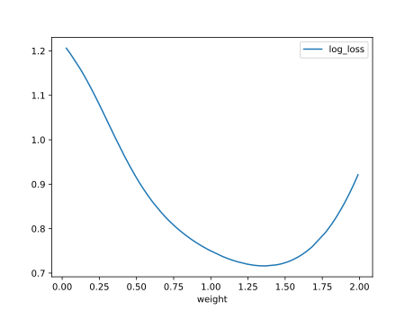

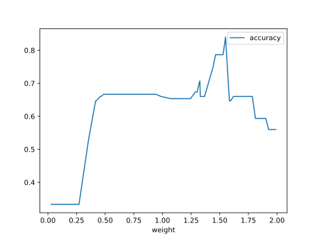

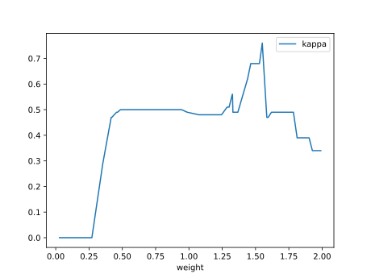

#### Network

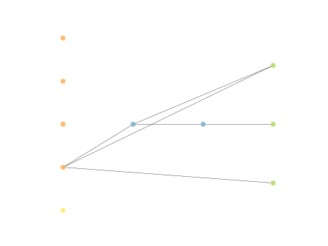

### Individual 12902

| key                    |      value |
|:-----------------------|-----------:|
| mean log_loss:         |   0.820914 |
| mean accuracy:         |   0.635133 |
| mean kappa:            |   0.4527   |
| number of edges        |  19        |
| number of hidden nodes |   2        |
| number of layers       |   2        |
| birth                  | 144        |

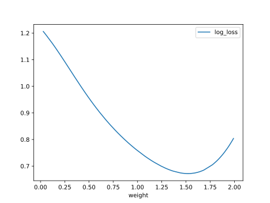

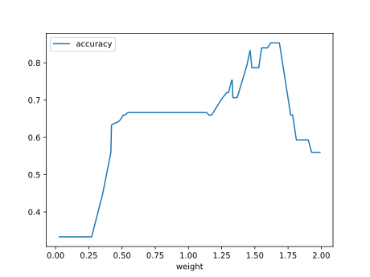

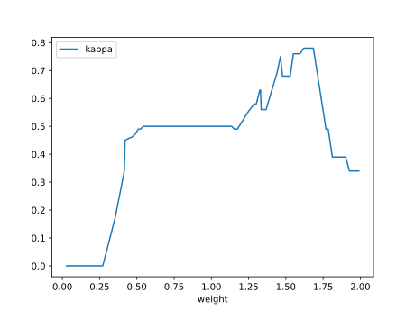

#### Network

### Individual 14276

| key                    |      value |
|:-----------------------|-----------:|
| mean log_loss:         |   0.820914 |
| mean accuracy:         |   0.635133 |
| mean kappa:            |   0.4527   |
| number of edges        |  19        |
| number of hidden nodes |   2        |
| number of layers       |   2        |
| birth                  | 159        |

#### Network

### Individual 17420

| key                    |      value |
|:-----------------------|-----------:|
| mean log_loss:         |   0.867129 |
| mean accuracy:         |   0.621067 |
| mean kappa:            |   0.4316   |
| number of edges        |  20        |
| number of hidden nodes |   2        |
| number of layers       |   2        |
| birth                  | 194        |

#### Network

### Individual 11014

| key                    |      value |
|:-----------------------|-----------:|
| mean log_loss:         |   0.839352 |
| mean accuracy:         |   0.617267 |
| mean kappa:            |   0.4259   |
| number of edges        |  20        |
| number of hidden nodes |   2        |
| number of layers       |   2        |
| birth                  | 123        |

#### Network

### Individual 17396

| key                    |      value |
|:-----------------------|-----------:|
| mean log_loss:         |   0.867129 |
| mean accuracy:         |   0.621067 |
| mean kappa:            |   0.4316   |
| number of edges        |  19        |
| number of hidden nodes |   2        |
| number of layers       |   2        |
| birth                  | 194        |

#### Network

### Individual 11716

| key                    |      value |
|:-----------------------|-----------:|
| mean log_loss:         |   0.845731 |
| mean accuracy:         |   0.618867 |
| mean kappa:            |   0.4283   |
| number of edges        |  21        |
| number of hidden nodes |   3        |
| number of layers       |   2        |
| birth                  | 131        |

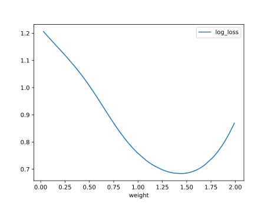

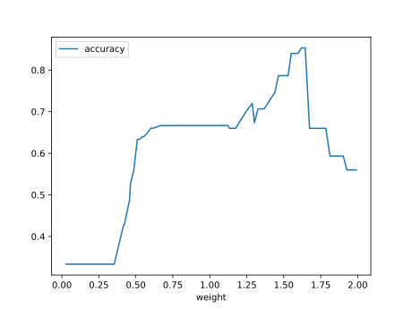

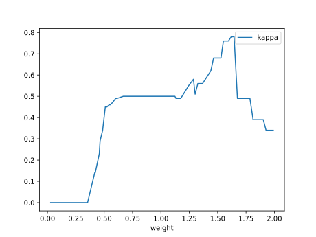

#### Network

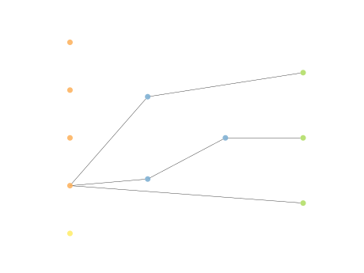

### Individual 15714

| key                    |      value |
|:-----------------------|-----------:|
| mean log_loss:         |   0.839352 |
| mean accuracy:         |   0.617267 |
| mean kappa:            |   0.4259   |
| number of edges        |  20        |
| number of hidden nodes |   2        |
| number of layers       |   2        |
| birth                  | 175        |

#### Network

