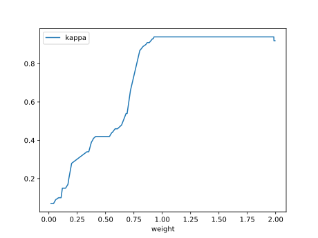

# Report Iris Uniform Distribution [0, 2] run 1

## Best results in hall of fame

| measure       |    value |   individual |
|:--------------|---------:|-------------:|
| mean accuracy | 0.838933 |        16050 |
| max accuracy  | 0.966667 |        17507 |
| mean kappa    | 0.7584   |        16050 |
| max kappa     | 0.95     |        17507 |

## Individuals in hall of fame

### Individual 17507

| key                    |      value |
|:-----------------------|-----------:|
| mean log_loss:         |   0.514945 |
| mean accuracy:         |   0.820933 |
| mean kappa:            |   0.7314   |
| number of edges        |  50        |
| number of hidden nodes |  12        |
| number of layers       |   8        |
| birth                  | 195        |

#### Network

### Individual 17518

| key                    |     value |
|:-----------------------|----------:|
| mean log_loss:         |   0.54454 |
| mean accuracy:         |   0.8126  |
| mean kappa:            |   0.7189  |
| number of edges        |  60       |
| number of hidden nodes |  18       |
| number of layers       |  14       |
| birth                  | 195       |

#### Network

### Individual 16869

| key                    |      value |
|:-----------------------|-----------:|
| mean log_loss:         |   0.537039 |
| mean accuracy:         |   0.809533 |
| mean kappa:            |   0.7143   |
| number of edges        |  48        |
| number of hidden nodes |  11        |
| number of layers       |   8        |
| birth                  | 188        |

#### Network

### Individual 17717

| key                    |      value |
|:-----------------------|-----------:|
| mean log_loss:         |   0.511185 |
| mean accuracy:         |   0.837333 |
| mean kappa:            |   0.756    |
| number of edges        |  52        |
| number of hidden nodes |  13        |
| number of layers       |   9        |
| birth                  | 197        |

#### Network

### Individual 17541

| key                    |      value |
|:-----------------------|-----------:|
| mean log_loss:         |   0.559333 |
| mean accuracy:         |   0.797733 |
| mean kappa:            |   0.6966   |
| number of edges        |  59        |
| number of hidden nodes |  17        |
| number of layers       |  14        |
| birth                  | 195        |

#### Network

### Individual 17041

| key                    |      value |
|:-----------------------|-----------:|
| mean log_loss:         |   0.51188  |
| mean accuracy:         |   0.818867 |
| mean kappa:            |   0.7283   |
| number of edges        |  50        |
| number of hidden nodes |  12        |
| number of layers       |   9        |
| birth                  | 190        |

#### Network

### Individual 16834

| key                    |      value |
|:-----------------------|-----------:|
| mean log_loss:         |   0.563455 |
| mean accuracy:         |   0.798    |
| mean kappa:            |   0.697    |
| number of edges        |  58        |
| number of hidden nodes |  17        |
| number of layers       |  14        |
| birth                  | 188        |

#### Network

### Individual 17079

| key                    |      value |
|:-----------------------|-----------:|
| mean log_loss:         |   0.536475 |
| mean accuracy:         |   0.818667 |
| mean kappa:            |   0.728    |
| number of edges        |  58        |
| number of hidden nodes |  17        |
| number of layers       |  14        |
| birth                  | 190        |

#### Network

### Individual 17650

| key                    |      value |
|:-----------------------|-----------:|
| mean log_loss:         |   0.514928 |
| mean accuracy:         |   0.821    |
| mean kappa:            |   0.7315   |
| number of edges        |  51        |
| number of hidden nodes |  12        |
| number of layers       |   8        |
| birth                  | 197        |

#### Network

### Individual 16050

| key                    |      value |
|:-----------------------|-----------:|
| mean log_loss:         |   0.510588 |
| mean accuracy:         |   0.838933 |
| mean kappa:            |   0.7584   |
| number of edges        |  48        |
| number of hidden nodes |  11        |
| number of layers       |   8        |
| birth                  | 179        |

#### Network

