# Report Iris Uniform Distribution [0, 2] run 2

## Best results in hall of fame

| measure       |    value |   individual |
|:--------------|---------:|-------------:|
| mean accuracy | 0.6906   |        15466 |
| max accuracy  | 0.853333 |        15466 |
| mean kappa    | 0.5359   |        15466 |
| max kappa     | 0.78     |        15466 |

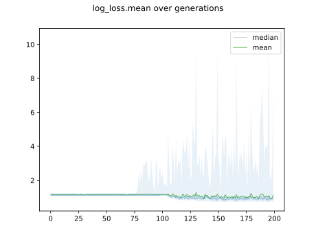

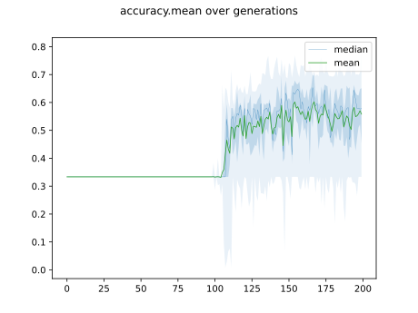

## Individuals in hall of fame

### Individual 15466

| key                    |      value |
|:-----------------------|-----------:|
| mean log_loss:         |   0.751086 |
| mean accuracy:         |   0.6906   |
| mean kappa:            |   0.5359   |
| number of edges        |  35        |
| number of hidden nodes |   7        |
| number of layers       |   4        |
| birth                  | 172        |

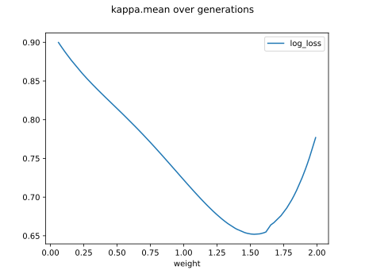

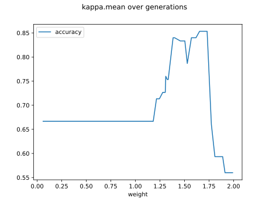

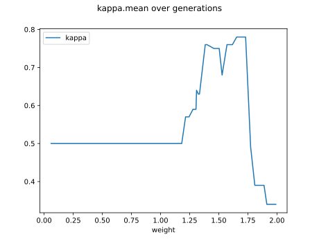

#### Network

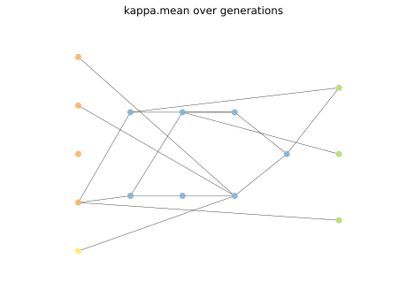

### Individual 15479

| key                    |      value |
|:-----------------------|-----------:|
| mean log_loss:         |   0.751086 |
| mean accuracy:         |   0.6906   |
| mean kappa:            |   0.5359   |
| number of edges        |  36        |
| number of hidden nodes |   8        |
| number of layers       |   4        |
| birth                  | 172        |

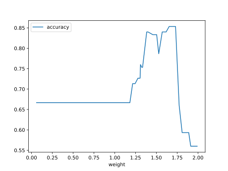

#### Network

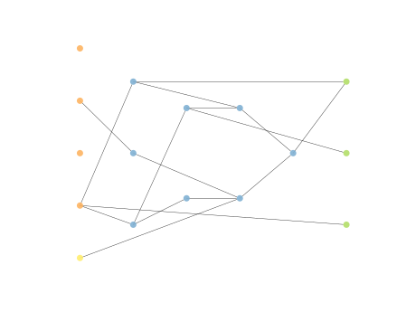

### Individual 17964

| key                    |      value |
|:-----------------------|-----------:|
| mean log_loss:         |   0.751028 |
| mean accuracy:         |   0.6906   |
| mean kappa:            |   0.5359   |
| number of edges        |  31        |
| number of hidden nodes |   7        |
| number of layers       |   4        |
| birth                  | 200        |

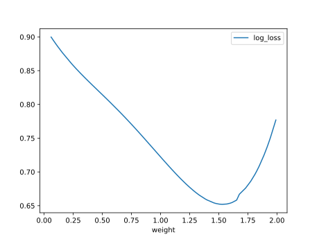

#### Network

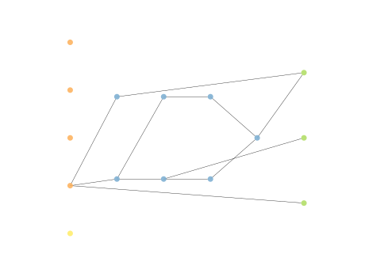

### Individual 11940

| key                    |      value |
|:-----------------------|-----------:|
| mean log_loss:         |   0.755535 |
| mean accuracy:         |   0.686    |
| mean kappa:            |   0.529    |
| number of edges        |  26        |
| number of hidden nodes |   5        |
| number of layers       |   3        |
| birth                  | 133        |

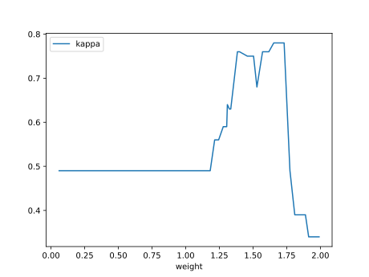

#### Network

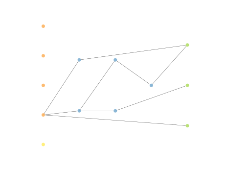

### Individual 17558

| key                    |      value |
|:-----------------------|-----------:|
| mean log_loss:         |   0.751028 |
| mean accuracy:         |   0.6906   |
| mean kappa:            |   0.5359   |
| number of edges        |  31        |
| number of hidden nodes |   7        |
| number of layers       |   4        |
| birth                  | 196        |

#### Network

### Individual 17617

| key                    |      value |
|:-----------------------|-----------:|
| mean log_loss:         |   0.75161  |
| mean accuracy:         |   0.689667 |
| mean kappa:            |   0.5345   |
| number of edges        |  31        |
| number of hidden nodes |   7        |
| number of layers       |   4        |
| birth                  | 196        |

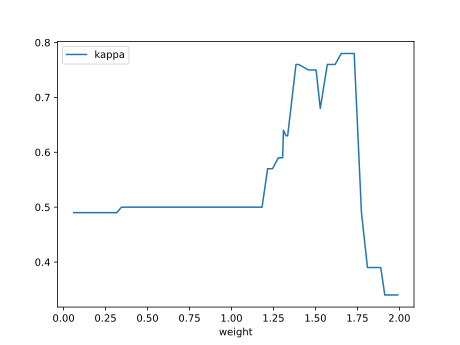

#### Network

### Individual 15634

| key                    |      value |
|:-----------------------|-----------:|
| mean log_loss:         |   0.750297 |
| mean accuracy:         |   0.6906   |
| mean kappa:            |   0.5359   |
| number of edges        |  38        |
| number of hidden nodes |   9        |
| number of layers       |   4        |
| birth                  | 174        |

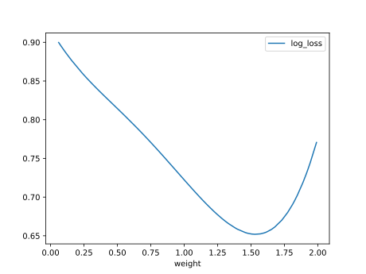

#### Network

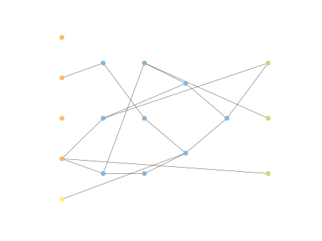

### Individual 15017

| key                    |      value |
|:-----------------------|-----------:|
| mean log_loss:         |   0.755497 |
| mean accuracy:         |   0.6906   |
| mean kappa:            |   0.5359   |
| number of edges        |  32        |
| number of hidden nodes |   7        |
| number of layers       |   4        |
| birth                  | 167        |

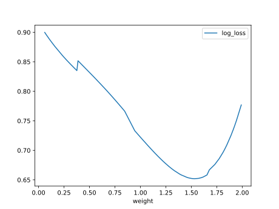

#### Network

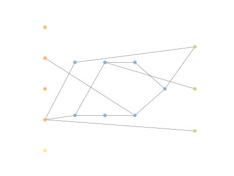

### Individual 14830

| key                    |      value |
|:-----------------------|-----------:|
| mean log_loss:         |   0.751139 |
| mean accuracy:         |   0.6904   |
| mean kappa:            |   0.5356   |
| number of edges        |  32        |
| number of hidden nodes |   7        |
| number of layers       |   4        |
| birth                  | 165        |

#### Network

### Individual 14944

| key                    |      value |
|:-----------------------|-----------:|
| mean log_loss:         |   0.751363 |
| mean accuracy:         |   0.69     |
| mean kappa:            |   0.535    |
| number of edges        |  34        |
| number of hidden nodes |   8        |
| number of layers       |   4        |
| birth                  | 167        |

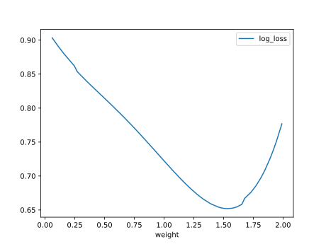

#### Network

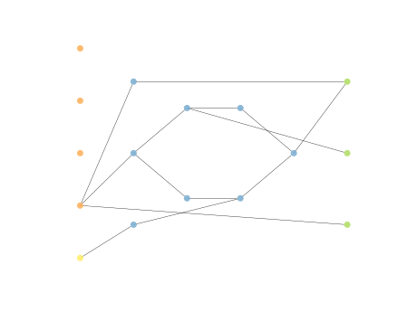

