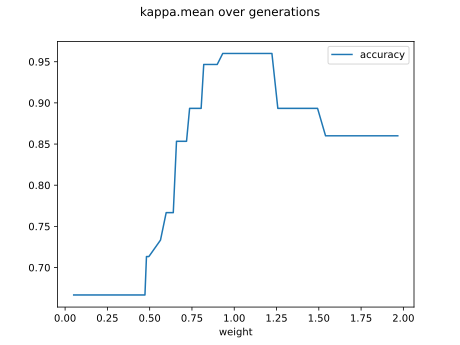
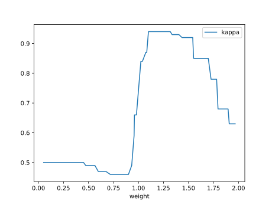
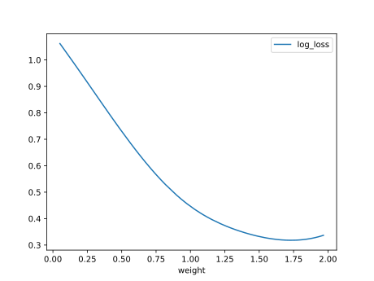

# Report Iris Uniform Distribution [0, 2] run 3

## Best results in hall of fame

| measure       |   value |   individual |
|:--------------|--------:|-------------:|
| mean accuracy |  0.8532 |        14870 |
| max accuracy  |  0.96   |        14870 |
| mean kappa    |  0.7798 |        14870 |
| max kappa     |  0.94   |        14870 |

## Individuals in hall of fame

### Individual 14870

| key                    |      value |
|:-----------------------|-----------:|
| mean log_loss:         |   0.508995 |
| mean accuracy:         |   0.8532   |
| mean kappa:            |   0.7798   |
| number of edges        |  40        |
| number of hidden nodes |  11        |
| number of layers       |   6        |
| birth                  | 166        |

#### Network

### Individual 16461

| key                    |      value |
|:-----------------------|-----------:|
| mean log_loss:         |   0.670157 |
| mean accuracy:         |   0.803867 |
| mean kappa:            |   0.7058   |
| number of edges        |  34        |
| number of hidden nodes |   8        |
| number of layers       |   5        |
| birth                  | 183        |

#### Network

### Individual 17117

| key                    |      value |
|:-----------------------|-----------:|
| mean log_loss:         |   0.471614 |
| mean accuracy:         |   0.8006   |
| mean kappa:            |   0.7009   |
| number of edges        |  57        |
| number of hidden nodes |  17        |
| number of layers       |   9        |
| birth                  | 191        |

#### Network

### Individual 17107

| key                    |      value |
|:-----------------------|-----------:|
| mean log_loss:         |   0.454541 |
| mean accuracy:         |   0.792    |
| mean kappa:            |   0.688    |
| number of edges        |  55        |
| number of hidden nodes |  16        |
| number of layers       |   9        |
| birth                  | 191        |

#### Network

### Individual 15147

| key                    |      value |
|:-----------------------|-----------:|
| mean log_loss:         |   0.482891 |
| mean accuracy:         |   0.792    |
| mean kappa:            |   0.688    |
| number of edges        |  39        |
| number of hidden nodes |  10        |
| number of layers       |   6        |
| birth                  | 169        |

#### Network

### Individual 16902

| key                    |      value |
|:-----------------------|-----------:|
| mean log_loss:         |   0.456265 |
| mean accuracy:         |   0.792    |
| mean kappa:            |   0.688    |
| number of edges        |  53        |
| number of hidden nodes |  15        |
| number of layers       |   8        |
| birth                  | 188        |

#### Network

### Individual 17213

| key                    |      value |
|:-----------------------|-----------:|
| mean log_loss:         |   0.463019 |
| mean accuracy:         |   0.792    |
| mean kappa:            |   0.688    |
| number of edges        |  55        |
| number of hidden nodes |  16        |
| number of layers       |   9        |
| birth                  | 192        |

#### Network

### Individual 17214

| key                    |      value |
|:-----------------------|-----------:|
| mean log_loss:         |   0.462991 |
| mean accuracy:         |   0.792    |
| mean kappa:            |   0.688    |
| number of edges        |  55        |
| number of hidden nodes |  16        |
| number of layers       |   9        |
| birth                  | 192        |

#### Network

### Individual 17209

| key                    |      value |
|:-----------------------|-----------:|
| mean log_loss:         |   0.463062 |
| mean accuracy:         |   0.792    |
| mean kappa:            |   0.688    |
| number of edges        |  55        |
| number of hidden nodes |  16        |
| number of layers       |   9        |
| birth                  | 192        |

#### Network

### Individual 17746

| key                    |      value |
|:-----------------------|-----------:|
| mean log_loss:         |   0.456133 |
| mean accuracy:         |   0.792    |
| mean kappa:            |   0.688    |
| number of edges        |  57        |
| number of hidden nodes |  17        |
| number of layers       |   9        |
| birth                  | 198        |

#### Network

