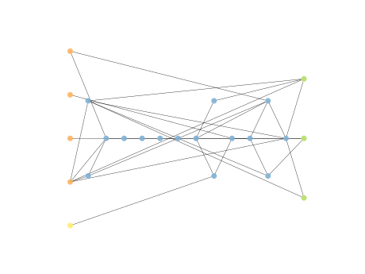

# Report Iris Uniform Distribution [0, 2] run 4

## Best results in hall of fame

| measure       |    value |   individual |
|:--------------|---------:|-------------:|
| mean accuracy | 0.744267 |        12373 |
| max accuracy  | 0.973333 |        13592 |
| mean kappa    | 0.6164   |        12373 |
| max kappa     | 0.96     |        13592 |

## Individuals in hall of fame

### Individual 13592

| key                    |      value |
|:-----------------------|-----------:|
| mean log_loss:         |   0.739264 |
| mean accuracy:         |   0.7442   |
| mean kappa:            |   0.6163   |
| number of edges        |  36        |
| number of hidden nodes |   5        |
| number of layers       |   2        |
| birth                  | 152        |

#### Network

### Individual 16064

| key                    |      value |
|:-----------------------|-----------:|
| mean log_loss:         |   0.726095 |
| mean accuracy:         |   0.7372   |
| mean kappa:            |   0.6058   |
| number of edges        |  49        |
| number of hidden nodes |  11        |
| number of layers       |   7        |
| birth                  | 179        |

#### Network

### Individual 13619

| key                    |      value |
|:-----------------------|-----------:|
| mean log_loss:         |   0.721576 |
| mean accuracy:         |   0.7166   |
| mean kappa:            |   0.5749   |
| number of edges        |  36        |
| number of hidden nodes |   5        |
| number of layers       |   3        |
| birth                  | 152        |

#### Network

### Individual 16226

| key                    |      value |
|:-----------------------|-----------:|
| mean log_loss:         |   0.717341 |
| mean accuracy:         |   0.710867 |
| mean kappa:            |   0.5663   |
| number of edges        |  51        |
| number of hidden nodes |  11        |
| number of layers       |   9        |
| birth                  | 181        |

#### Network

### Individual 11763

| key                    |      value |
|:-----------------------|-----------:|
| mean log_loss:         |   0.790189 |
| mean accuracy:         |   0.726667 |
| mean kappa:            |   0.59     |
| number of edges        |  30        |
| number of hidden nodes |   4        |
| number of layers       |   2        |
| birth                  | 131        |

#### Network

### Individual 13246

| key                    |      value |
|:-----------------------|-----------:|
| mean log_loss:         |   0.728938 |
| mean accuracy:         |   0.701533 |
| mean kappa:            |   0.5523   |
| number of edges        |  37        |
| number of hidden nodes |   6        |
| number of layers       |   3        |
| birth                  | 148        |

#### Network

### Individual 12373

| key                    |      value |
|:-----------------------|-----------:|
| mean log_loss:         |   0.739282 |
| mean accuracy:         |   0.744267 |
| mean kappa:            |   0.6164   |
| number of edges        |  36        |
| number of hidden nodes |   5        |
| number of layers       |   2        |
| birth                  | 138        |

#### Network

### Individual 16215

| key                    |      value |
|:-----------------------|-----------:|
| mean log_loss:         |   0.718787 |
| mean accuracy:         |   0.700667 |
| mean kappa:            |   0.551    |
| number of edges        |  52        |
| number of hidden nodes |  12        |
| number of layers       |   7        |
| birth                  | 181        |

#### Network

### Individual 17170

| key                    |      value |
|:-----------------------|-----------:|
| mean log_loss:         |   0.712994 |
| mean accuracy:         |   0.700867 |
| mean kappa:            |   0.5513   |
| number of edges        |  60        |
| number of hidden nodes |  15        |
| number of layers       |  12        |
| birth                  | 191        |

#### Network

### Individual 17755

| key                    |      value |
|:-----------------------|-----------:|
| mean log_loss:         |   0.713218 |
| mean accuracy:         |   0.698667 |
| mean kappa:            |   0.548    |
| number of edges        |  61        |
| number of hidden nodes |  16        |
| number of layers       |  13        |
| birth                  | 198        |

#### Network

