# Report Iris Uniform Distribution [0, 2] run 5

## Best results in hall of fame

| measure       |    value |   individual |
|:--------------|---------:|-------------:|
| mean accuracy | 0.953733 |        13134 |
| max accuracy  | 0.96     |        13134 |
| mean kappa    | 0.9306   |        13134 |
| max kappa     | 0.94     |        13134 |

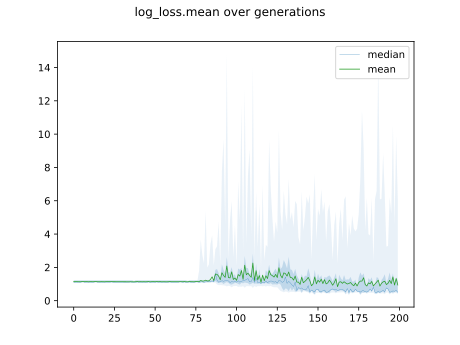

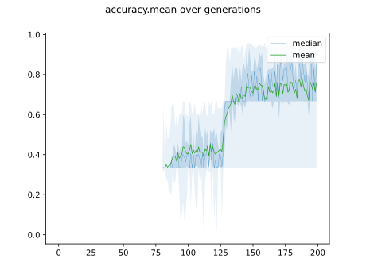

## Individuals in hall of fame

### Individual 13134

| key                    |      value |
|:-----------------------|-----------:|
| mean log_loss:         |   0.545795 |
| mean accuracy:         |   0.953733 |
| mean kappa:            |   0.9306   |
| number of edges        |  26        |
| number of hidden nodes |   5        |
| number of layers       |   2        |
| birth                  | 146        |

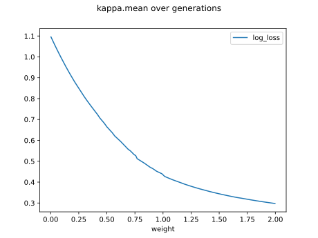

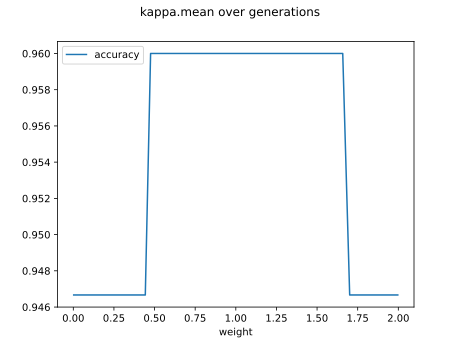

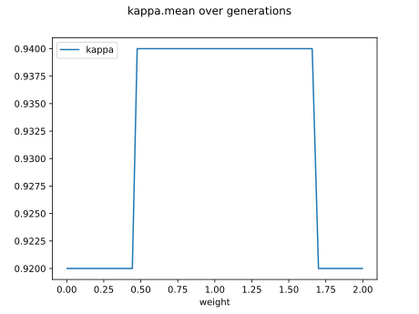

#### Network

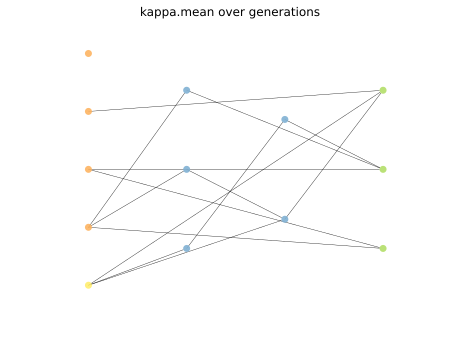

### Individual 13541

| key                    |      value |
|:-----------------------|-----------:|
| mean log_loss:         |   0.534138 |
| mean accuracy:         |   0.934933 |
| mean kappa:            |   0.9024   |
| number of edges        |  28        |
| number of hidden nodes |   6        |
| number of layers       |   2        |
| birth                  | 151        |

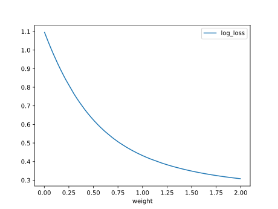

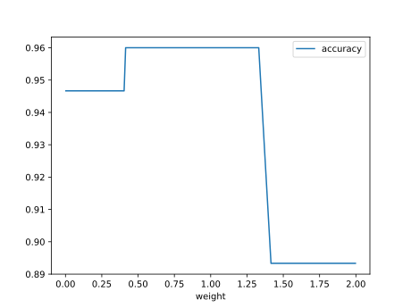

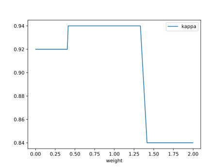

#### Network

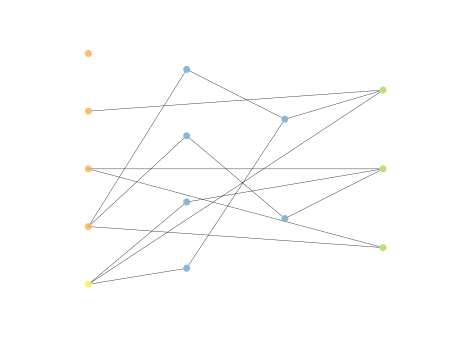

### Individual 14031

| key                    |      value |
|:-----------------------|-----------:|
| mean log_loss:         |   0.547486 |
| mean accuracy:         |   0.933467 |
| mean kappa:            |   0.9002   |
| number of edges        |  28        |
| number of hidden nodes |   6        |
| number of layers       |   2        |
| birth                  | 156        |

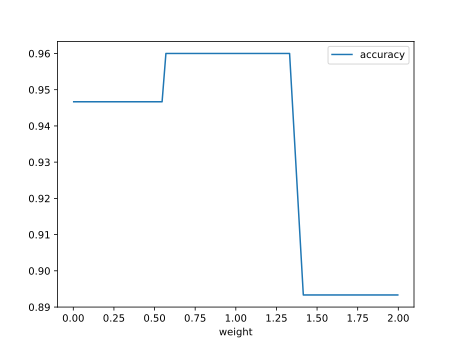

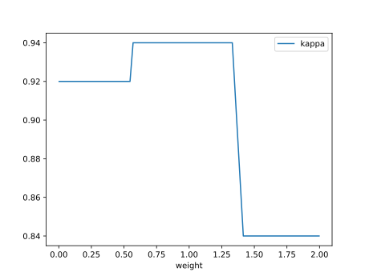

#### Network

### Individual 14570

| key                    |      value |
|:-----------------------|-----------:|
| mean log_loss:         |   0.548198 |
| mean accuracy:         |   0.934933 |
| mean kappa:            |   0.9024   |
| number of edges        |  29        |
| number of hidden nodes |   6        |
| number of layers       |   2        |
| birth                  | 162        |

#### Network

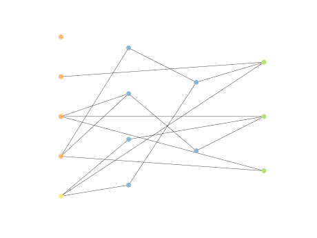

### Individual 11764

| key                    |      value |
|:-----------------------|-----------:|
| mean log_loss:         |   0.585033 |
| mean accuracy:         |   0.928867 |
| mean kappa:            |   0.8933   |
| number of edges        |  21        |
| number of hidden nodes |   3        |
| number of layers       |   2        |
| birth                  | 131        |

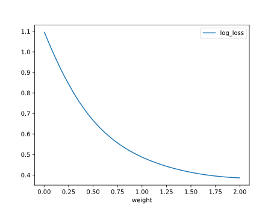

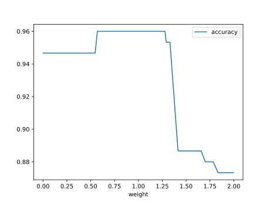

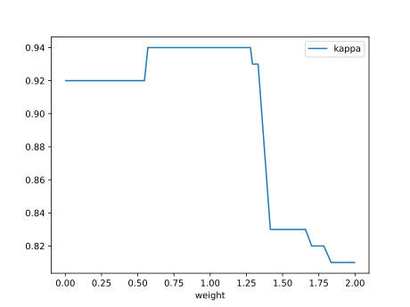

#### Network

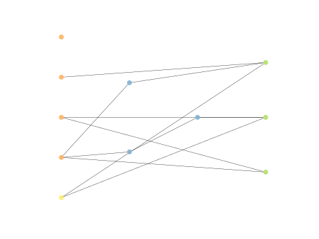

### Individual 11984

| key                    |      value |
|:-----------------------|-----------:|
| mean log_loss:         |   0.570507 |
| mean accuracy:         |   0.933467 |
| mean kappa:            |   0.9002   |
| number of edges        |  22        |
| number of hidden nodes |   3        |
| number of layers       |   2        |
| birth                  | 134        |

#### Network

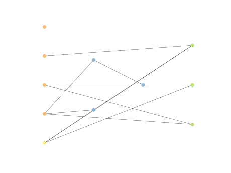

### Individual 12055

| key                    |      value |
|:-----------------------|-----------:|
| mean log_loss:         |   0.570507 |
| mean accuracy:         |   0.933467 |
| mean kappa:            |   0.9002   |
| number of edges        |  22        |
| number of hidden nodes |   3        |
| number of layers       |   2        |
| birth                  | 134        |

#### Network

### Individual 12246

| key                    |      value |
|:-----------------------|-----------:|
| mean log_loss:         |   0.572103 |
| mean accuracy:         |   0.905333 |
| mean kappa:            |   0.858    |
| number of edges        |  23        |
| number of hidden nodes |   3        |
| number of layers       |   1        |
| birth                  | 137        |

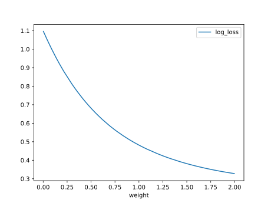

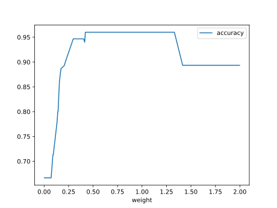

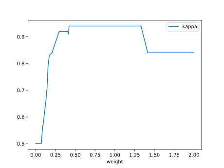

#### Network

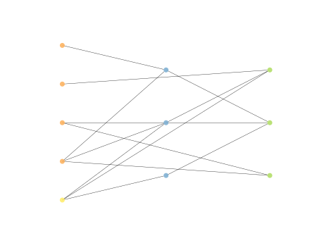

### Individual 14562

| key                    |      value |
|:-----------------------|-----------:|
| mean log_loss:         |   0.548266 |
| mean accuracy:         |   0.901333 |
| mean kappa:            |   0.852    |
| number of edges        |  30        |
| number of hidden nodes |   6        |
| number of layers       |   2        |
| birth                  | 162        |

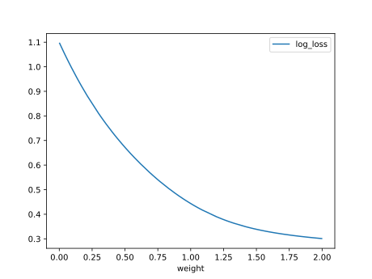

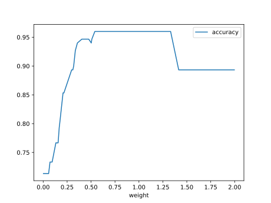

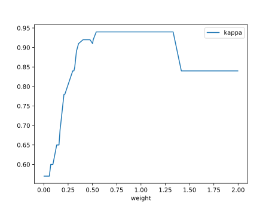

#### Network

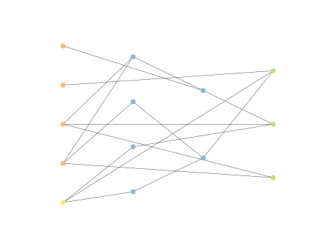

### Individual 17711

| key                    |      value |
|:-----------------------|-----------:|
| mean log_loss:         |   0.511585 |
| mean accuracy:         |   0.902133 |
| mean kappa:            |   0.8532   |
| number of edges        |  41        |
| number of hidden nodes |   9        |
| number of layers       |   7        |
| birth                  | 197        |

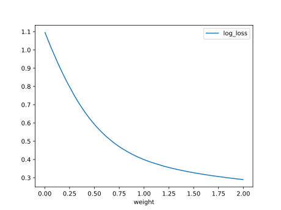

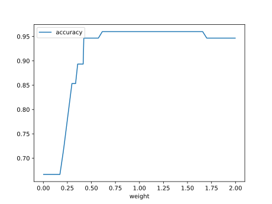

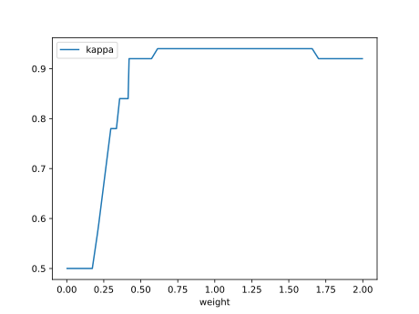

#### Network

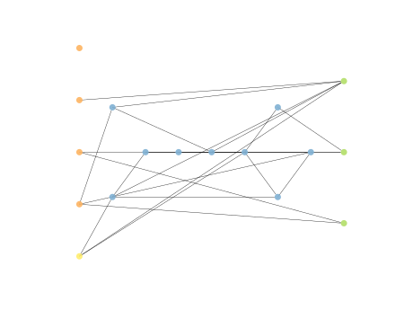

