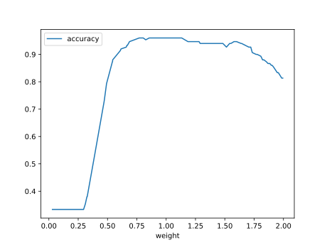
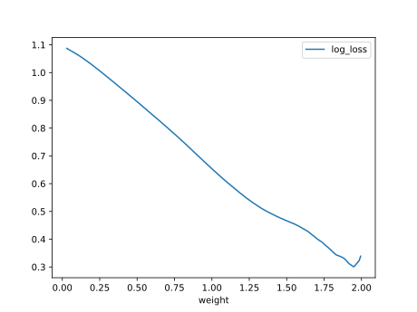

# Report Iris Uniform Distribution [0, 2] run 6

## Best results in hall of fame

| measure       |    value |   individual |
|:--------------|---------:|-------------:|
| mean accuracy | 0.836267 |        16414 |
| max accuracy  | 0.966667 |        15088 |
| mean kappa    | 0.7544   |        16414 |
| max kappa     | 0.95     |        15088 |

## Individuals in hall of fame

### Individual 17643

| key                    |      value |
|:-----------------------|-----------:|
| mean log_loss:         |   0.664641 |
| mean accuracy:         |   0.826933 |
| mean kappa:            |   0.7404   |
| number of edges        |  41        |
| number of hidden nodes |   8        |
| number of layers       |   3        |
| birth                  | 197        |

#### Network

### Individual 17642

| key                    |      value |
|:-----------------------|-----------:|
| mean log_loss:         |   0.674087 |
| mean accuracy:         |   0.818533 |
| mean kappa:            |   0.7278   |
| number of edges        |  40        |
| number of hidden nodes |   8        |
| number of layers       |   3        |
| birth                  | 197        |

#### Network

### Individual 10717

| key                    |      value |
|:-----------------------|-----------:|
| mean log_loss:         |   0.672964 |
| mean accuracy:         |   0.805267 |
| mean kappa:            |   0.7079   |
| number of edges        |  31        |
| number of hidden nodes |   6        |
| number of layers       |   4        |
| birth                  | 120        |

#### Network

### Individual 15996

| key                    |      value |
|:-----------------------|-----------:|
| mean log_loss:         |   0.650574 |
| mean accuracy:         |   0.832467 |
| mean kappa:            |   0.7487   |
| number of edges        |  45        |
| number of hidden nodes |  11        |
| number of layers       |   5        |
| birth                  | 178        |

#### Network

### Individual 16414

| key                    |      value |
|:-----------------------|-----------:|
| mean log_loss:         |   0.648849 |
| mean accuracy:         |   0.836267 |
| mean kappa:            |   0.7544   |
| number of edges        |  49        |
| number of hidden nodes |  13        |
| number of layers       |   6        |
| birth                  | 183        |

#### Network

### Individual 15088

| key                    |     value |
|:-----------------------|----------:|
| mean log_loss:         |   0.66459 |
| mean accuracy:         |   0.8356  |
| mean kappa:            |   0.7534  |
| number of edges        |  43       |
| number of hidden nodes |  10       |
| number of layers       |   5       |
| birth                  | 168       |

#### Network

### Individual 16055

| key                    |      value |
|:-----------------------|-----------:|
| mean log_loss:         |   0.682859 |
| mean accuracy:         |   0.8038   |
| mean kappa:            |   0.7057   |
| number of edges        |  38        |
| number of hidden nodes |   7        |
| number of layers       |   4        |
| birth                  | 179        |

#### Network

### Individual 16058

| key                    |      value |
|:-----------------------|-----------:|
| mean log_loss:         |   0.68424  |
| mean accuracy:         |   0.798733 |
| mean kappa:            |   0.6981   |
| number of edges        |  37        |
| number of hidden nodes |   6        |
| number of layers       |   3        |
| birth                  | 179        |

#### Network

### Individual 15328

| key                    |      value |
|:-----------------------|-----------:|
| mean log_loss:         |   0.685645 |
| mean accuracy:         |   0.7992   |
| mean kappa:            |   0.6988   |
| number of edges        |  36        |
| number of hidden nodes |   6        |
| number of layers       |   3        |
| birth                  | 171        |

#### Network

### Individual 14877

| key                    |      value |
|:-----------------------|-----------:|
| mean log_loss:         |   0.653344 |
| mean accuracy:         |   0.8326   |
| mean kappa:            |   0.7489   |
| number of edges        |  43        |
| number of hidden nodes |  10        |
| number of layers       |   5        |
| birth                  | 166        |

#### Network

