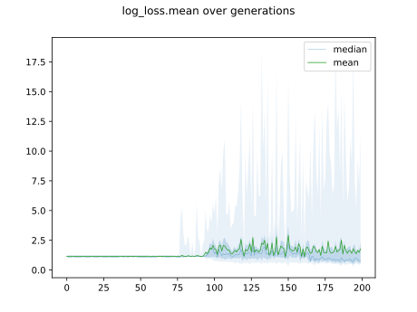
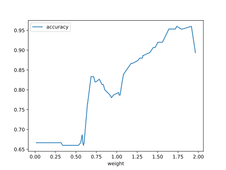
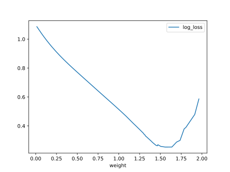

# Report Iris Uniform Distribution [0, 2] run 7

## Best results in hall of fame

| measure       |   value |   individual |
|:--------------|--------:|-------------:|
| mean accuracy |  0.7912 |        17831 |
| max accuracy  |  0.96   |        17988 |
| mean kappa    |  0.6868 |        17831 |
| max kappa     |  0.94   |        17988 |

## Individuals in hall of fame

### Individual 17079

| key                    |      value |
|:-----------------------|-----------:|
| mean log_loss:         |   0.599614 |
| mean accuracy:         |   0.774867 |
| mean kappa:            |   0.6623   |
| number of edges        |  47        |
| number of hidden nodes |  12        |
| number of layers       |   9        |
| birth                  | 190        |

#### Network

### Individual 17831

| key                    |      value |
|:-----------------------|-----------:|
| mean log_loss:         |   0.564705 |
| mean accuracy:         |   0.7912   |
| mean kappa:            |   0.6868   |
| number of edges        |  53        |
| number of hidden nodes |  15        |
| number of layers       |  11        |
| birth                  | 199        |

#### Network

### Individual 17988

| key                    |      value |
|:-----------------------|-----------:|
| mean log_loss:         |   0.568534 |
| mean accuracy:         |   0.789533 |
| mean kappa:            |   0.6843   |
| number of edges        |  54        |
| number of hidden nodes |  15        |
| number of layers       |  11        |
| birth                  | 200        |

#### Network

### Individual 16861

| key                    |      value |
|:-----------------------|-----------:|
| mean log_loss:         |   0.599901 |
| mean accuracy:         |   0.776067 |
| mean kappa:            |   0.6641   |
| number of edges        |  46        |
| number of hidden nodes |  12        |
| number of layers       |   9        |
| birth                  | 188        |

#### Network

### Individual 17008

| key                    |      value |
|:-----------------------|-----------:|
| mean log_loss:         |   0.599614 |
| mean accuracy:         |   0.774867 |
| mean kappa:            |   0.6623   |
| number of edges        |  46        |
| number of hidden nodes |  12        |
| number of layers       |   9        |
| birth                  | 189        |

#### Network

### Individual 17570

| key                    |      value |
|:-----------------------|-----------:|
| mean log_loss:         |   0.562135 |
| mean accuracy:         |   0.7874   |
| mean kappa:            |   0.6811   |
| number of edges        |  49        |
| number of hidden nodes |  13        |
| number of layers       |  10        |
| birth                  | 196        |

#### Network

### Individual 15273

| key                    |      value |
|:-----------------------|-----------:|
| mean log_loss:         |   0.612567 |
| mean accuracy:         |   0.7832   |
| mean kappa:            |   0.6748   |
| number of edges        |  32        |
| number of hidden nodes |   6        |
| number of layers       |   5        |
| birth                  | 170        |

#### Network

### Individual 17177

| key                    |      value |
|:-----------------------|-----------:|
| mean log_loss:         |   0.599653 |
| mean accuracy:         |   0.7768   |
| mean kappa:            |   0.6652   |
| number of edges        |  47        |
| number of hidden nodes |  12        |
| number of layers       |   9        |
| birth                  | 191        |

#### Network

### Individual 17131

| key                    |      value |
|:-----------------------|-----------:|
| mean log_loss:         |   0.6032   |
| mean accuracy:         |   0.782133 |
| mean kappa:            |   0.6732   |
| number of edges        |  49        |
| number of hidden nodes |  13        |
| number of layers       |  10        |
| birth                  | 191        |

#### Network

### Individual 17685

| key                    |      value |
|:-----------------------|-----------:|
| mean log_loss:         |   0.556817 |
| mean accuracy:         |   0.782467 |
| mean kappa:            |   0.6737   |
| number of edges        |  51        |
| number of hidden nodes |  14        |
| number of layers       |  10        |
| birth                  | 197        |

#### Network

