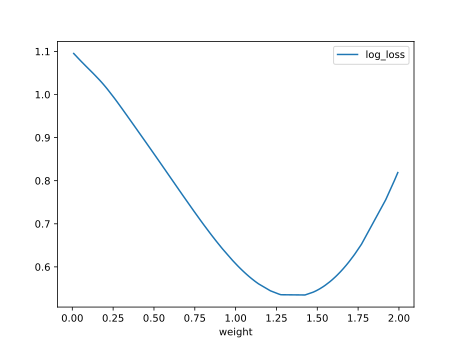

# Report Iris Uniform Distribution [0, 2] run 8

## Best results in hall of fame

| measure       |    value |   individual |
|:--------------|---------:|-------------:|
| mean accuracy | 0.822933 |         8617 |
| max accuracy  | 0.96     |        17013 |
| mean kappa    | 0.7344   |         8617 |
| max kappa     | 0.94     |        17013 |

## Individuals in hall of fame

### Individual 17013

| key                    |      value |
|:-----------------------|-----------:|
| mean log_loss:         |   0.625821 |
| mean accuracy:         |   0.754933 |
| mean kappa:            |   0.6324   |
| number of edges        |  78        |
| number of hidden nodes |  25        |
| number of layers       |  11        |
| birth                  | 190        |

#### Network

### Individual 17081

| key                    |      value |
|:-----------------------|-----------:|
| mean log_loss:         |   0.620031 |
| mean accuracy:         |   0.756067 |
| mean kappa:            |   0.6341   |
| number of edges        |  76        |
| number of hidden nodes |  24        |
| number of layers       |  10        |
| birth                  | 190        |

#### Network

### Individual 8617

| key                    |     value |
|:-----------------------|----------:|
| mean log_loss:         |  0.69743  |
| mean accuracy:         |  0.822933 |
| mean kappa:            |  0.7344   |
| number of edges        | 30        |
| number of hidden nodes |  6        |
| number of layers       |  2        |
| birth                  | 96        |

#### Network

### Individual 8308

| key                    |     value |
|:-----------------------|----------:|
| mean log_loss:         |  0.707318 |
| mean accuracy:         |  0.821667 |
| mean kappa:            |  0.7325   |
| number of edges        | 30        |
| number of hidden nodes |  6        |
| number of layers       |  1        |
| birth                  | 93        |

#### Network

### Individual 9864

| key                    |      value |
|:-----------------------|-----------:|
| mean log_loss:         |   0.692869 |
| mean accuracy:         |   0.814    |
| mean kappa:            |   0.721    |
| number of edges        |  33        |
| number of hidden nodes |   8        |
| number of layers       |   3        |
| birth                  | 110        |

#### Network

### Individual 17063

| key                    |      value |
|:-----------------------|-----------:|
| mean log_loss:         |   0.619385 |
| mean accuracy:         |   0.749733 |
| mean kappa:            |   0.6246   |
| number of edges        |  76        |
| number of hidden nodes |  24        |
| number of layers       |  10        |
| birth                  | 190        |

#### Network

### Individual 8228

| key                    |     value |
|:-----------------------|----------:|
| mean log_loss:         |  0.707318 |
| mean accuracy:         |  0.821667 |
| mean kappa:            |  0.7325   |
| number of edges        | 29        |
| number of hidden nodes |  6        |
| number of layers       |  1        |
| birth                  | 92        |

#### Network

### Individual 9089

| key                    |      value |
|:-----------------------|-----------:|
| mean log_loss:         |   0.747824 |
| mean accuracy:         |   0.807533 |
| mean kappa:            |   0.7113   |
| number of edges        |  30        |
| number of hidden nodes |   6        |
| number of layers       |   1        |
| birth                  | 101        |

#### Network

### Individual 9969

| key                    |      value |
|:-----------------------|-----------:|
| mean log_loss:         |   0.689494 |
| mean accuracy:         |   0.810467 |
| mean kappa:            |   0.7157   |
| number of edges        |  35        |
| number of hidden nodes |   9        |
| number of layers       |   3        |
| birth                  | 111        |

#### Network

### Individual 17090

| key                    |      value |
|:-----------------------|-----------:|
| mean log_loss:         |   0.642003 |
| mean accuracy:         |   0.720533 |
| mean kappa:            |   0.5808   |
| number of edges        |  72        |
| number of hidden nodes |  24        |
| number of layers       |  16        |
| birth                  | 190        |

#### Network

