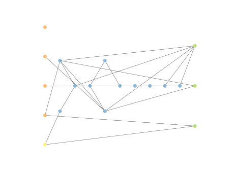

# Report Iris Uniform Distribution [0, 2] run 9

## Best results in hall of fame

| measure       |    value |   individual |
|:--------------|---------:|-------------:|
| mean accuracy | 0.748467 |        17999 |
| max accuracy  | 0.966667 |        17504 |
| mean kappa    | 0.6227   |        17999 |
| max kappa     | 0.95     |        17504 |

## Individuals in hall of fame

### Individual 8474

| key                    |     value |
|:-----------------------|----------:|
| mean log_loss:         |  0.927134 |
| mean accuracy:         |  0.721867 |
| mean kappa:            |  0.5828   |
| number of edges        | 17        |
| number of hidden nodes |  1        |
| number of layers       |  1        |
| birth                  | 95        |

#### Network

### Individual 11525

| key                    |      value |
|:-----------------------|-----------:|
| mean log_loss:         |   0.927451 |
| mean accuracy:         |   0.706733 |
| mean kappa:            |   0.5601   |
| number of edges        |  18        |
| number of hidden nodes |   1        |
| number of layers       |   1        |
| birth                  | 129        |

#### Network

### Individual 17999

| key                    |      value |
|:-----------------------|-----------:|
| mean log_loss:         |   0.590109 |
| mean accuracy:         |   0.748467 |
| mean kappa:            |   0.6227   |
| number of edges        |  49        |
| number of hidden nodes |  12        |
| number of layers       |   9        |
| birth                  | 200        |

#### Network

### Individual 17841

| key                    |      value |
|:-----------------------|-----------:|
| mean log_loss:         |   0.590109 |
| mean accuracy:         |   0.748467 |
| mean kappa:            |   0.6227   |
| number of edges        |  48        |
| number of hidden nodes |  12        |
| number of layers       |   9        |
| birth                  | 199        |

#### Network

### Individual 9565

| key                    |      value |
|:-----------------------|-----------:|
| mean log_loss:         |   0.927134 |
| mean accuracy:         |   0.721867 |
| mean kappa:            |   0.5828   |
| number of edges        |  17        |
| number of hidden nodes |   1        |
| number of layers       |   1        |
| birth                  | 107        |

#### Network

### Individual 15598

| key                    |      value |
|:-----------------------|-----------:|
| mean log_loss:         |   0.631386 |
| mean accuracy:         |   0.728733 |
| mean kappa:            |   0.5931   |
| number of edges        |  46        |
| number of hidden nodes |  12        |
| number of layers       |   9        |
| birth                  | 174        |

#### Network

### Individual 17579

| key                    |      value |
|:-----------------------|-----------:|
| mean log_loss:         |   0.59957  |
| mean accuracy:         |   0.722533 |
| mean kappa:            |   0.5838   |
| number of edges        |  46        |
| number of hidden nodes |  11        |
| number of layers       |   9        |
| birth                  | 196        |

#### Network

### Individual 8014

| key                    |     value |
|:-----------------------|----------:|
| mean log_loss:         |  0.927134 |
| mean accuracy:         |  0.721867 |
| mean kappa:            |  0.5828   |
| number of edges        | 17        |
| number of hidden nodes |  1        |
| number of layers       |  1        |
| birth                  | 90        |

#### Network

### Individual 16851

| key                    |      value |
|:-----------------------|-----------:|
| mean log_loss:         |   0.607649 |
| mean accuracy:         |   0.712667 |
| mean kappa:            |   0.569    |
| number of edges        |  46        |
| number of hidden nodes |  11        |
| number of layers       |   9        |
| birth                  | 188        |

#### Network

### Individual 17504

| key                    |      value |
|:-----------------------|-----------:|
| mean log_loss:         |   0.832515 |
| mean accuracy:         |   0.700733 |
| mean kappa:            |   0.5511   |
| number of edges        |  24        |
| number of hidden nodes |   4        |
| number of layers       |   3        |
| birth                  | 195        |

#### Network

