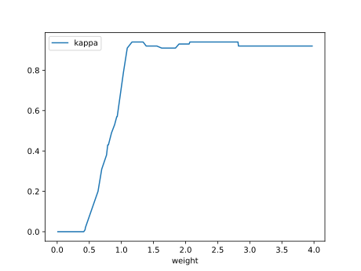

# Report Iris Uniform Distribution [0, 4] run 0

## Best results in hall of fame

| measure       |    value |   individual |
|:--------------|---------:|-------------:|
| mean accuracy | 0.877867 |        15671 |
| max accuracy  | 0.96     |        17911 |
| mean kappa    | 0.8168   |        15671 |
| max kappa     | 0.94     |        17911 |

## Individuals in hall of fame

### Individual 15671

| key                    |      value |
|:-----------------------|-----------:|
| mean log_loss:         |   0.446212 |
| mean accuracy:         |   0.877867 |
| mean kappa:            |   0.8168   |
| number of edges        |  29        |
| number of hidden nodes |   5        |
| number of layers       |   4        |
| birth                  | 175        |

#### Network

### Individual 17911

| key                    |      value |
|:-----------------------|-----------:|
| mean log_loss:         |   0.456337 |
| mean accuracy:         |   0.8382   |
| mean kappa:            |   0.7573   |
| number of edges        |  37        |
| number of hidden nodes |   9        |
| number of layers       |   6        |
| birth                  | 200        |

#### Network

### Individual 17977

| key                    |      value |
|:-----------------------|-----------:|
| mean log_loss:         |   0.456866 |
| mean accuracy:         |   0.831333 |
| mean kappa:            |   0.747    |
| number of edges        |  35        |
| number of hidden nodes |   8        |
| number of layers       |   5        |
| birth                  | 200        |

#### Network

### Individual 17836

| key                    |     value |
|:-----------------------|----------:|
| mean log_loss:         |   0.45567 |
| mean accuracy:         |   0.836   |
| mean kappa:            |   0.754   |
| number of edges        |  35       |
| number of hidden nodes |   8       |
| number of layers       |   5       |
| birth                  | 199       |

#### Network

### Individual 15381

| key                    |      value |
|:-----------------------|-----------:|
| mean log_loss:         |   0.479621 |
| mean accuracy:         |   0.800133 |
| mean kappa:            |   0.7002   |
| number of edges        |  27        |
| number of hidden nodes |   5        |
| number of layers       |   4        |
| birth                  | 171        |

#### Network

### Individual 15386

| key                    |      value |
|:-----------------------|-----------:|
| mean log_loss:         |   0.479621 |
| mean accuracy:         |   0.800133 |
| mean kappa:            |   0.7002   |
| number of edges        |  27        |
| number of hidden nodes |   5        |
| number of layers       |   4        |
| birth                  | 171        |

#### Network

### Individual 17806

| key                    |      value |
|:-----------------------|-----------:|
| mean log_loss:         |   0.464275 |
| mean accuracy:         |   0.8226   |
| mean kappa:            |   0.7339   |
| number of edges        |  33        |
| number of hidden nodes |   7        |
| number of layers       |   5        |
| birth                  | 198        |

#### Network

### Individual 17158

| key                    |      value |
|:-----------------------|-----------:|
| mean log_loss:         |   0.465336 |
| mean accuracy:         |   0.843933 |
| mean kappa:            |   0.7659   |
| number of edges        |  33        |
| number of hidden nodes |   8        |
| number of layers       |   6        |
| birth                  | 191        |

#### Network

### Individual 17534

| key                    |      value |
|:-----------------------|-----------:|
| mean log_loss:         |   0.465336 |
| mean accuracy:         |   0.843933 |
| mean kappa:            |   0.7659   |
| number of edges        |  34        |
| number of hidden nodes |   8        |
| number of layers       |   6        |
| birth                  | 195        |

#### Network

### Individual 15425

| key                    |      value |
|:-----------------------|-----------:|
| mean log_loss:         |   0.483435 |
| mean accuracy:         |   0.836733 |
| mean kappa:            |   0.7551   |
| number of edges        |  27        |
| number of hidden nodes |   5        |
| number of layers       |   4        |
| birth                  | 172        |

#### Network

