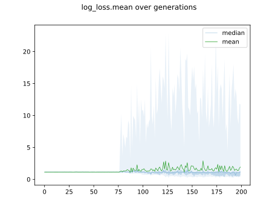
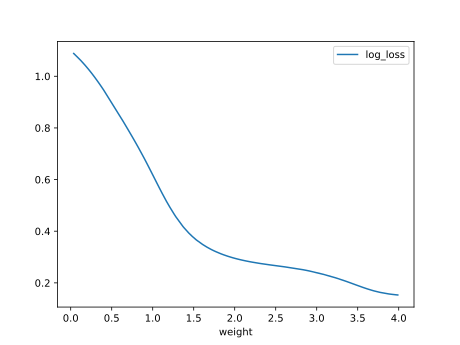

# Report Iris Uniform Distribution [0, 4] run 1

## Best results in hall of fame

| measure       |    value |   individual |
|:--------------|---------:|-------------:|
| mean accuracy | 0.880067 |        15912 |
| max accuracy  | 0.966667 |        15912 |
| mean kappa    | 0.8201   |        15912 |
| max kappa     | 0.95     |        15912 |

## Individuals in hall of fame

### Individual 16488

| key                    |      value |
|:-----------------------|-----------:|
| mean log_loss:         |   0.475617 |
| mean accuracy:         |   0.860667 |
| mean kappa:            |   0.791    |
| number of edges        |  50        |
| number of hidden nodes |  14        |
| number of layers       |   9        |
| birth                  | 184        |

#### Network

### Individual 15912

| key                    |      value |
|:-----------------------|-----------:|
| mean log_loss:         |   0.474492 |
| mean accuracy:         |   0.880067 |
| mean kappa:            |   0.8201   |
| number of edges        |  47        |
| number of hidden nodes |  12        |
| number of layers       |   9        |
| birth                  | 177        |

#### Network

### Individual 14728

| key                    |      value |
|:-----------------------|-----------:|
| mean log_loss:         |   0.484637 |
| mean accuracy:         |   0.879267 |
| mean kappa:            |   0.8189   |
| number of edges        |  44        |
| number of hidden nodes |  11        |
| number of layers       |   8        |
| birth                  | 164        |

#### Network

### Individual 17274

| key                    |      value |
|:-----------------------|-----------:|
| mean log_loss:         |   0.492001 |
| mean accuracy:         |   0.8714   |
| mean kappa:            |   0.8071   |
| number of edges        |  52        |
| number of hidden nodes |  14        |
| number of layers       |  10        |
| birth                  | 192        |

#### Network

### Individual 16974

| key                    |      value |
|:-----------------------|-----------:|
| mean log_loss:         |   0.485074 |
| mean accuracy:         |   0.8728   |
| mean kappa:            |   0.8092   |
| number of edges        |  52        |
| number of hidden nodes |  14        |
| number of layers       |  10        |
| birth                  | 189        |

#### Network

### Individual 15592

| key                    |      value |
|:-----------------------|-----------:|
| mean log_loss:         |   0.480392 |
| mean accuracy:         |   0.857533 |
| mean kappa:            |   0.7863   |
| number of edges        |  46        |
| number of hidden nodes |  12        |
| number of layers       |   9        |
| birth                  | 174        |

#### Network

### Individual 17751

| key                    |      value |
|:-----------------------|-----------:|
| mean log_loss:         |   0.464437 |
| mean accuracy:         |   0.876867 |
| mean kappa:            |   0.8153   |
| number of edges        |  56        |
| number of hidden nodes |  16        |
| number of layers       |  11        |
| birth                  | 198        |

#### Network

### Individual 15921

| key                    |      value |
|:-----------------------|-----------:|
| mean log_loss:         |   0.495053 |
| mean accuracy:         |   0.8624   |
| mean kappa:            |   0.7936   |
| number of edges        |  46        |
| number of hidden nodes |  12        |
| number of layers       |   8        |
| birth                  | 177        |

#### Network

### Individual 16113

| key                    |      value |
|:-----------------------|-----------:|
| mean log_loss:         |   0.472005 |
| mean accuracy:         |   0.847267 |
| mean kappa:            |   0.7709   |
| number of edges        |  49        |
| number of hidden nodes |  13        |
| number of layers       |  10        |
| birth                  | 180        |

#### Network

### Individual 16586

| key                    |      value |
|:-----------------------|-----------:|
| mean log_loss:         |   0.473735 |
| mean accuracy:         |   0.869333 |
| mean kappa:            |   0.804    |
| number of edges        |  50        |
| number of hidden nodes |  14        |
| number of layers       |   9        |
| birth                  | 185        |

#### Network

