# Report Iris Uniform Distribution [0, 4] run 2

## Best results in hall of fame

| measure       |    value |   individual |
|:--------------|---------:|-------------:|
| mean accuracy | 0.929133 |        16886 |
| max accuracy  | 0.96     |        17464 |
| mean kappa    | 0.8937   |        16886 |
| max kappa     | 0.94     |        17464 |

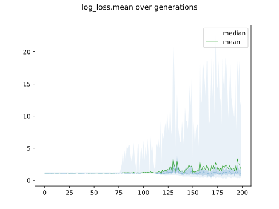

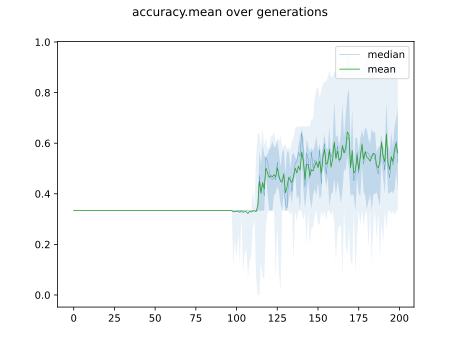

## Individuals in hall of fame

### Individual 17464

| key                    |      value |
|:-----------------------|-----------:|
| mean log_loss:         |   0.414404 |
| mean accuracy:         |   0.913    |
| mean kappa:            |   0.8695   |
| number of edges        |  44        |
| number of hidden nodes |  12        |
| number of layers       |   6        |
| birth                  | 195        |

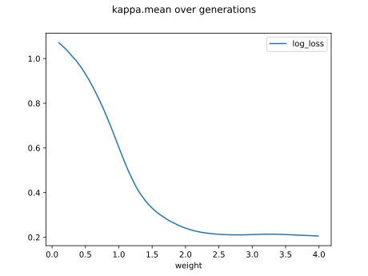

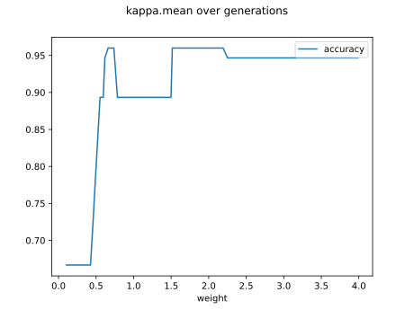

#### Network

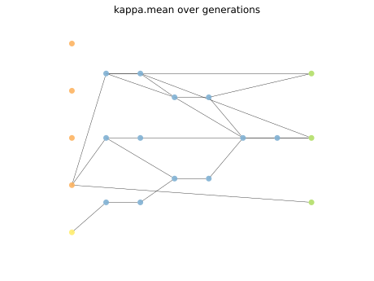

### Individual 17599

| key                    |      value |
|:-----------------------|-----------:|
| mean log_loss:         |   0.412925 |
| mean accuracy:         |   0.911667 |
| mean kappa:            |   0.8675   |
| number of edges        |  45        |
| number of hidden nodes |  12        |
| number of layers       |   6        |
| birth                  | 196        |

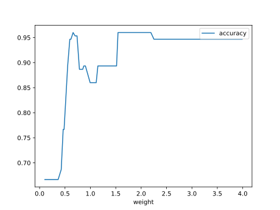

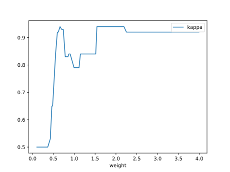

#### Network

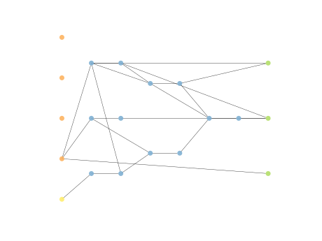

### Individual 16935

| key                    |      value |
|:-----------------------|-----------:|
| mean log_loss:         |   0.418844 |
| mean accuracy:         |   0.921933 |
| mean kappa:            |   0.8829   |
| number of edges        |  44        |
| number of hidden nodes |  12        |
| number of layers       |   6        |
| birth                  | 189        |

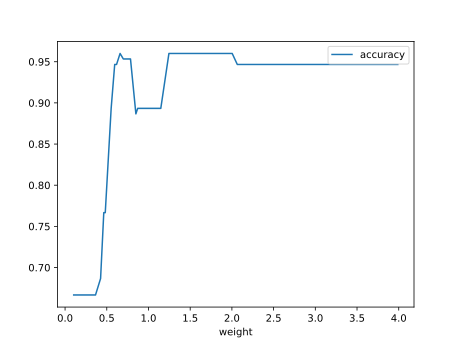

#### Network

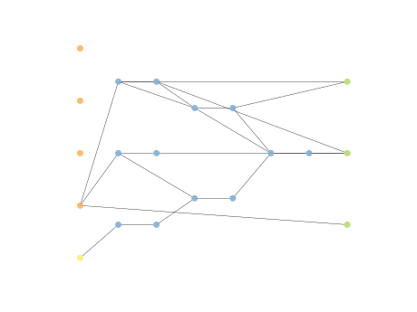

### Individual 17387

| key                    |      value |
|:-----------------------|-----------:|
| mean log_loss:         |   0.412956 |
| mean accuracy:         |   0.9136   |
| mean kappa:            |   0.8704   |
| number of edges        |  44        |
| number of hidden nodes |  12        |
| number of layers       |   6        |
| birth                  | 194        |

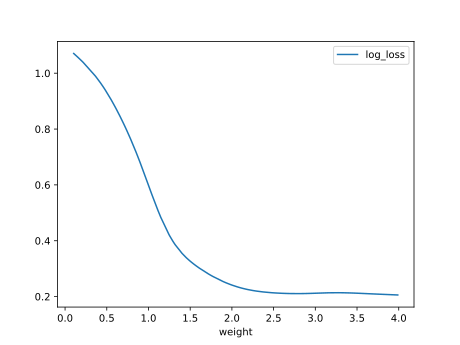

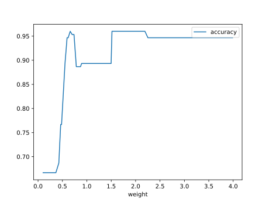

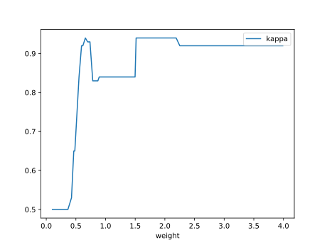

#### Network

### Individual 16623

| key                    |      value |
|:-----------------------|-----------:|
| mean log_loss:         |   0.418857 |
| mean accuracy:         |   0.922    |
| mean kappa:            |   0.883    |
| number of edges        |  44        |
| number of hidden nodes |  12        |
| number of layers       |   6        |
| birth                  | 185        |

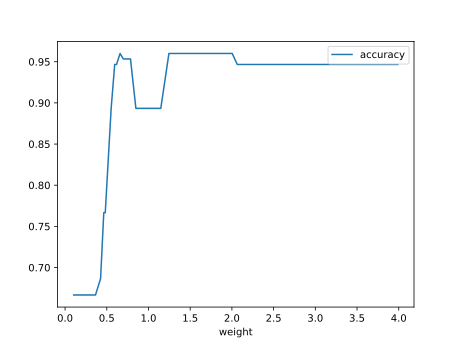

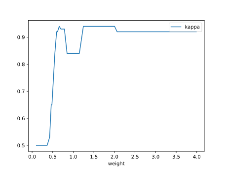

#### Network

### Individual 15637

| key                    |      value |
|:-----------------------|-----------:|
| mean log_loss:         |   0.462752 |
| mean accuracy:         |   0.882533 |
| mean kappa:            |   0.8238   |
| number of edges        |  38        |
| number of hidden nodes |  11        |
| number of layers       |   6        |
| birth                  | 174        |

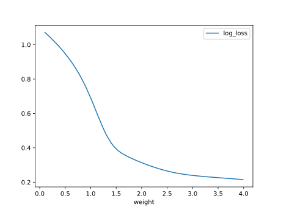

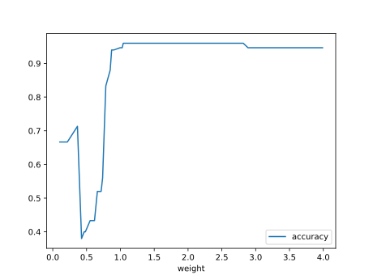

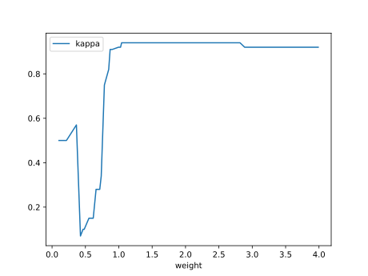

#### Network

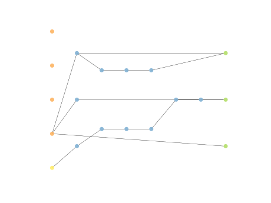

### Individual 17096

| key                    |      value |
|:-----------------------|-----------:|
| mean log_loss:         |   0.412654 |
| mean accuracy:         |   0.9166   |
| mean kappa:            |   0.8749   |
| number of edges        |  44        |
| number of hidden nodes |  12        |
| number of layers       |   6        |
| birth                  | 190        |

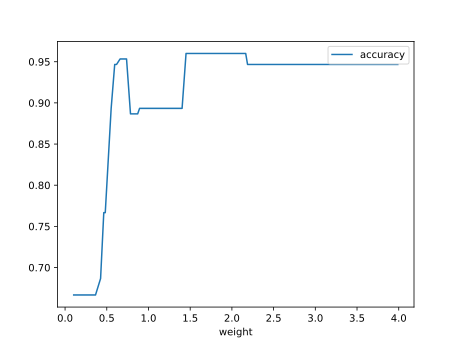

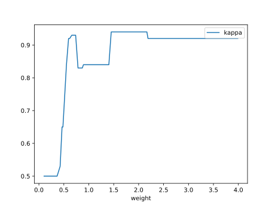

#### Network

### Individual 16555

| key                    |      value |
|:-----------------------|-----------:|
| mean log_loss:         |   0.427024 |
| mean accuracy:         |   0.887333 |
| mean kappa:            |   0.831    |
| number of edges        |  43        |
| number of hidden nodes |  12        |
| number of layers       |   6        |
| birth                  | 184        |

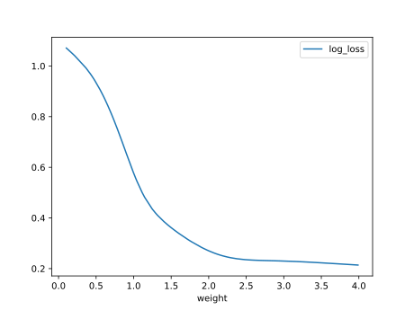

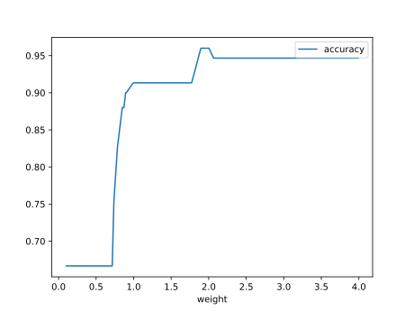

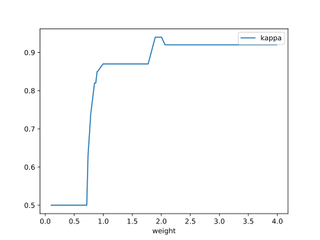

#### Network

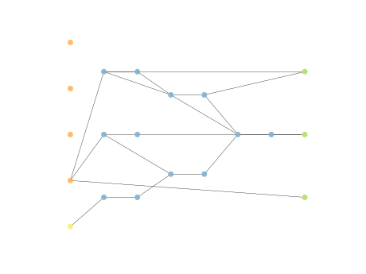

### Individual 15967

| key                    |      value |
|:-----------------------|-----------:|
| mean log_loss:         |   0.440382 |
| mean accuracy:         |   0.908333 |
| mean kappa:            |   0.8625   |
| number of edges        |  40        |
| number of hidden nodes |  11        |
| number of layers       |   6        |
| birth                  | 178        |

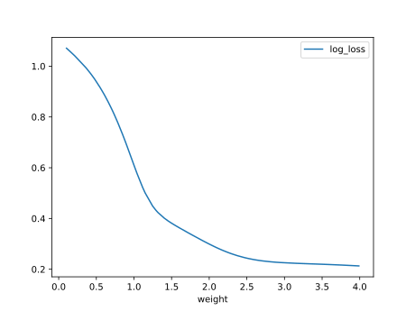

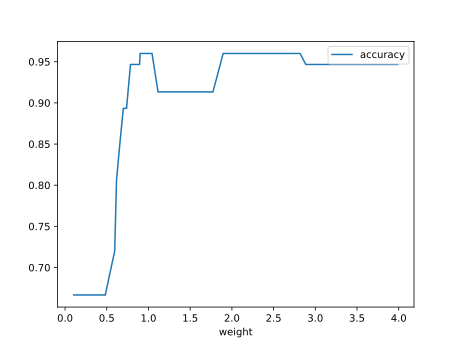

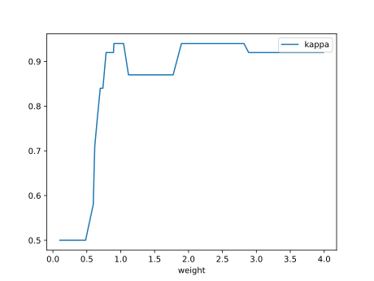

#### Network

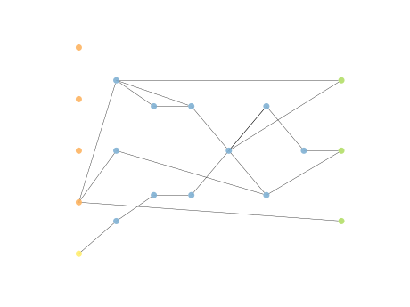

### Individual 16886

| key                    |      value |
|:-----------------------|-----------:|
| mean log_loss:         |   0.422191 |
| mean accuracy:         |   0.929133 |
| mean kappa:            |   0.8937   |
| number of edges        |  44        |
| number of hidden nodes |  12        |
| number of layers       |   6        |
| birth                  | 188        |

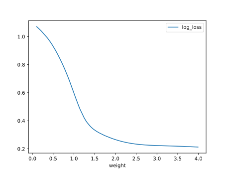

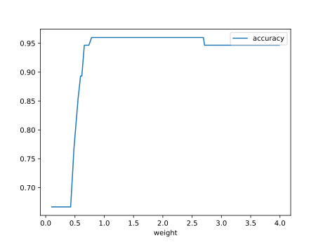

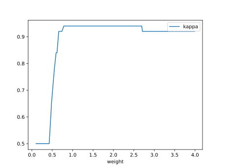

#### Network

