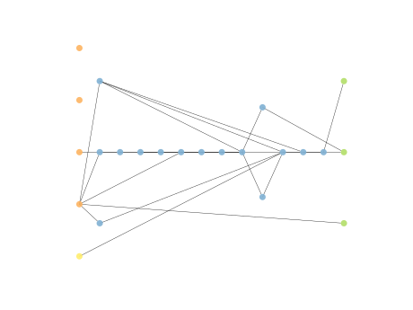

# Report Iris Uniform Distribution [0, 4] run 3

## Best results in hall of fame

| measure       |    value |   individual |
|:--------------|---------:|-------------:|
| mean accuracy | 0.891733 |        17746 |
| max accuracy  | 0.966667 |        17746 |
| mean kappa    | 0.8376   |        17746 |
| max kappa     | 0.95     |        17746 |

## Individuals in hall of fame

### Individual 17746

| key                    |      value |
|:-----------------------|-----------:|
| mean log_loss:         |   0.391412 |
| mean accuracy:         |   0.891733 |
| mean kappa:            |   0.8376   |
| number of edges        |  58        |
| number of hidden nodes |  18        |
| number of layers       |  12        |
| birth                  | 198        |

#### Network

### Individual 17848

| key                    |      value |
|:-----------------------|-----------:|
| mean log_loss:         |   0.392742 |
| mean accuracy:         |   0.878533 |
| mean kappa:            |   0.8178   |
| number of edges        |  57        |
| number of hidden nodes |  18        |
| number of layers       |  12        |
| birth                  | 199        |

#### Network

### Individual 14748

| key                    |      value |
|:-----------------------|-----------:|
| mean log_loss:         |   0.39367  |
| mean accuracy:         |   0.865133 |
| mean kappa:            |   0.7977   |
| number of edges        |  39        |
| number of hidden nodes |   9        |
| number of layers       |   6        |
| birth                  | 164        |

#### Network

### Individual 17721

| key                    |      value |
|:-----------------------|-----------:|
| mean log_loss:         |   0.392602 |
| mean accuracy:         |   0.8704   |
| mean kappa:            |   0.8056   |
| number of edges        |  57        |
| number of hidden nodes |  18        |
| number of layers       |  12        |
| birth                  | 197        |

#### Network

### Individual 14157

| key                    |      value |
|:-----------------------|-----------:|
| mean log_loss:         |   0.406121 |
| mean accuracy:         |   0.854867 |
| mean kappa:            |   0.7823   |
| number of edges        |  39        |
| number of hidden nodes |  10        |
| number of layers       |   6        |
| birth                  | 158        |

#### Network

### Individual 17525

| key                    |      value |
|:-----------------------|-----------:|
| mean log_loss:         |   0.402921 |
| mean accuracy:         |   0.848267 |
| mean kappa:            |   0.7724   |
| number of edges        |  55        |
| number of hidden nodes |  17        |
| number of layers       |  12        |
| birth                  | 195        |

#### Network

### Individual 15937

| key                    |      value |
|:-----------------------|-----------:|
| mean log_loss:         |   0.393067 |
| mean accuracy:         |   0.856467 |
| mean kappa:            |   0.7847   |
| number of edges        |  51        |
| number of hidden nodes |  15        |
| number of layers       |  12        |
| birth                  | 178        |

#### Network

### Individual 16797

| key                    |      value |
|:-----------------------|-----------:|
| mean log_loss:         |   0.396352 |
| mean accuracy:         |   0.861    |
| mean kappa:            |   0.7915   |
| number of edges        |  53        |
| number of hidden nodes |  16        |
| number of layers       |  12        |
| birth                  | 187        |

#### Network

### Individual 15307

| key                    |      value |
|:-----------------------|-----------:|
| mean log_loss:         |   0.393305 |
| mean accuracy:         |   0.866533 |
| mean kappa:            |   0.7998   |
| number of edges        |  41        |
| number of hidden nodes |  10        |
| number of layers       |   7        |
| birth                  | 171        |

#### Network

### Individual 14247

| key                    |      value |
|:-----------------------|-----------:|
| mean log_loss:         |   0.439742 |
| mean accuracy:         |   0.837533 |
| mean kappa:            |   0.7563   |
| number of edges        |  34        |
| number of hidden nodes |   7        |
| number of layers       |   4        |
| birth                  | 159        |

#### Network

