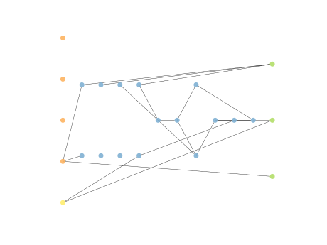
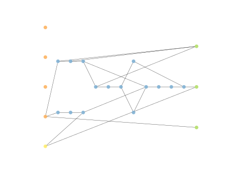
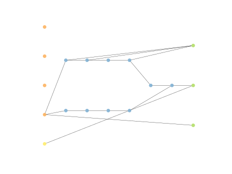
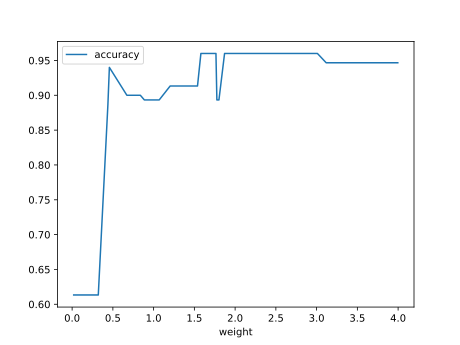

# Report Iris Uniform Distribution [0, 4] run 4

## Best results in hall of fame

| measure       |    value |   individual |
|:--------------|---------:|-------------:|
| mean accuracy | 0.916867 |        14140 |
| max accuracy  | 0.96     |        16240 |
| mean kappa    | 0.8753   |        14140 |
| max kappa     | 0.94     |        16240 |

## Individuals in hall of fame

### Individual 16240

| key                    |      value |
|:-----------------------|-----------:|
| mean log_loss:         |   0.353979 |
| mean accuracy:         |   0.914933 |
| mean kappa:            |   0.8724   |
| number of edges        |  47        |
| number of hidden nodes |  14        |
| number of layers       |  10        |
| birth                  | 181        |

#### Network

### Individual 17015

| key                    |      value |
|:-----------------------|-----------:|
| mean log_loss:         |   0.354689 |
| mean accuracy:         |   0.908    |
| mean kappa:            |   0.862    |
| number of edges        |  50        |
| number of hidden nodes |  15        |
| number of layers       |  10        |
| birth                  | 190        |

#### Network

### Individual 16236

| key                    |      value |
|:-----------------------|-----------:|
| mean log_loss:         |   0.351773 |
| mean accuracy:         |   0.910067 |
| mean kappa:            |   0.8651   |
| number of edges        |  49        |
| number of hidden nodes |  15        |
| number of layers       |  11        |
| birth                  | 181        |

#### Network

### Individual 14140

| key                    |      value |
|:-----------------------|-----------:|
| mean log_loss:         |   0.386651 |
| mean accuracy:         |   0.916867 |
| mean kappa:            |   0.8753   |
| number of edges        |  36        |
| number of hidden nodes |  10        |
| number of layers       |   6        |
| birth                  | 158        |

#### Network

### Individual 16476

| key                    |      value |
|:-----------------------|-----------:|
| mean log_loss:         |   0.352408 |
| mean accuracy:         |   0.915267 |
| mean kappa:            |   0.8729   |
| number of edges        |  51        |
| number of hidden nodes |  16        |
| number of layers       |  11        |
| birth                  | 184        |

#### Network

### Individual 16578

| key                    |      value |
|:-----------------------|-----------:|
| mean log_loss:         |   0.391167 |
| mean accuracy:         |   0.915933 |
| mean kappa:            |   0.8739   |
| number of edges        |  35        |
| number of hidden nodes |   9        |
| number of layers       |   8        |
| birth                  | 185        |

#### Network

### Individual 13802

| key                    |      value |
|:-----------------------|-----------:|
| mean log_loss:         |   0.40283  |
| mean accuracy:         |   0.907133 |
| mean kappa:            |   0.8607   |
| number of edges        |  31        |
| number of hidden nodes |   8        |
| number of layers       |   4        |
| birth                  | 154        |

#### Network

### Individual 14064

| key                    |      value |
|:-----------------------|-----------:|
| mean log_loss:         |   0.390334 |
| mean accuracy:         |   0.9158   |
| mean kappa:            |   0.8737   |
| number of edges        |  35        |
| number of hidden nodes |   9        |
| number of layers       |   5        |
| birth                  | 157        |

#### Network

### Individual 15041

| key                    |      value |
|:-----------------------|-----------:|
| mean log_loss:         |   0.360153 |
| mean accuracy:         |   0.914933 |
| mean kappa:            |   0.8724   |
| number of edges        |  43        |
| number of hidden nodes |  12        |
| number of layers       |   9        |
| birth                  | 168        |

#### Network

### Individual 12525

| key                    |      value |
|:-----------------------|-----------:|
| mean log_loss:         |   0.405237 |
| mean accuracy:         |   0.904667 |
| mean kappa:            |   0.857    |
| number of edges        |  29        |
| number of hidden nodes |   7        |
| number of layers       |   4        |
| birth                  | 140        |

#### Network

