# Report Iris Uniform Distribution [0, 4] run 5

## Best results in hall of fame

| measure       |    value |   individual |
|:--------------|---------:|-------------:|
| mean accuracy | 0.878133 |        17970 |
| max accuracy  | 0.96     |        17633 |
| mean kappa    | 0.8172   |        17970 |
| max kappa     | 0.94     |        17633 |

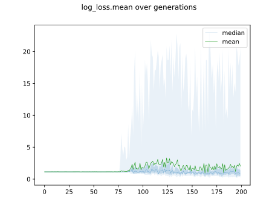

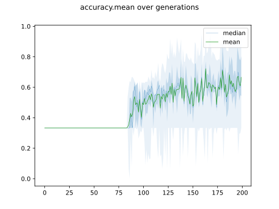

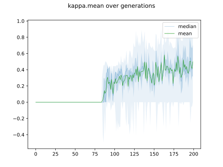

## Individuals in hall of fame

### Individual 17633

| key                    |      value |
|:-----------------------|-----------:|
| mean log_loss:         |   0.342026 |
| mean accuracy:         |   0.877067 |
| mean kappa:            |   0.8156   |
| number of edges        |  76        |
| number of hidden nodes |  25        |
| number of layers       |  17        |
| birth                  | 196        |

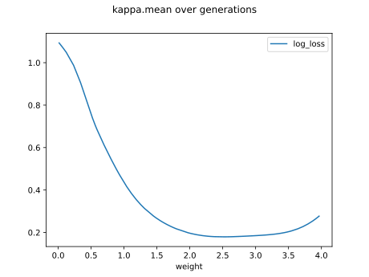

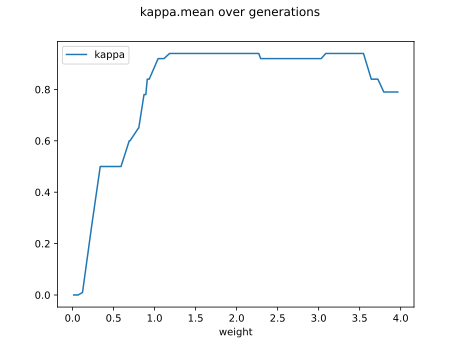

#### Network

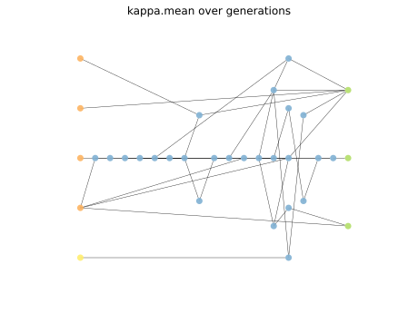

### Individual 17037

| key                    |    value |
|:-----------------------|---------:|
| mean log_loss:         |   0.3445 |
| mean accuracy:         |   0.8722 |
| mean kappa:            |   0.8083 |
| number of edges        |  75      |
| number of hidden nodes |  25      |
| number of layers       |  17      |
| birth                  | 190      |

#### Network

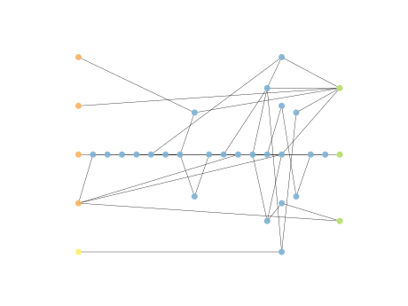

### Individual 16964

| key                    |      value |
|:-----------------------|-----------:|
| mean log_loss:         |   0.343857 |
| mean accuracy:         |   0.875933 |
| mean kappa:            |   0.8139   |
| number of edges        |  75        |
| number of hidden nodes |  25        |
| number of layers       |  17        |
| birth                  | 189        |

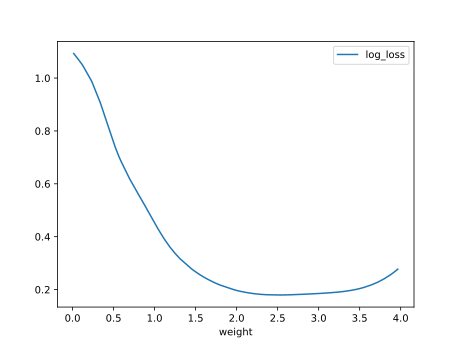

#### Network

### Individual 17658

| key                    |      value |
|:-----------------------|-----------:|
| mean log_loss:         |   0.342027 |
| mean accuracy:         |   0.877067 |
| mean kappa:            |   0.8156   |
| number of edges        |  78        |
| number of hidden nodes |  26        |
| number of layers       |  17        |
| birth                  | 197        |

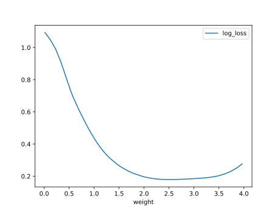

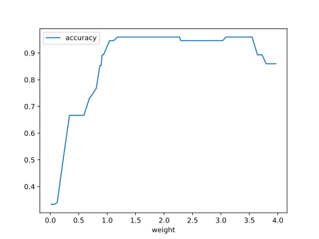

#### Network

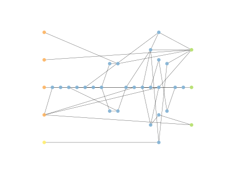

### Individual 16169

| key                    |      value |
|:-----------------------|-----------:|
| mean log_loss:         |   0.350733 |
| mean accuracy:         |   0.871867 |
| mean kappa:            |   0.8078   |
| number of edges        |  70        |
| number of hidden nodes |  23        |
| number of layers       |  16        |
| birth                  | 180        |

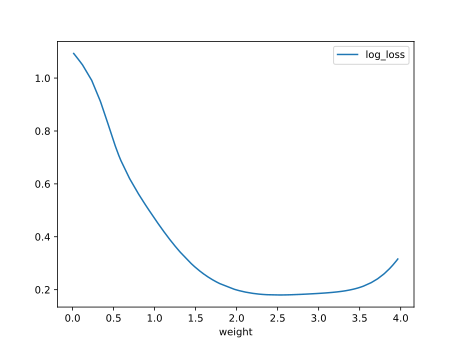

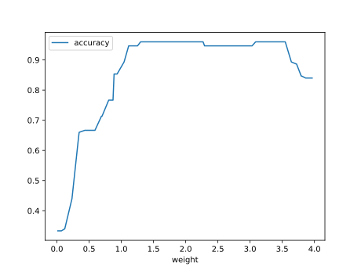

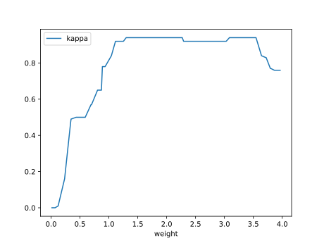

#### Network

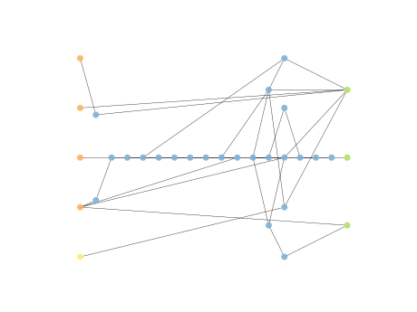

### Individual 17278

| key                    |      value |
|:-----------------------|-----------:|
| mean log_loss:         |   0.342928 |
| mean accuracy:         |   0.876467 |
| mean kappa:            |   0.8147   |
| number of edges        |  75        |
| number of hidden nodes |  25        |
| number of layers       |  17        |
| birth                  | 192        |

#### Network

### Individual 16150

| key                    |      value |
|:-----------------------|-----------:|
| mean log_loss:         |   0.347448 |
| mean accuracy:         |   0.873067 |
| mean kappa:            |   0.8096   |
| number of edges        |  72        |
| number of hidden nodes |  24        |
| number of layers       |  17        |
| birth                  | 180        |

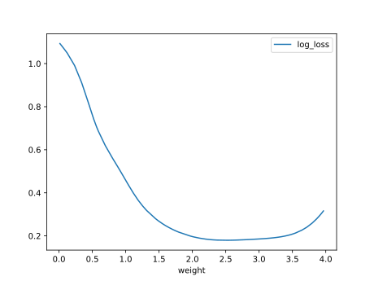

#### Network

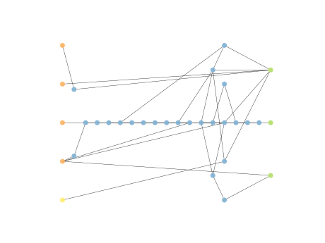

### Individual 16886

| key                    |      value |
|:-----------------------|-----------:|
| mean log_loss:         |   0.343857 |
| mean accuracy:         |   0.875933 |
| mean kappa:            |   0.8139   |
| number of edges        |  75        |
| number of hidden nodes |  25        |
| number of layers       |  17        |
| birth                  | 188        |

#### Network

### Individual 17970

| key                    |      value |
|:-----------------------|-----------:|
| mean log_loss:         |   0.342502 |
| mean accuracy:         |   0.878133 |
| mean kappa:            |   0.8172   |
| number of edges        |  80        |
| number of hidden nodes |  27        |
| number of layers       |  17        |
| birth                  | 200        |

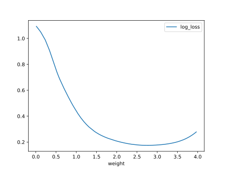

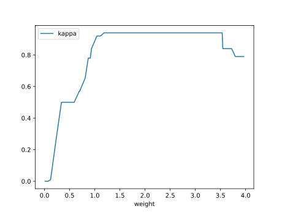

#### Network

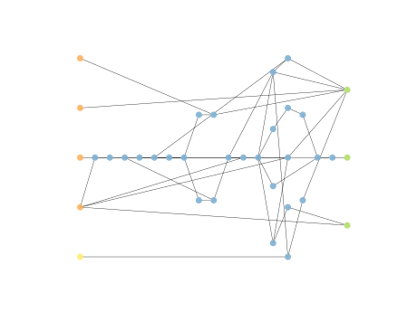

### Individual 16869

| key                    |      value |
|:-----------------------|-----------:|
| mean log_loss:         |   0.343857 |
| mean accuracy:         |   0.875933 |
| mean kappa:            |   0.8139   |
| number of edges        |  75        |
| number of hidden nodes |  25        |
| number of layers       |  17        |
| birth                  | 188        |

#### Network

