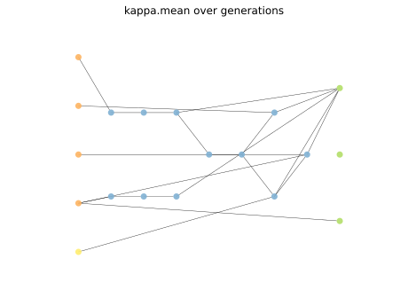
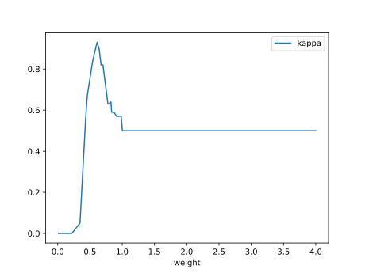
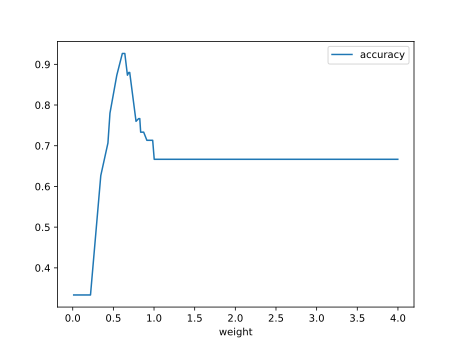
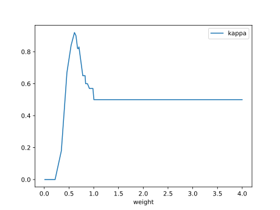

# Report Iris Uniform Distribution [0, 4] run 6

## Best results in hall of fame

| measure       |    value |   individual |
|:--------------|---------:|-------------:|
| mean accuracy | 0.676867 |        15500 |
| max accuracy  | 0.96     |        15500 |
| mean kappa    | 0.5153   |        15500 |
| max kappa     | 0.94     |        15500 |

## Individuals in hall of fame

### Individual 15500

| key                    |      value |
|:-----------------------|-----------:|
| mean log_loss:         |   0.822917 |
| mean accuracy:         |   0.676867 |
| mean kappa:            |   0.5153   |
| number of edges        |  42        |
| number of hidden nodes |  11        |
| number of layers       |   7        |
| birth                  | 173        |

#### Network

### Individual 16643

| key                    |      value |
|:-----------------------|-----------:|
| mean log_loss:         |   0.819529 |
| mean accuracy:         |   0.6726   |
| mean kappa:            |   0.5089   |
| number of edges        |  43        |
| number of hidden nodes |  10        |
| number of layers       |   5        |
| birth                  | 185        |

#### Network

### Individual 16231

| key                    |      value |
|:-----------------------|-----------:|
| mean log_loss:         |   0.819607 |
| mean accuracy:         |   0.672667 |
| mean kappa:            |   0.509    |
| number of edges        |  43        |
| number of hidden nodes |  10        |
| number of layers       |   5        |
| birth                  | 181        |

#### Network

### Individual 16759

| key                    |      value |
|:-----------------------|-----------:|
| mean log_loss:         |   0.815663 |
| mean accuracy:         |   0.6752   |
| mean kappa:            |   0.5128   |
| number of edges        |  43        |
| number of hidden nodes |  10        |
| number of layers       |   5        |
| birth                  | 187        |

#### Network

### Individual 16758

| key                    |      value |
|:-----------------------|-----------:|
| mean log_loss:         |   1.11063  |
| mean accuracy:         |   0.672133 |
| mean kappa:            |   0.5082   |
| number of edges        |  43        |
| number of hidden nodes |  12        |
| number of layers       |   4        |
| birth                  | 187        |

#### Network

### Individual 10868

| key                    |      value |
|:-----------------------|-----------:|
| mean log_loss:         |   0.874565 |
| mean accuracy:         |   0.670333 |
| mean kappa:            |   0.5055   |
| number of edges        |  27        |
| number of hidden nodes |   3        |
| number of layers       |   2        |
| birth                  | 121        |

#### Network

### Individual 10781

| key                    |      value |
|:-----------------------|-----------:|
| mean log_loss:         |   0.832891 |
| mean accuracy:         |   0.670667 |
| mean kappa:            |   0.506    |
| number of edges        |  30        |
| number of hidden nodes |   6        |
| number of layers       |   4        |
| birth                  | 120        |

#### Network

### Individual 16925

| key                    |      value |
|:-----------------------|-----------:|
| mean log_loss:         |   0.816997 |
| mean accuracy:         |   0.674133 |
| mean kappa:            |   0.5112   |
| number of edges        |  44        |
| number of hidden nodes |  10        |
| number of layers       |   5        |
| birth                  | 189        |

#### Network

### Individual 16753

| key                    |      value |
|:-----------------------|-----------:|
| mean log_loss:         |   0.824361 |
| mean accuracy:         |   0.669067 |
| mean kappa:            |   0.5036   |
| number of edges        |  45        |
| number of hidden nodes |  11        |
| number of layers       |   6        |
| birth                  | 187        |

#### Network

### Individual 14304

| key                    |      value |
|:-----------------------|-----------:|
| mean log_loss:         |   0.824633 |
| mean accuracy:         |   0.673667 |
| mean kappa:            |   0.5105   |
| number of edges        |  36        |
| number of hidden nodes |   9        |
| number of layers       |   4        |
| birth                  | 159        |

#### Network

