# Report Iris Uniform Distribution [0, 4] run 7

## Best results in hall of fame

| measure       |    value |   individual |
|:--------------|---------:|-------------:|
| mean accuracy | 0.950533 |        16350 |
| max accuracy  | 0.96     |        16350 |
| mean kappa    | 0.9258   |        16350 |
| max kappa     | 0.94     |        16350 |

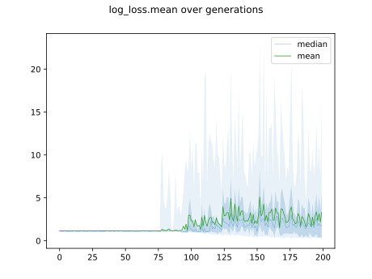

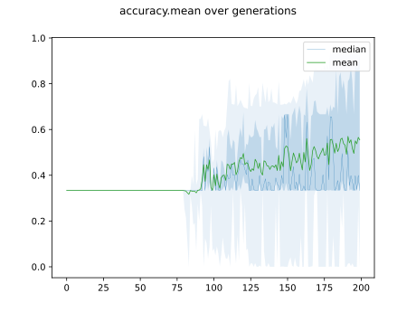

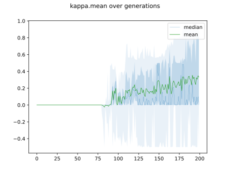

## Individuals in hall of fame

### Individual 16350

| key                    |      value |
|:-----------------------|-----------:|
| mean log_loss:         |   0.383978 |
| mean accuracy:         |   0.950533 |
| mean kappa:            |   0.9258   |
| number of edges        |  39        |
| number of hidden nodes |  12        |
| number of layers       |   3        |
| birth                  | 182        |

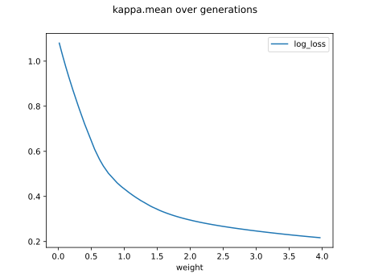

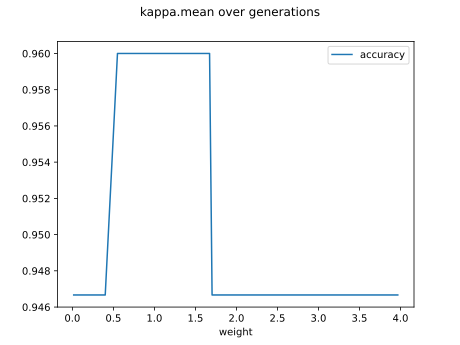

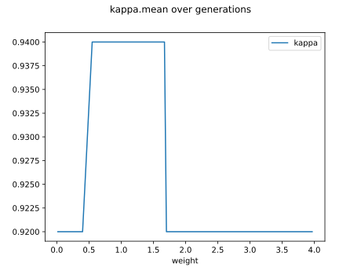

#### Network

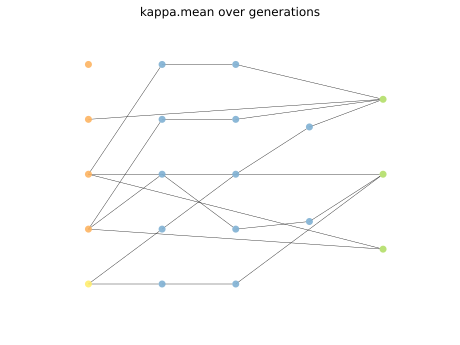

### Individual 17930

| key                    |      value |
|:-----------------------|-----------:|
| mean log_loss:         |   0.383978 |
| mean accuracy:         |   0.950533 |
| mean kappa:            |   0.9258   |
| number of edges        |  42        |
| number of hidden nodes |  13        |
| number of layers       |   4        |
| birth                  | 200        |

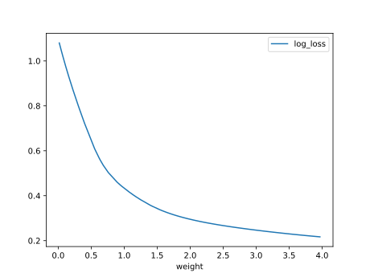

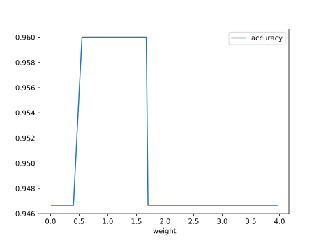

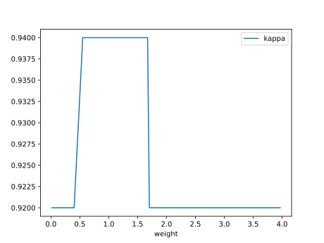

#### Network

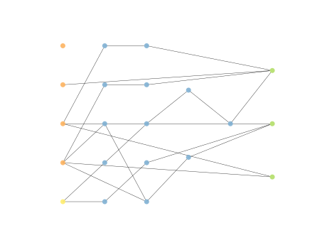

### Individual 17063

| key                    |      value |
|:-----------------------|-----------:|
| mean log_loss:         |   0.381905 |
| mean accuracy:         |   0.915467 |
| mean kappa:            |   0.8732   |
| number of edges        |  39        |
| number of hidden nodes |  11        |
| number of layers       |   3        |
| birth                  | 190        |

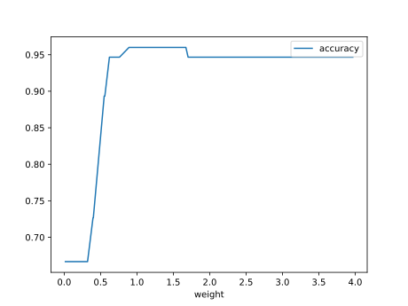

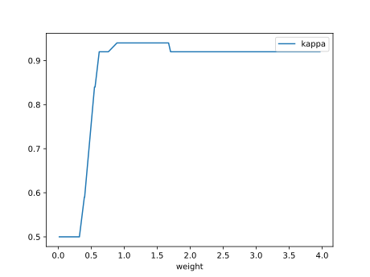

#### Network

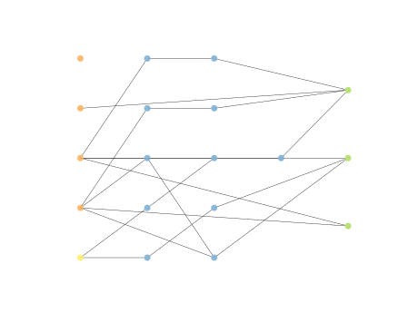

### Individual 17769

| key                    |      value |
|:-----------------------|-----------:|
| mean log_loss:         |   0.381905 |
| mean accuracy:         |   0.915467 |
| mean kappa:            |   0.8732   |
| number of edges        |  40        |
| number of hidden nodes |  12        |
| number of layers       |   4        |
| birth                  | 198        |

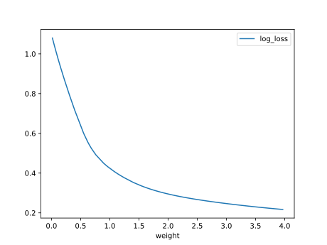

#### Network

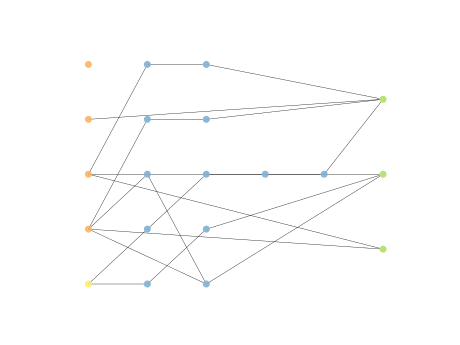

### Individual 17943

| key                    |      value |
|:-----------------------|-----------:|
| mean log_loss:         |   0.381677 |
| mean accuracy:         |   0.915733 |
| mean kappa:            |   0.8736   |
| number of edges        |  38        |
| number of hidden nodes |  11        |
| number of layers       |   3        |
| birth                  | 200        |

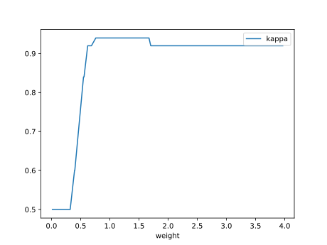

#### Network

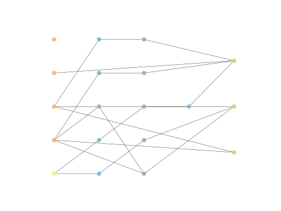

### Individual 17017

| key                    |      value |
|:-----------------------|-----------:|
| mean log_loss:         |   0.381177 |
| mean accuracy:         |   0.9156   |
| mean kappa:            |   0.8734   |
| number of edges        |  40        |
| number of hidden nodes |  12        |
| number of layers       |   4        |
| birth                  | 190        |

#### Network

### Individual 16603

| key                    |      value |
|:-----------------------|-----------:|
| mean log_loss:         |   0.381905 |
| mean accuracy:         |   0.915467 |
| mean kappa:            |   0.8732   |
| number of edges        |  38        |
| number of hidden nodes |  11        |
| number of layers       |   3        |
| birth                  | 185        |

#### Network

### Individual 17749

| key                    |      value |
|:-----------------------|-----------:|
| mean log_loss:         |   0.382112 |
| mean accuracy:         |   0.9148   |
| mean kappa:            |   0.8722   |
| number of edges        |  40        |
| number of hidden nodes |  12        |
| number of layers       |   4        |
| birth                  | 198        |

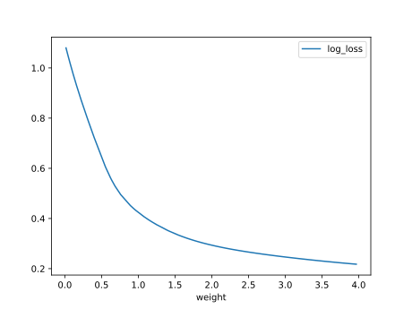

#### Network

### Individual 17610

| key                    |     value |
|:-----------------------|----------:|
| mean log_loss:         |   0.38178 |
| mean accuracy:         |   0.9156  |
| mean kappa:            |   0.8734  |
| number of edges        |  42       |
| number of hidden nodes |  13       |
| number of layers       |   5       |
| birth                  | 196       |

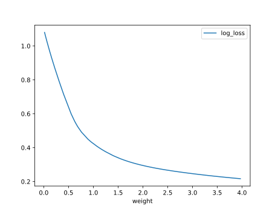

#### Network

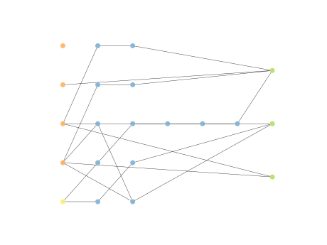

### Individual 17587

| key                    |      value |
|:-----------------------|-----------:|
| mean log_loss:         |   0.379518 |
| mean accuracy:         |   0.913667 |
| mean kappa:            |   0.8705   |
| number of edges        |  40        |
| number of hidden nodes |  12        |
| number of layers       |   4        |
| birth                  | 196        |

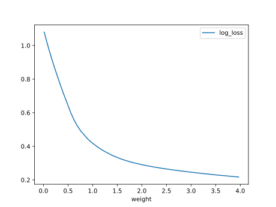

#### Network

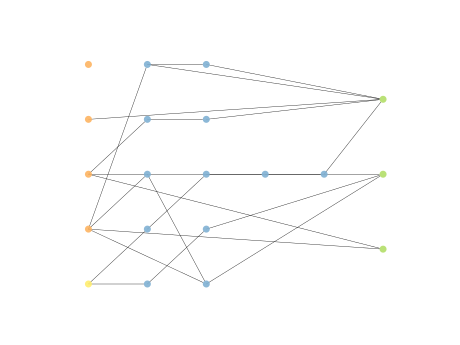

