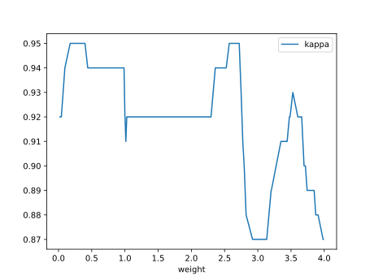
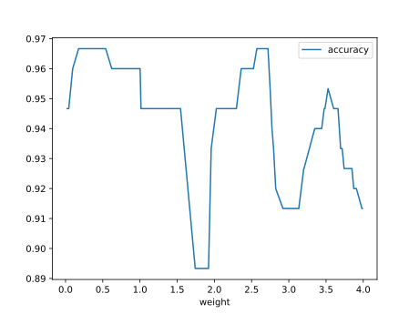

# Report Iris Uniform Distribution [0, 4] run 8

## Best results in hall of fame

| measure       |    value |   individual |
|:--------------|---------:|-------------:|
| mean accuracy | 0.945467 |        17292 |
| max accuracy  | 0.966667 |        17292 |
| mean kappa    | 0.9182   |        17292 |
| max kappa     | 0.95     |        17292 |

## Individuals in hall of fame

### Individual 17292

| key                    |      value |
|:-----------------------|-----------:|
| mean log_loss:         |   0.297177 |
| mean accuracy:         |   0.945467 |
| mean kappa:            |   0.9182   |
| number of edges        |  49        |
| number of hidden nodes |  13        |
| number of layers       |   5        |
| birth                  | 193        |

#### Network

### Individual 17351

| key                    |      value |
|:-----------------------|-----------:|
| mean log_loss:         |   0.297903 |
| mean accuracy:         |   0.944667 |
| mean kappa:            |   0.917    |
| number of edges        |  49        |
| number of hidden nodes |  13        |
| number of layers       |   5        |
| birth                  | 193        |

#### Network

### Individual 17024

| key                    |      value |
|:-----------------------|-----------:|
| mean log_loss:         |   0.292019 |
| mean accuracy:         |   0.9442   |
| mean kappa:            |   0.9163   |
| number of edges        |  51        |
| number of hidden nodes |  14        |
| number of layers       |   5        |
| birth                  | 190        |

#### Network

### Individual 16656

| key                    |      value |
|:-----------------------|-----------:|
| mean log_loss:         |   0.289166 |
| mean accuracy:         |   0.9438   |
| mean kappa:            |   0.9157   |
| number of edges        |  51        |
| number of hidden nodes |  14        |
| number of layers       |   6        |
| birth                  | 186        |

#### Network

### Individual 17542

| key                    |      value |
|:-----------------------|-----------:|
| mean log_loss:         |   0.297656 |
| mean accuracy:         |   0.945467 |
| mean kappa:            |   0.9182   |
| number of edges        |  51        |
| number of hidden nodes |  14        |
| number of layers       |   5        |
| birth                  | 195        |

#### Network

### Individual 16742

| key                    |     value |
|:-----------------------|----------:|
| mean log_loss:         |   0.29615 |
| mean accuracy:         |   0.942   |
| mean kappa:            |   0.913   |
| number of edges        |  49       |
| number of hidden nodes |  13       |
| number of layers       |   5       |
| birth                  | 187       |

#### Network

### Individual 15353

| key                    |      value |
|:-----------------------|-----------:|
| mean log_loss:         |   0.301438 |
| mean accuracy:         |   0.9328   |
| mean kappa:            |   0.8992   |
| number of edges        |  45        |
| number of hidden nodes |  11        |
| number of layers       |   5        |
| birth                  | 171        |

#### Network

### Individual 16531

| key                    |      value |
|:-----------------------|-----------:|
| mean log_loss:         |   0.297317 |
| mean accuracy:         |   0.941467 |
| mean kappa:            |   0.9122   |
| number of edges        |  49        |
| number of hidden nodes |  13        |
| number of layers       |   5        |
| birth                  | 184        |

#### Network

### Individual 15476

| key                    |      value |
|:-----------------------|-----------:|
| mean log_loss:         |   0.296624 |
| mean accuracy:         |   0.9328   |
| mean kappa:            |   0.8992   |
| number of edges        |  46        |
| number of hidden nodes |  11        |
| number of layers       |   5        |
| birth                  | 172        |

#### Network

### Individual 15535

| key                    |      value |
|:-----------------------|-----------:|
| mean log_loss:         |   0.291607 |
| mean accuracy:         |   0.9356   |
| mean kappa:            |   0.9034   |
| number of edges        |  46        |
| number of hidden nodes |  11        |
| number of layers       |   5        |
| birth                  | 173        |

#### Network

