# Report Iris Uniform Distribution [0, 4] run 9

## Best results in hall of fame

| measure       |    value |   individual |
|:--------------|---------:|-------------:|
| mean accuracy | 0.834267 |         9051 |
| max accuracy  | 0.96     |         9051 |
| mean kappa    | 0.7514   |         9051 |
| max kappa     | 0.94     |         9051 |

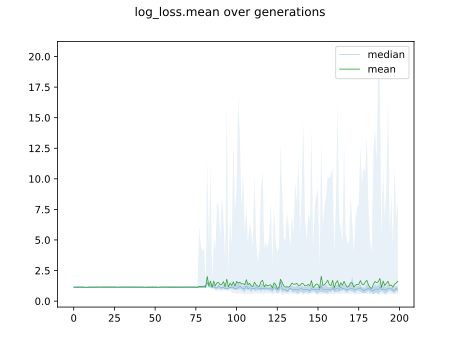

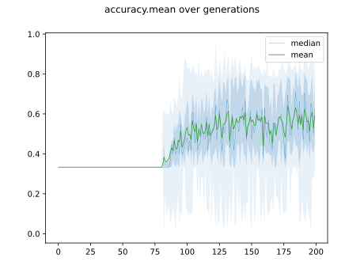

## Individuals in hall of fame

### Individual 9051

| key                    |      value |
|:-----------------------|-----------:|
| mean log_loss:         |   0.665654 |
| mean accuracy:         |   0.834267 |
| mean kappa:            |   0.7514   |
| number of edges        |  22        |
| number of hidden nodes |   3        |
| number of layers       |   3        |
| birth                  | 101        |

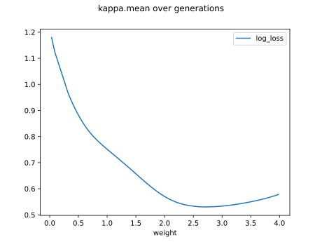

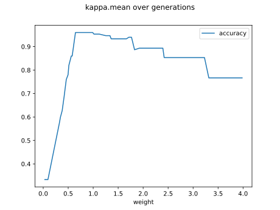

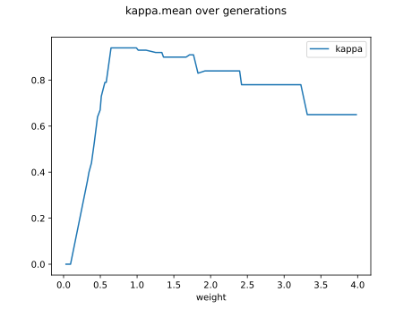

#### Network

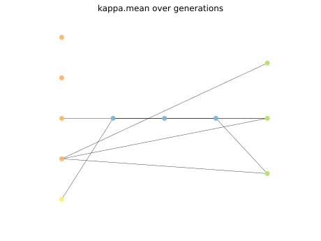

### Individual 17915

| key                    |      value |
|:-----------------------|-----------:|
| mean log_loss:         |   0.595855 |
| mean accuracy:         |   0.817467 |
| mean kappa:            |   0.7262   |
| number of edges        |  60        |
| number of hidden nodes |  16        |
| number of layers       |  13        |
| birth                  | 200        |

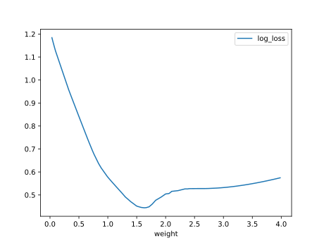

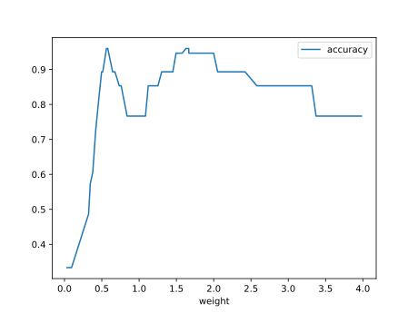

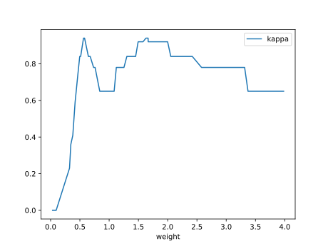

#### Network

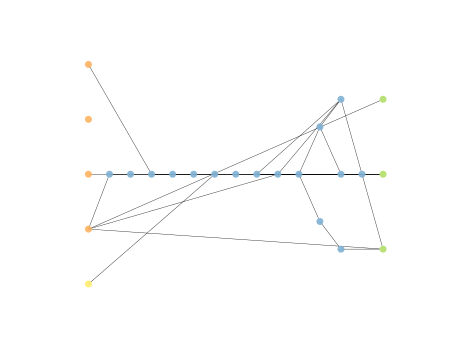

### Individual 16447

| key                    |      value |
|:-----------------------|-----------:|
| mean log_loss:         |   0.588094 |
| mean accuracy:         |   0.826867 |
| mean kappa:            |   0.7403   |
| number of edges        |  55        |
| number of hidden nodes |  14        |
| number of layers       |  11        |
| birth                  | 183        |

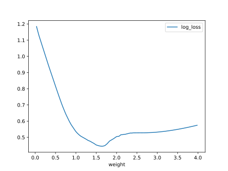

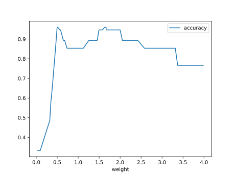

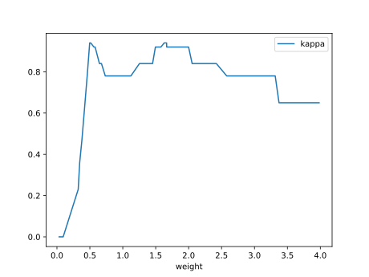

#### Network

### Individual 8858

| key                    |     value |
|:-----------------------|----------:|
| mean log_loss:         |  0.66755  |
| mean accuracy:         |  0.831533 |
| mean kappa:            |  0.7473   |
| number of edges        | 20        |
| number of hidden nodes |  2        |
| number of layers       |  2        |
| birth                  | 99        |

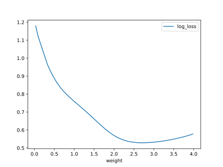

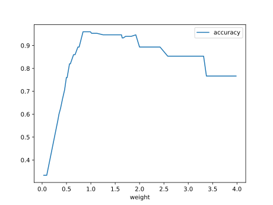

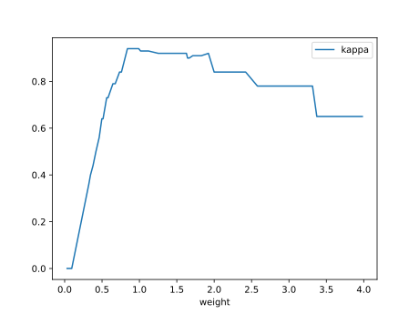

#### Network

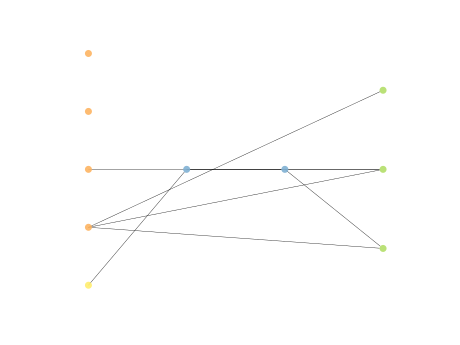

### Individual 17243

| key                    |      value |
|:-----------------------|-----------:|
| mean log_loss:         |   0.593842 |
| mean accuracy:         |   0.820267 |
| mean kappa:            |   0.7304   |
| number of edges        |  57        |
| number of hidden nodes |  14        |
| number of layers       |  11        |
| birth                  | 192        |

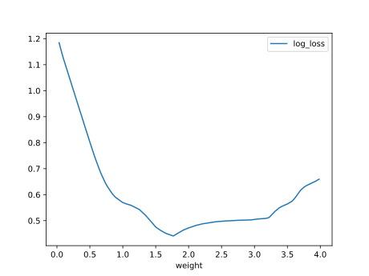

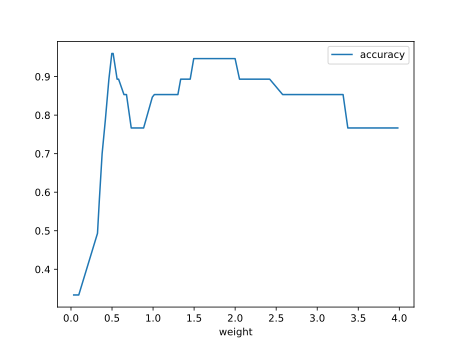

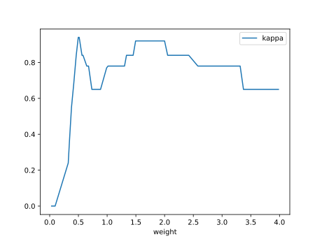

#### Network

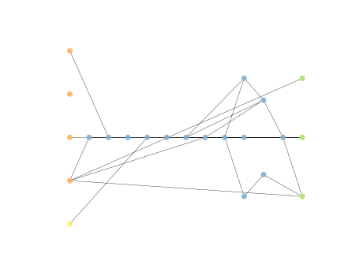

### Individual 15761

| key                    |      value |
|:-----------------------|-----------:|
| mean log_loss:         |   0.612992 |
| mean accuracy:         |   0.799133 |
| mean kappa:            |   0.6987   |
| number of edges        |  54        |
| number of hidden nodes |  14        |
| number of layers       |  11        |
| birth                  | 176        |

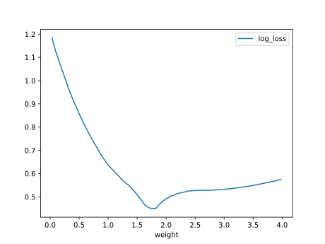

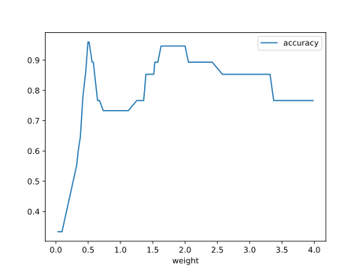

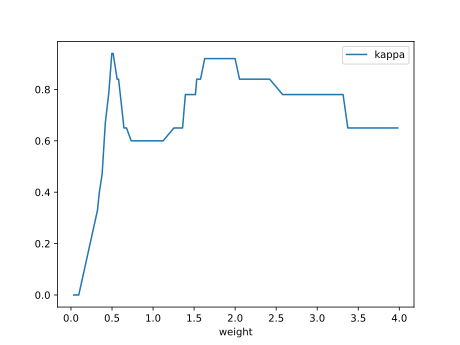

#### Network

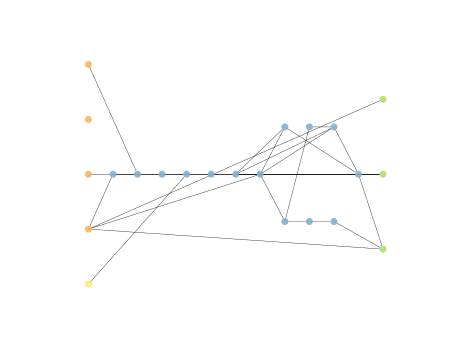

### Individual 13422

| key                    |      value |
|:-----------------------|-----------:|
| mean log_loss:         |   0.598521 |
| mean accuracy:         |   0.819267 |
| mean kappa:            |   0.7289   |
| number of edges        |  50        |
| number of hidden nodes |  13        |
| number of layers       |  10        |
| birth                  | 150        |

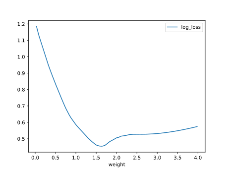

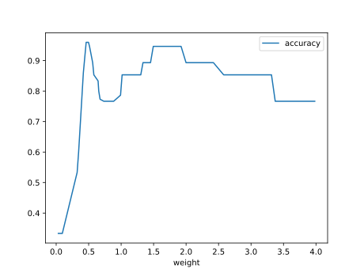

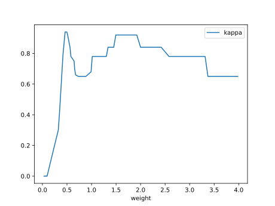

#### Network

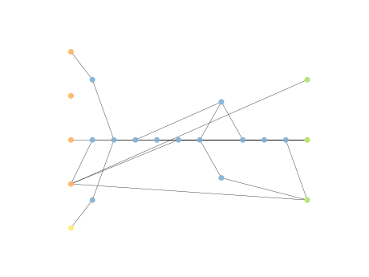

### Individual 17357

| key                    |      value |
|:-----------------------|-----------:|
| mean log_loss:         |   0.593842 |
| mean accuracy:         |   0.820267 |
| mean kappa:            |   0.7304   |
| number of edges        |  58        |
| number of hidden nodes |  14        |
| number of layers       |  11        |
| birth                  | 193        |

#### Network

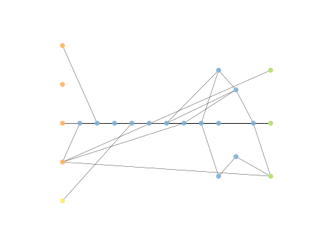

### Individual 16330

| key                    |      value |
|:-----------------------|-----------:|
| mean log_loss:         |   0.594642 |
| mean accuracy:         |   0.829533 |
| mean kappa:            |   0.7443   |
| number of edges        |  55        |
| number of hidden nodes |  14        |
| number of layers       |  11        |
| birth                  | 182        |

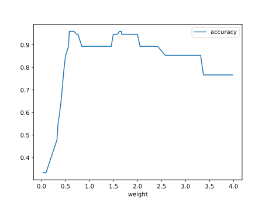

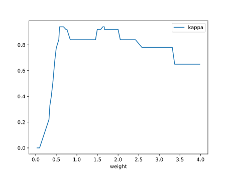

#### Network

### Individual 13657

| key                    |      value |
|:-----------------------|-----------:|
| mean log_loss:         |   0.594428 |
| mean accuracy:         |   0.824333 |
| mean kappa:            |   0.7365   |
| number of edges        |  48        |
| number of hidden nodes |  12        |
| number of layers       |  10        |
| birth                  | 152        |

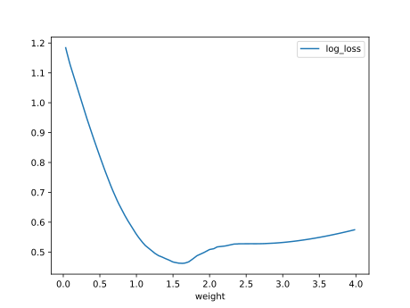

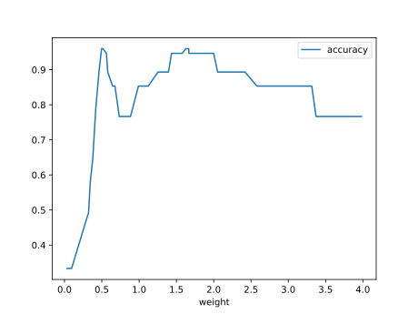

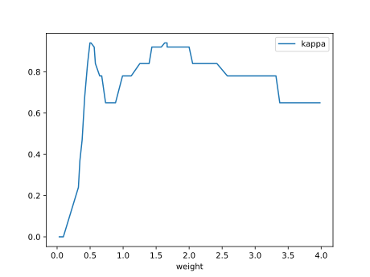

#### Network

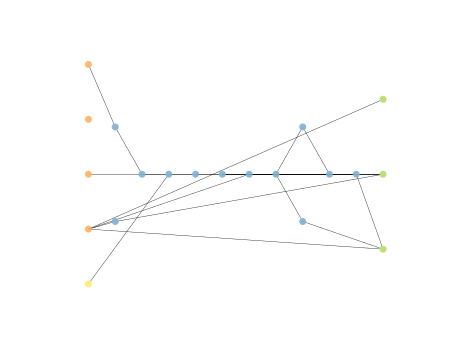

